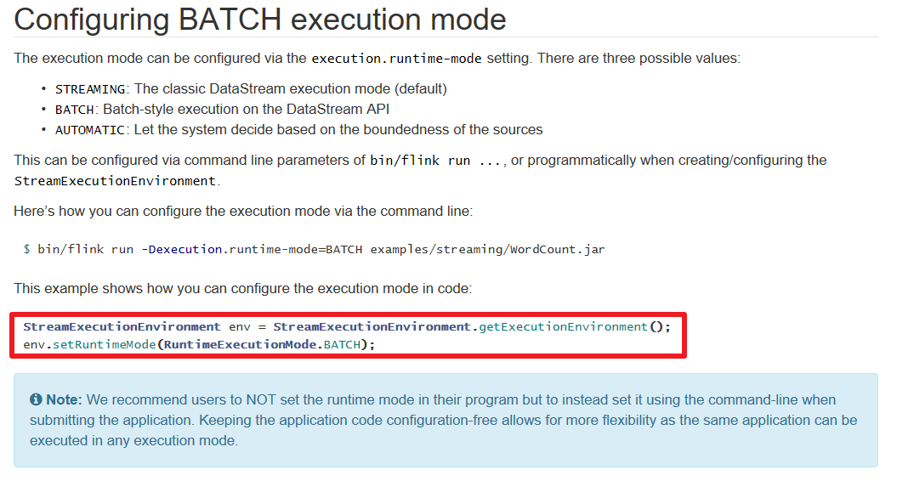
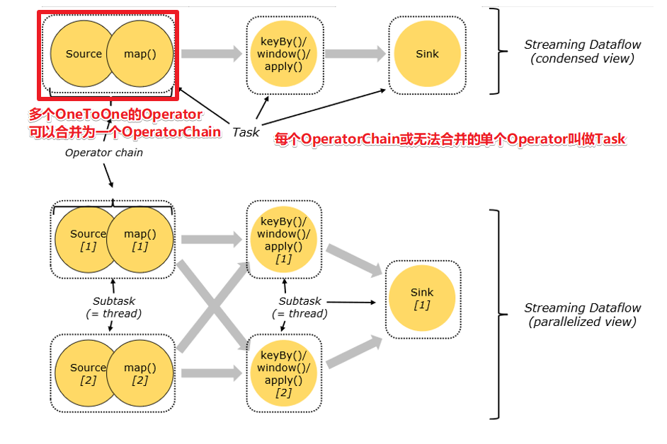
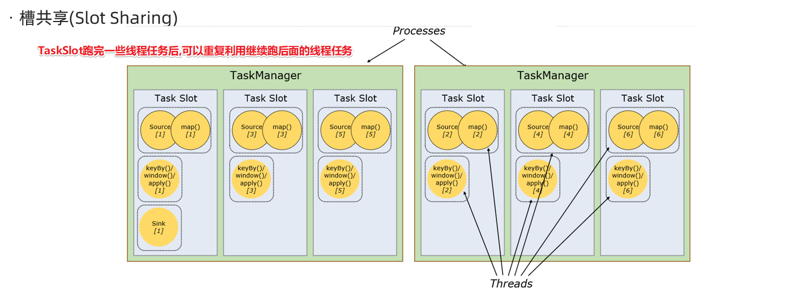
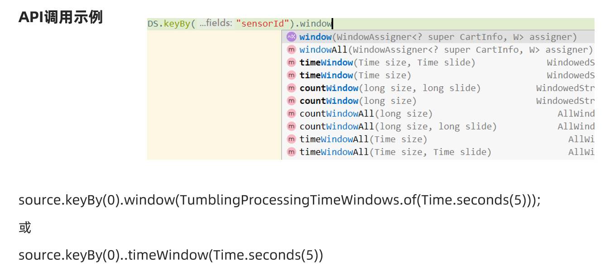
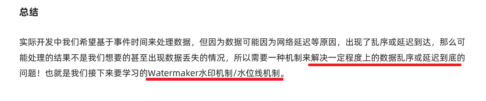
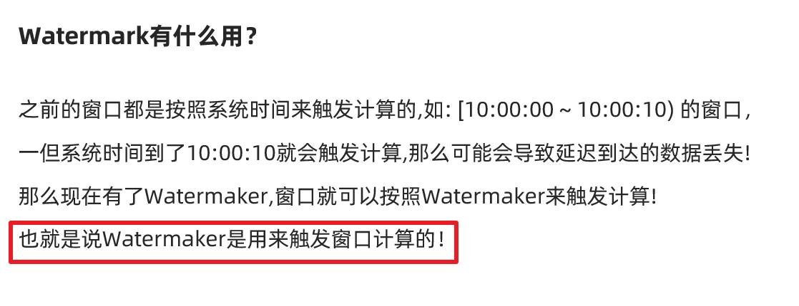
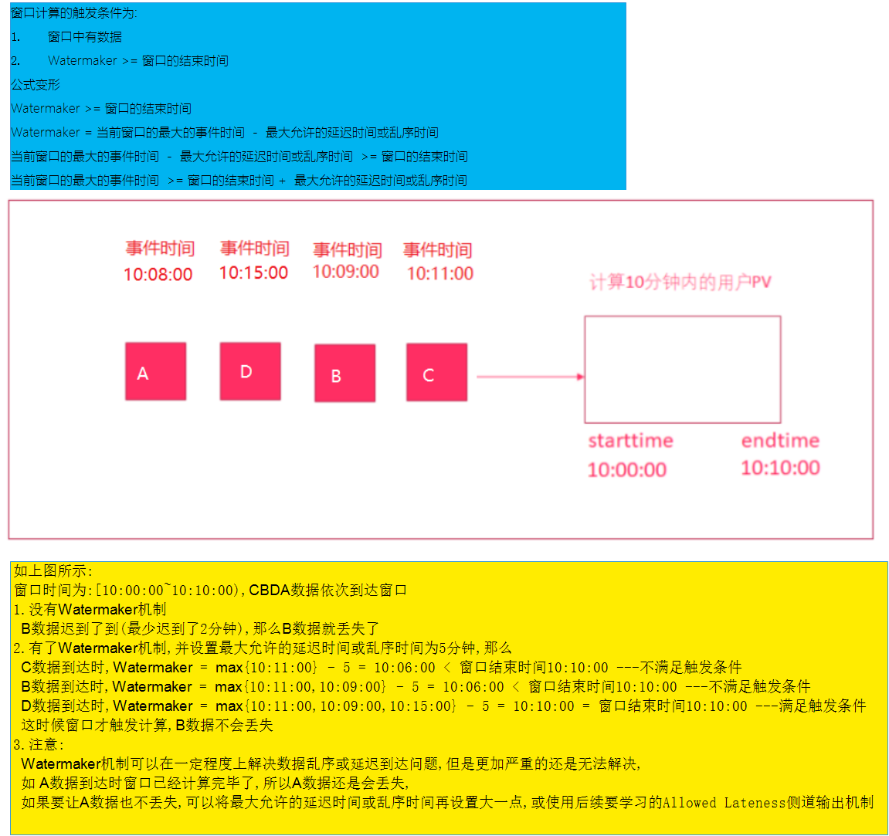
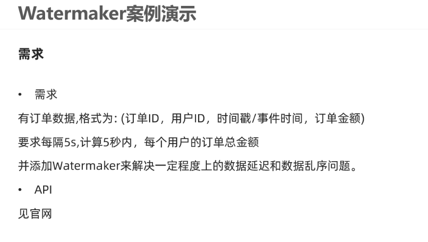
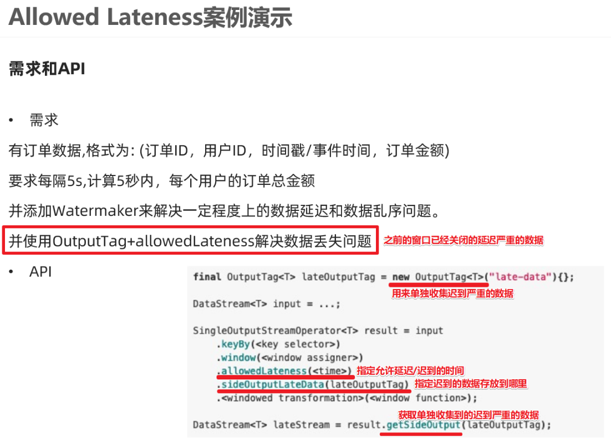
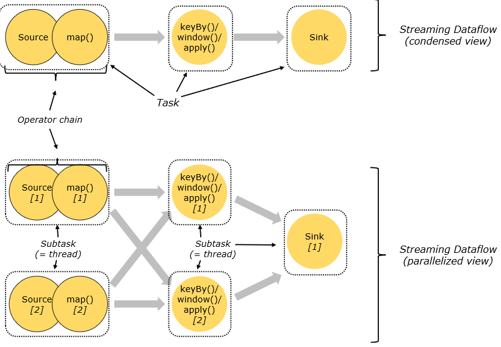

# Flink介绍

## 发展历史


## 官方介绍


## 组件栈


## 应用场景

所有的流式计算


# Flink安装部署

## local本地模式-了解

### 原理


### 操作

1.下载安装包

https://archive.apache.org/dist/flink/

 

2.上传flink-1.12.0-bin-scala_2.12.tgz到node1的指定目录

 

3.解压

tar -zxvf flink-1.12.0-bin-scala_2.12.tgz 

 

4.如果出现权限问题，需要修改权限

chown -R root:root /export/server/flink-1.12.0

5.改名或创建软链接

mv flink-1.12.0 flink

ln -s /export/server/flink-1.12.0 /export/server/flink

### 测试

1.准备文件/root/words.txt

vim /root/words.txt

 ```
hello me you her
hello me you
hello me
hello
 ```


 

2.启动Flink本地“集群”

  /export/server/flink/bin/start-cluster.sh

  

3.使用jps可以查看到下面两个进程

  \- TaskManagerRunner

  \- StandaloneSessionClusterEntrypoint

 

4.访问Flink的Web UI

  http://node1:8081/#/overview

  

  slot在Flink里面可以认为是资源组，Flink是通过将任务分成子任务并且将这些子任务分配到slot来并行执行程序。

 

5.执行官方示例

```
/export/server/flink/bin/flink run /export/server/flink/examples/batch/WordCount.jar --input /root/words.txt --output /root/out
```


6.停止Flink

/export/server/flink/bin/stop-cluster.sh

 

 

启动shell交互式窗口(目前所有Scala 2.12版本的安装包暂时都不支持 Scala Shell)

/export/server/flink/bin/start-scala-shell.sh local

 

执行如下命令

 ```
benv.readTextFile("/root/words.txt").flatMap(_.split(" ")).map((_,1)).groupBy(0).sum(1).print()
 ```


退出shell

:quit


## Standalone独立集群模式-了解

### 原理


### 操作

1.集群规划:

\- 服务器: node1(Master + Slave): JobManager + TaskManager

\- 服务器: node2(Slave): TaskManager

\- 服务器: node3(Slave): TaskManager

 

2.修改flink-conf.yaml

vim /export/server/flink/conf/flink-conf.yaml

```
jobmanager.rpc.address: node1
taskmanager.numberOfTaskSlots: 2
web.submit.enable: true

#历史服务器
jobmanager.archive.fs.dir: hdfs://node1:8020/flink/completed-jobs/
historyserver.web.address: node1
historyserver.web.port: 8082
historyserver.archive.fs.dir: hdfs://node1:8020/flink/completed-jobs/
```

2.修改masters

vim /export/server/flink/conf/masters

```
node1:8081
```


3.修改slaves

vim /export/server/flink/conf/workers

```
node1
node2
node3
```


4.添加HADOOP_CONF_DIR环境变量

vim /etc/profile

```
export HADOOP_CONF_DIR=/export/server/hadoop/etc/hadoop
```


5.分发

  scp -r /export/server/flink node2:/export/server/flink

  scp -r /export/server/flink node3:/export/server/flink

  scp  /etc/profile node2:/etc/profile

  scp  /etc/profile node3:/etc/profile

  或

```
 for i in {2..3}; do scp -r flink node$i:$PWD; done
```


  

6.source 

source /etc/profile


### 测试

1.启动集群，在node1上执行如下命令

  /export/server/flink/bin/start-cluster.sh

  或者单独启动

/export/server/flink/bin/jobmanager.sh ((start|start-foreground) cluster)|stop|stop-all

/export/server/flink/bin/taskmanager.sh start|start-foreground|stop|stop-all

 

2.启动历史服务器

​	/export/server/flink/bin/historyserver.sh start

 

3.访问Flink UI界面或使用jps查看

http://node1:8081/#/overview

http://node1:8082/#/overview


4.执行官方测试案例

```
/export/server/flink/bin/flink run /export/server/flink/examples/batch/WordCount.jar
```


6.停止Flink集群

/export/server/flink/bin/stop-cluster.sh


## Standalone-HA高可用集群模式-了解

### 原理


### 操作

1.集群规划

\- 服务器: node1(Master + Slave): JobManager + TaskManager

\- 服务器: node2(Master + Slave): JobManager + TaskManager

\- 服务器: node3(Slave): TaskManager

 

2.启动ZooKeeper

zkServer.sh status

zkServer.sh stop

zkServer.sh start

 

3.启动HDFS

/export/serves/hadoop/sbin/start-dfs.sh

 

4.停止Flink集群

/export/server/flink/bin/stop-cluster.sh

 

5.修改flink-conf.yaml

vim /export/server/flink/conf/flink-conf.yaml

增加如下内容G

```
state.backend: filesystem
state.backend.fs.checkpointdir: hdfs://node1:8020/flink-checkpoints
high-availability: zookeeper
high-availability.storageDir: hdfs://node1:8020/flink/ha/
high-availability.zookeeper.quorum: node1:2181,node2:2181,node3:2181
```

6.修改masters

vim /export/server/flink/conf/masters

7.同步

```
scp -r /export/server/flink/conf/flink-conf.yaml node2:/export/server/flink/conf/
scp -r /export/server/flink/conf/flink-conf.yaml node3:/export/server/flink/conf/
scp -r /export/server/flink/conf/masters node2:/export/server/flink/conf/
scp -r /export/server/flink/conf/masters node3:/export/server/flink/conf/
```


8.修改node2上的flink-conf.yaml

vim /export/server/flink/conf/flink-conf.yaml

```
jobmanager.rpc.address: node2
```


9.重新启动Flink集群,node1上执行

/export/server/flink/bin/stop-cluster.sh

/export/server/flink/bin/start-cluster.sh

 

 

10.使用jps命令查看

发现没有Flink相关进程被启动

 

11.查看日志

cat /export/server/flink/log/flink-root-standalonesession-0-node1.log

发现如下错误

 

因为在Flink1.8版本后,Flink官方提供的安装包里没有整合HDFS的jar

 

12.下载jar包并在Flink的lib目录下放入该jar包并分发使Flink能够支持对Hadoop的操作

下载地址

https://flink.apache.org/downloads.html

13.放入lib目录

cd /export/server/flink/lib

 

 

14.分发

for i in {2..3}; do scp -r flink-shaded-hadoop-2-uber-2.7.5-10.0.jar node$i:$PWD; done

 

15.重新启动Flink集群,node1上执行

/export/server/flink/bin/stop-cluster.sh

/export/server/flink/bin/start-cluster.sh

 

16.使用jps命令查看,发现三台机器已经ok


### 测试

1.访问WebUI

http://node1:8081/#/job-manager/config

http://node2:8081/#/job-manager/config


2.执行wc

/export/server/flink/bin/flink run  /export/server/flink/examples/batch/WordCount.jar

 

3.kill掉其中一个master

 

4.重新执行wc,还是可以正常执行

/export/server/flink/bin/flink run  /export/server/flink/examples/batch/WordCount.jar

 

3.停止集群

/export/server/flink/bin/stop-cluster.sh


## Flink-On-Yarn-开发使用

### 原理


### 两种模式

#### Session会话模式


#### Job分离模式


### 操作

1.关闭yarn的内存检查

vim /export/server/hadoop/etc/hadoop/yarn-site.xml

```
 <!-- 关闭yarn内存检查 -->
    <property>
        <name>yarn.nodemanager.pmem-check-enabled</name>
        <value>false</value>
    </property>
    <property>
        <name>yarn.nodemanager.vmem-check-enabled</name>
        <value>false</value>
    </property>
```

2.分发

```
scp -r /export/server/hadoop/etc/hadoop/yarn-site.xml node2:/export/server/hadoop/etc/hadoop/yarn-site.xml
scp -r /export/server/hadoop/etc/hadoop/yarn-site.xml node3:/export/server/hadoop/etc/hadoop/yarn-site.xml
```


3.重启yarn

/export/server/hadoop/sbin/stop-yarn.sh

/export/server/hadoop/sbin/start-yarn.sh


### 测试

#### Session会话模式

在Yarn上启动一个Flink集群,并重复使用该集群,后续提交的任务都是给该集群,资源会被一直占用,除非手动关闭该集群----适用于大量的小任务


1.在yarn上启动一个Flink集群/会话，node1上执行以下命令

/export/server/flink/bin/yarn-session.sh -n 2 -tm 800 -s 1 -d

 

说明:

申请2个CPU、1600M内存

\# -n 表示申请2个容器，这里指的就是多少个taskmanager

\# -tm 表示每个TaskManager的内存大小

\# -s 表示每个TaskManager的slots数量

\# -d 表示以后台程序方式运行

 

注意:

该警告不用管

WARN  org.apache.hadoop.hdfs.DFSClient  - Caught exception 

java.lang.InterruptedException

 

2.查看UI界面

http://node1:8088/cluster

 

 

 

 

3.使用flink run提交任务：

  /export/server/flink/bin/flink run  /export/server/flink/examples/batch/WordCount.jar

  运行完之后可以继续运行其他的小任务

  /export/server/flink/bin/flink run  /export/server/flink/examples/batch/WordCount.jar

  

  

4.通过上方的ApplicationMaster可以进入Flink的管理界面

 

 

  

==5.关闭yarn-session：==

yarn application -kill application_1609508087977_0005


#### Job分离模式--用的更多

针对每个Flink任务在Yarn上启动一个独立的Flink集群并运行,结束后自动关闭并释放资源,----适用于大任务


1.直接提交job

/export/server/flink/bin/flink run -m yarn-cluster -yjm 1024 -ytm 1024 /export/server/flink/examples/batch/WordCount.jar

\# -m  jobmanager的地址

\# -yjm 1024 指定jobmanager的内存信息

\# -ytm 1024 指定taskmanager的内存信息

 

 

2.查看UI界面

http://node1:8088/cluster


 

 


### 参数说明

```shell
/export/server/flink/bin/flink --help
SLF4J: Class path contains multiple SLF4J bindings.
SLF4J: Found binding in [jar:file:/export/server/flink/lib/log4j-slf4j-impl-2.12.1.jar!/org/slf4j/impl/StaticLoggerBinder.class]
SLF4J: Found binding in [jar:file:/export/server/hadoop-2.7.5/share/hadoop/common/lib/slf4j-log4j12-1.7.10.jar!/org/slf4j/impl/StaticLoggerBinder.class]
SLF4J: See http://www.slf4j.org/codes.html#multiple_bindings for an explanation.
SLF4J: Actual binding is of type [org.apache.logging.slf4j.Log4jLoggerFactory]
./flink <ACTION> [OPTIONS] [ARGUMENTS]

The following actions are available:

Action "run" compiles and runs a program.

  Syntax: run [OPTIONS] <jar-file> <arguments>
  "run" action options:
     -c,--class <classname>               Class with the program entry point
                                          ("main()" method). Only needed if the
                                          JAR file does not specify the class in
                                          its manifest.
     -C,--classpath <url>                 Adds a URL to each user code
                                          classloader  on all nodes in the
                                          cluster. The paths must specify a
                                          protocol (e.g. file://) and be
                                          accessible on all nodes (e.g. by means
                                          of a NFS share). You can use this
                                          option multiple times for specifying
                                          more than one URL. The protocol must
                                          be supported by the {@link
                                          java.net.URLClassLoader}.
     -d,--detached                        If present, runs the job in detached
                                          mode
     -n,--allowNonRestoredState           Allow to skip savepoint state that
                                          cannot be restored. You need to allow
                                          this if you removed an operator from
                                          your program that was part of the
                                          program when the savepoint was
                                          triggered.
     -p,--parallelism <parallelism>       The parallelism with which to run the
                                          program. Optional flag to override the
                                          default value specified in the
                                          configuration.
     -py,--python <pythonFile>            Python script with the program entry
                                          point. The dependent resources can be
                                          configured with the `--pyFiles`
                                          option.
     -pyarch,--pyArchives <arg>           Add python archive files for job. The
                                          archive files will be extracted to the
                                          working directory of python UDF
                                          worker. Currently only zip-format is
                                          supported. For each archive file, a
                                          target directory be specified. If the
                                          target directory name is specified,
                                          the archive file will be extracted to
                                          a name can directory with the
                                          specified name. Otherwise, the archive
                                          file will be extracted to a directory
                                          with the same name of the archive
                                          file. The files uploaded via this
                                          option are accessible via relative
                                          path. '#' could be used as the
                                          separator of the archive file path and
                                          the target directory name. Comma (',')
                                          could be used as the separator to
                                          specify multiple archive files. This
                                          option can be used to upload the
                                          virtual environment, the data files
                                          used in Python UDF (e.g.: --pyArchives
                                          file:///tmp/py37.zip,file:///tmp/data.
                                          zip#data --pyExecutable
                                          py37.zip/py37/bin/python). The data
                                          files could be accessed in Python UDF,
                                          e.g.: f = open('data/data.txt', 'r').
     -pyexec,--pyExecutable <arg>         Specify the path of the python
                                          interpreter used to execute the python
                                          UDF worker (e.g.: --pyExecutable
                                          /usr/local/bin/python3). The python
                                          UDF worker depends on Python 3.5+,
                                          Apache Beam (version == 2.23.0), Pip
                                          (version >= 7.1.0) and SetupTools
                                          (version >= 37.0.0). Please ensure
                                          that the specified environment meets
                                          the above requirements.
     -pyfs,--pyFiles <pythonFiles>        Attach custom python files for job.
                                          These files will be added to the
                                          PYTHONPATH of both the local client
                                          and the remote python UDF worker. The
                                          standard python resource file suffixes
                                          such as .py/.egg/.zip or directory are
                                          all supported. Comma (',') could be
                                          used as the separator to specify
                                          multiple files (e.g.: --pyFiles
                                          file:///tmp/myresource.zip,hdfs:///$na
                                          menode_address/myresource2.zip).
     -pym,--pyModule <pythonModule>       Python module with the program entry
                                          point. This option must be used in
                                          conjunction with `--pyFiles`.
     -pyreq,--pyRequirements <arg>        Specify a requirements.txt file which
                                          defines the third-party dependencies.
                                          These dependencies will be installed
                                          and added to the PYTHONPATH of the
                                          python UDF worker. A directory which
                                          contains the installation packages of
                                          these dependencies could be specified
                                          optionally. Use '#' as the separator
                                          if the optional parameter exists
                                          (e.g.: --pyRequirements
                                          file:///tmp/requirements.txt#file:///t
                                          mp/cached_dir).
     -s,--fromSavepoint <savepointPath>   Path to a savepoint to restore the job
                                          from (for example
                                          hdfs:///flink/savepoint-1537).
     -sae,--shutdownOnAttachedExit        If the job is submitted in attached
                                          mode, perform a best-effort cluster
                                          shutdown when the CLI is terminated
                                          abruptly, e.g., in response to a user
                                          interrupt, such as typing Ctrl + C.
  Options for Generic CLI mode:
     -D <property=value>   Allows specifying multiple generic configuration
                           options. The available options can be found at
                           https://ci.apache.org/projects/flink/flink-docs-stabl
                           e/ops/config.html
     -e,--executor <arg>   DEPRECATED: Please use the -t option instead which is
                           also available with the "Application Mode".
                           The name of the executor to be used for executing the
                           given job, which is equivalent to the
                           "execution.target" config option. The currently
                           available executors are: "remote", "local",
                           "kubernetes-session", "yarn-per-job", "yarn-session".
     -t,--target <arg>     The deployment target for the given application,
                           which is equivalent to the "execution.target" config
                           option. For the "run" action the currently available
                           targets are: "remote", "local", "kubernetes-session",
                           "yarn-per-job", "yarn-session". For the
                           "run-application" action the currently available
                           targets are: "kubernetes-application",
                           "yarn-application".

  Options for yarn-cluster mode:
     -d,--detached                        If present, runs the job in detached
                                          mode
     -m,--jobmanager <arg>                Set to yarn-cluster to use YARN
                                          execution mode.
     -yat,--yarnapplicationType <arg>     Set a custom application type for the
                                          application on YARN
     -yD <property=value>                 use value for given property
     -yd,--yarndetached                   If present, runs the job in detached
                                          mode (deprecated; use non-YARN
                                          specific option instead)
     -yh,--yarnhelp                       Help for the Yarn session CLI.
     -yid,--yarnapplicationId <arg>       Attach to running YARN session
     -yj,--yarnjar <arg>                  Path to Flink jar file
     -yjm,--yarnjobManagerMemory <arg>    Memory for JobManager Container with
                                          optional unit (default: MB)
     -ynl,--yarnnodeLabel <arg>           Specify YARN node label for the YARN
                                          application
     -ynm,--yarnname <arg>                Set a custom name for the application
                                          on YARN
     -yq,--yarnquery                      Display available YARN resources
                                          (memory, cores)
     -yqu,--yarnqueue <arg>               Specify YARN queue.
     -ys,--yarnslots <arg>                Number of slots per TaskManager
     -yt,--yarnship <arg>                 Ship files in the specified directory
                                          (t for transfer)
     -ytm,--yarntaskManagerMemory <arg>   Memory per TaskManager Container with
                                          optional unit (default: MB)
     -yz,--yarnzookeeperNamespace <arg>   Namespace to create the Zookeeper
                                          sub-paths for high availability mode
     -z,--zookeeperNamespace <arg>        Namespace to create the Zookeeper
                                          sub-paths for high availability mode

  Options for default mode:
     -D <property=value>             Allows specifying multiple generic
                                     configuration options. The available
                                     options can be found at
                                     https://ci.apache.org/projects/flink/flink-
                                     docs-stable/ops/config.html
     -m,--jobmanager <arg>           Address of the JobManager to which to
                                     connect. Use this flag to connect to a
                                     different JobManager than the one specified
                                     in the configuration. Attention: This
                                     option is respected only if the
                                     high-availability configuration is NONE.
     -z,--zookeeperNamespace <arg>   Namespace to create the Zookeeper sub-paths
                                     for high availability mode


Action "run-application" runs an application in Application Mode.

  Syntax: run-application [OPTIONS] <jar-file> <arguments>
  Options for Generic CLI mode:
     -D <property=value>   Allows specifying multiple generic configuration
                           options. The available options can be found at
                           https://ci.apache.org/projects/flink/flink-docs-stabl
                           e/ops/config.html
     -e,--executor <arg>   DEPRECATED: Please use the -t option instead which is
                           also available with the "Application Mode".
                           The name of the executor to be used for executing the
                           given job, which is equivalent to the
                           "execution.target" config option. The currently
                           available executors are: "remote", "local",
                           "kubernetes-session", "yarn-per-job", "yarn-session".
     -t,--target <arg>     The deployment target for the given application,
                           which is equivalent to the "execution.target" config
                           option. For the "run" action the currently available
                           targets are: "remote", "local", "kubernetes-session",
                           "yarn-per-job", "yarn-session". For the
                           "run-application" action the currently available
                           targets are: "kubernetes-application",
                           "yarn-application".


Action "info" shows the optimized execution plan of the program (JSON).

  Syntax: info [OPTIONS] <jar-file> <arguments>
  "info" action options:
     -c,--class <classname>           Class with the program entry point
                                      ("main()" method). Only needed if the JAR
                                      file does not specify the class in its
                                      manifest.
     -p,--parallelism <parallelism>   The parallelism with which to run the
                                      program. Optional flag to override the
                                      default value specified in the
                                      configuration.


Action "list" lists running and scheduled programs.

  Syntax: list [OPTIONS]
  "list" action options:
     -a,--all         Show all programs and their JobIDs
     -r,--running     Show only running programs and their JobIDs
     -s,--scheduled   Show only scheduled programs and their JobIDs
  Options for Generic CLI mode:
     -D <property=value>   Allows specifying multiple generic configuration
                           options. The available options can be found at
                           https://ci.apache.org/projects/flink/flink-docs-stabl
                           e/ops/config.html
     -e,--executor <arg>   DEPRECATED: Please use the -t option instead which is
                           also available with the "Application Mode".
                           The name of the executor to be used for executing the
                           given job, which is equivalent to the
                           "execution.target" config option. The currently
                           available executors are: "remote", "local",
                           "kubernetes-session", "yarn-per-job", "yarn-session".
     -t,--target <arg>     The deployment target for the given application,
                           which is equivalent to the "execution.target" config
                           option. For the "run" action the currently available
                           targets are: "remote", "local", "kubernetes-session",
                           "yarn-per-job", "yarn-session". For the
                           "run-application" action the currently available
                           targets are: "kubernetes-application",
                           "yarn-application".

  Options for yarn-cluster mode:
     -m,--jobmanager <arg>            Set to yarn-cluster to use YARN execution
                                      mode.
     -yid,--yarnapplicationId <arg>   Attach to running YARN session
     -z,--zookeeperNamespace <arg>    Namespace to create the Zookeeper
                                      sub-paths for high availability mode

  Options for default mode:
     -D <property=value>             Allows specifying multiple generic
                                     configuration options. The available
                                     options can be found at
                                     https://ci.apache.org/projects/flink/flink-
                                     docs-stable/ops/config.html
     -m,--jobmanager <arg>           Address of the JobManager to which to
                                     connect. Use this flag to connect to a
                                     different JobManager than the one specified
                                     in the configuration. Attention: This
                                     option is respected only if the
                                     high-availability configuration is NONE.
     -z,--zookeeperNamespace <arg>   Namespace to create the Zookeeper sub-paths
                                     for high availability mode


Action "stop" stops a running program with a savepoint (streaming jobs only).

  Syntax: stop [OPTIONS] <Job ID>
  "stop" action options:
     -d,--drain                           Send MAX_WATERMARK before taking the
                                          savepoint and stopping the pipelne.
     -p,--savepointPath <savepointPath>   Path to the savepoint (for example
                                          hdfs:///flink/savepoint-1537). If no
                                          directory is specified, the configured
                                          default will be used
                                          ("state.savepoints.dir").
  Options for Generic CLI mode:
     -D <property=value>   Allows specifying multiple generic configuration
                           options. The available options can be found at
                           https://ci.apache.org/projects/flink/flink-docs-stabl
                           e/ops/config.html
     -e,--executor <arg>   DEPRECATED: Please use the -t option instead which is
                           also available with the "Application Mode".
                           The name of the executor to be used for executing the
                           given job, which is equivalent to the
                           "execution.target" config option. The currently
                           available executors are: "remote", "local",
                           "kubernetes-session", "yarn-per-job", "yarn-session".
     -t,--target <arg>     The deployment target for the given application,
                           which is equivalent to the "execution.target" config
                           option. For the "run" action the currently available
                           targets are: "remote", "local", "kubernetes-session",
                           "yarn-per-job", "yarn-session". For the
                           "run-application" action the currently available
                           targets are: "kubernetes-application",
                           "yarn-application".

  Options for yarn-cluster mode:
     -m,--jobmanager <arg>            Set to yarn-cluster to use YARN execution
                                      mode.
     -yid,--yarnapplicationId <arg>   Attach to running YARN session
     -z,--zookeeperNamespace <arg>    Namespace to create the Zookeeper
                                      sub-paths for high availability mode

  Options for default mode:
     -D <property=value>             Allows specifying multiple generic
                                     configuration options. The available
                                     options can be found at
                                     https://ci.apache.org/projects/flink/flink-
                                     docs-stable/ops/config.html
     -m,--jobmanager <arg>           Address of the JobManager to which to
                                     connect. Use this flag to connect to a
                                     different JobManager than the one specified
                                     in the configuration. Attention: This
                                     option is respected only if the
                                     high-availability configuration is NONE.
     -z,--zookeeperNamespace <arg>   Namespace to create the Zookeeper sub-paths
                                     for high availability mode


Action "cancel" cancels a running program.

  Syntax: cancel [OPTIONS] <Job ID>
  "cancel" action options:
     -s,--withSavepoint <targetDirectory>   **DEPRECATION WARNING**: Cancelling
                                            a job with savepoint is deprecated.
                                            Use "stop" instead.
                                            Trigger savepoint and cancel job.
                                            The target directory is optional. If
                                            no directory is specified, the
                                            configured default directory
                                            (state.savepoints.dir) is used.
  Options for Generic CLI mode:
     -D <property=value>   Allows specifying multiple generic configuration
                           options. The available options can be found at
                           https://ci.apache.org/projects/flink/flink-docs-stabl
                           e/ops/config.html
     -e,--executor <arg>   DEPRECATED: Please use the -t option instead which is
                           also available with the "Application Mode".
                           The name of the executor to be used for executing the
                           given job, which is equivalent to the
                           "execution.target" config option. The currently
                           available executors are: "remote", "local",
                           "kubernetes-session", "yarn-per-job", "yarn-session".
     -t,--target <arg>     The deployment target for the given application,
                           which is equivalent to the "execution.target" config
                           option. For the "run" action the currently available
                           targets are: "remote", "local", "kubernetes-session",
                           "yarn-per-job", "yarn-session". For the
                           "run-application" action the currently available
                           targets are: "kubernetes-application",
                           "yarn-application".

  Options for yarn-cluster mode:
     -m,--jobmanager <arg>            Set to yarn-cluster to use YARN execution
                                      mode.
     -yid,--yarnapplicationId <arg>   Attach to running YARN session
     -z,--zookeeperNamespace <arg>    Namespace to create the Zookeeper
                                      sub-paths for high availability mode

  Options for default mode:
     -D <property=value>             Allows specifying multiple generic
                                     configuration options. The available
                                     options can be found at
                                     https://ci.apache.org/projects/flink/flink-
                                     docs-stable/ops/config.html
     -m,--jobmanager <arg>           Address of the JobManager to which to
                                     connect. Use this flag to connect to a
                                     different JobManager than the one specified
                                     in the configuration. Attention: This
                                     option is respected only if the
                                     high-availability configuration is NONE.
     -z,--zookeeperNamespace <arg>   Namespace to create the Zookeeper sub-paths
                                     for high availability mode


Action "savepoint" triggers savepoints for a running job or disposes existing ones.

  Syntax: savepoint [OPTIONS] <Job ID> [<target directory>]
  "savepoint" action options:
     -d,--dispose <arg>       Path of savepoint to dispose.
     -j,--jarfile <jarfile>   Flink program JAR file.
  Options for Generic CLI mode:
     -D <property=value>   Allows specifying multiple generic configuration
                           options. The available options can be found at
                           https://ci.apache.org/projects/flink/flink-docs-stabl
                           e/ops/config.html
     -e,--executor <arg>   DEPRECATED: Please use the -t option instead which is
                           also available with the "Application Mode".
                           The name of the executor to be used for executing the
                           given job, which is equivalent to the
                           "execution.target" config option. The currently
                           available executors are: "remote", "local",
                           "kubernetes-session", "yarn-per-job", "yarn-session".
     -t,--target <arg>     The deployment target for the given application,
                           which is equivalent to the "execution.target" config
                           option. For the "run" action the currently available
                           targets are: "remote", "local", "kubernetes-session",
                           "yarn-per-job", "yarn-session". For the
                           "run-application" action the currently available
                           targets are: "kubernetes-application",
                           "yarn-application".

  Options for yarn-cluster mode:
     -m,--jobmanager <arg>            Set to yarn-cluster to use YARN execution
                                      mode.
     -yid,--yarnapplicationId <arg>   Attach to running YARN session
     -z,--zookeeperNamespace <arg>    Namespace to create the Zookeeper
                                      sub-paths for high availability mode

  Options for default mode:
     -D <property=value>             Allows specifying multiple generic
                                     configuration options. The available
                                     options can be found at
                                     https://ci.apache.org/projects/flink/flink-
                                     docs-stable/ops/config.html
     -m,--jobmanager <arg>           Address of the JobManager to which to
                                     connect. Use this flag to connect to a
                                     different JobManager than the one specified
                                     in the configuration. Attention: This
                                     option is respected only if the
                                     high-availability configuration is NONE.
     -z,--zookeeperNamespace <arg>   Namespace to create the Zookeeper sub-paths
                                     for high availability mode
```

# Flink入门案例

## 前置说明


注意:入门案例使用DataSet后续就不再使用了,而是使用流批一体的DataStream


https://ci.apache.org/projects/flink/flink-docs-release-1.12/dev/batch/


## 准备环境


```xml
<?xml version="1.0" encoding="UTF-8"?>
<project xmlns="http://maven.apache.org/POM/4.0.0"
         xmlns:xsi="http://www.w3.org/2001/XMLSchema-instance"
         xsi:schemaLocation="http://maven.apache.org/POM/4.0.0 http://maven.apache.org/xsd/maven-4.0.0.xsd">
    <modelVersion>4.0.0</modelVersion>

    <groupId>cn.itcast</groupId>
    <artifactId>flink_study_47</artifactId>
            <version>1.0.0</version>
    <!-- 指定仓库位置，依次为aliyun、apache和cloudera仓库 -->
    <repositories>
        <repository>
            <id>aliyun</id>
            <url>http://maven.aliyun.com/nexus/content/groups/public/</url>
        </repository>
        <repository>
            <id>apache</id>
            <url>https://repository.apache.org/content/repositories/snapshots/</url>
        </repository>
        <repository>
            <id>cloudera</id>
            <url>https://repository.cloudera.com/artifactory/cloudera-repos/</url>
        </repository>
    </repositories>

    <properties>
        <encoding>UTF-8</encoding>
        <project.build.sourceEncoding>UTF-8</project.build.sourceEncoding>
        <maven.compiler.source>1.8</maven.compiler.source>
        <maven.compiler.target>1.8</maven.compiler.target>
        <java.version>1.8</java.version>
        <scala.version>2.12</scala.version>
        <flink.version>1.12.0</flink.version>
    </properties>
    <dependencies>
        <dependency>
            <groupId>org.apache.flink</groupId>
            <artifactId>flink-clients_2.12</artifactId>
            <version>${flink.version}</version>
        </dependency>
        <dependency>
            <groupId>org.apache.flink</groupId>
            <artifactId>flink-scala_2.12</artifactId>
            <version>${flink.version}</version>
        </dependency>
        <dependency>
            <groupId>org.apache.flink</groupId>
            <artifactId>flink-java</artifactId>
            <version>${flink.version}</version>
        </dependency>
        <dependency>
            <groupId>org.apache.flink</groupId>
            <artifactId>flink-streaming-scala_2.12</artifactId>
            <version>${flink.version}</version>
        </dependency>
        <dependency>
            <groupId>org.apache.flink</groupId>
            <artifactId>flink-streaming-java_2.12</artifactId>
            <version>${flink.version}</version>
        </dependency>
        <dependency>
            <groupId>org.apache.flink</groupId>
            <artifactId>flink-table-api-scala-bridge_2.12</artifactId>
            <version>${flink.version}</version>
        </dependency>
        <dependency>
            <groupId>org.apache.flink</groupId>
            <artifactId>flink-table-api-java-bridge_2.12</artifactId>
            <version>${flink.version}</version>
        </dependency>
        <!-- flink执行计划,这是1.9版本之前的-->
        <dependency>
            <groupId>org.apache.flink</groupId>
            <artifactId>flink-table-planner_2.12</artifactId>
            <version>${flink.version}</version>
        </dependency>
        <!-- blink执行计划,1.11+默认的-->
        <dependency>
            <groupId>org.apache.flink</groupId>
            <artifactId>flink-table-planner-blink_2.12</artifactId>
            <version>${flink.version}</version>
        </dependency>
        <dependency>
            <groupId>org.apache.flink</groupId>
            <artifactId>flink-table-common</artifactId>
            <version>${flink.version}</version>
        </dependency>

        <!--<dependency>
            <groupId>org.apache.flink</groupId>
            <artifactId>flink-cep_2.12</artifactId>
            <version>${flink.version}</version>
        </dependency>-->

        <!-- flink连接器-->
        <dependency>
            <groupId>org.apache.flink</groupId>
            <artifactId>flink-connector-kafka_2.12</artifactId>
            <version>${flink.version}</version>
        </dependency>
        <dependency>
            <groupId>org.apache.flink</groupId>
            <artifactId>flink-sql-connector-kafka_2.12</artifactId>
            <version>${flink.version}</version>
        </dependency>
        <dependency>
            <groupId>org.apache.flink</groupId>
            <artifactId>flink-connector-jdbc_2.12</artifactId>
            <version>${flink.version}</version>
        </dependency>
        <dependency>
            <groupId>org.apache.flink</groupId>
            <artifactId>flink-csv</artifactId>
            <version>${flink.version}</version>
        </dependency>
        <dependency>
            <groupId>org.apache.flink</groupId>
            <artifactId>flink-json</artifactId>
            <version>${flink.version}</version>
        </dependency>

        <!-- <dependency>
           <groupId>org.apache.flink</groupId>
           <artifactId>flink-connector-filesystem_2.12</artifactId>
           <version>${flink.version}</version>
       </dependency>-->
        <!--<dependency>
            <groupId>org.apache.flink</groupId>
            <artifactId>flink-jdbc_2.12</artifactId>
            <version>${flink.version}</version>
        </dependency>-->
        <!--<dependency>
              <groupId>org.apache.flink</groupId>
              <artifactId>flink-parquet_2.12</artifactId>
              <version>${flink.version}</version>
         </dependency>-->
        <!--<dependency>
            <groupId>org.apache.avro</groupId>
            <artifactId>avro</artifactId>
            <version>1.9.2</version>
        </dependency>
        <dependency>
            <groupId>org.apache.parquet</groupId>
            <artifactId>parquet-avro</artifactId>
            <version>1.10.0</version>
        </dependency>-->


        <dependency>
            <groupId>org.apache.bahir</groupId>
            <artifactId>flink-connector-redis_2.11</artifactId>
            <version>1.0</version>
            <exclusions>
                <exclusion>
                    <artifactId>flink-streaming-java_2.11</artifactId>
                    <groupId>org.apache.flink</groupId>
                </exclusion>
                <exclusion>
                    <artifactId>flink-runtime_2.11</artifactId>
                    <groupId>org.apache.flink</groupId>
                </exclusion>
                <exclusion>
                    <artifactId>flink-core</artifactId>
                    <groupId>org.apache.flink</groupId>
                </exclusion>
                <exclusion>
                    <artifactId>flink-java</artifactId>
                    <groupId>org.apache.flink</groupId>
                </exclusion>
            </exclusions>
        </dependency>

        <dependency>
            <groupId>org.apache.flink</groupId>
            <artifactId>flink-connector-hive_2.12</artifactId>
            <version>${flink.version}</version>
        </dependency>
        <dependency>
            <groupId>org.apache.hive</groupId>
            <artifactId>hive-metastore</artifactId>
            <version>2.1.0</version>
        </dependency>
        <dependency>
            <groupId>org.apache.hive</groupId>
            <artifactId>hive-exec</artifactId>
            <version>2.1.0</version>
        </dependency>

        <dependency>
            <groupId>org.apache.flink</groupId>
            <artifactId>flink-shaded-hadoop-2-uber</artifactId>
            <version>2.7.5-10.0</version>
        </dependency>

        <dependency>
            <groupId>org.apache.hbase</groupId>
            <artifactId>hbase-client</artifactId>
            <version>2.1.0</version>
        </dependency>

        <dependency>
            <groupId>mysql</groupId>
            <artifactId>mysql-connector-java</artifactId>
            <version>5.1.38</version>
            <!--<version>8.0.20</version>-->
        </dependency>

        <!-- 高性能异步组件：Vertx-->
        <dependency>
            <groupId>io.vertx</groupId>
            <artifactId>vertx-core</artifactId>
            <version>3.9.0</version>
        </dependency>
        <dependency>
            <groupId>io.vertx</groupId>
            <artifactId>vertx-jdbc-client</artifactId>
            <version>3.9.0</version>
        </dependency>
        <dependency>
            <groupId>io.vertx</groupId>
            <artifactId>vertx-redis-client</artifactId>
            <version>3.9.0</version>
        </dependency>

        <!-- 日志 -->
        <dependency>
            <groupId>org.slf4j</groupId>
            <artifactId>slf4j-log4j12</artifactId>
            <version>1.7.7</version>
            <scope>runtime</scope>
        </dependency>
        <dependency>
            <groupId>log4j</groupId>
            <artifactId>log4j</artifactId>
            <version>1.2.17</version>
            <scope>runtime</scope>
        </dependency>

        <dependency>
            <groupId>com.alibaba</groupId>
            <artifactId>fastjson</artifactId>
            <version>1.2.44</version>
        </dependency>

        <dependency>
            <groupId>org.projectlombok</groupId>
            <artifactId>lombok</artifactId>
            <version>1.18.2</version>
            <scope>provided</scope>
        </dependency>

        <!-- 参考：https://blog.csdn.net/f641385712/article/details/84109098-->
        <!--<dependency>
            <groupId>org.apache.commons</groupId>
            <artifactId>commons-collections4</artifactId>
            <version>4.4</version>
        </dependency>-->
        <!--<dependency>
            <groupId>org.apache.thrift</groupId>
            <artifactId>libfb303</artifactId>
            <version>0.9.3</version>
            <type>pom</type>
            <scope>provided</scope>
         </dependency>-->
        <!--<dependency>
           <groupId>com.google.guava</groupId>
           <artifactId>guava</artifactId>
           <version>28.2-jre</version>
       </dependency>-->

    </dependencies>

    <build>
        <sourceDirectory>src/main/java</sourceDirectory>
        <plugins>
            <!-- 编译插件 -->
            <plugin>
                <groupId>org.apache.maven.plugins</groupId>
                <artifactId>maven-compiler-plugin</artifactId>
                <version>3.5.1</version>
                <configuration>
                    <source>1.8</source>
                    <target>1.8</target>
                    <!--<encoding>${project.build.sourceEncoding}</encoding>-->
                </configuration>
            </plugin>
            <plugin>
                <groupId>org.apache.maven.plugins</groupId>
                <artifactId>maven-surefire-plugin</artifactId>
                <version>2.18.1</version>
                <configuration>
                    <useFile>false</useFile>
                    <disableXmlReport>true</disableXmlReport>
                    <includes>
                        <include>**/*Test.*</include>
                        <include>**/*Suite.*</include>
                    </includes>
                </configuration>
            </plugin>
            <!-- 打包插件(会包含所有依赖) -->
            <plugin>
                <groupId>org.apache.maven.plugins</groupId>
                <artifactId>maven-shade-plugin</artifactId>
                <version>2.3</version>
                <executions>
                    <execution>
                        <phase>package</phase>
                        <goals>
                            <goal>shade</goal>
                        </goals>
                        <configuration>
                            <filters>
                                <filter>
                                    <artifact>*:*</artifact>
                                    <excludes>
                                        <!--
                                        zip -d learn_spark.jar META-INF/*.RSA META-INF/*.DSA META-INF/*.SF -->
                                        <exclude>META-INF/*.SF</exclude>
                                        <exclude>META-INF/*.DSA</exclude>
                                        <exclude>META-INF/*.RSA</exclude>
                                    </excludes>
                                </filter>
                            </filters>
                            <transformers>
                                <transformer implementation="org.apache.maven.plugins.shade.resource.ManifestResourceTransformer">
                                    <!-- 设置jar包的入口类(可选) -->
                                    <mainClass></mainClass>
                                </transformer>
                            </transformers>
                        </configuration>
                    </execution>
                </executions>
            </plugin>
        </plugins>
    </build>
</project>

```


## 代码实现-DataSet-了解


```java
package cn.itcast.hello;

import org.apache.flink.api.common.functions.FlatMapFunction;
import org.apache.flink.api.common.functions.MapFunction;
import org.apache.flink.api.java.DataSet;
import org.apache.flink.api.java.ExecutionEnvironment;
import org.apache.flink.api.java.operators.AggregateOperator;
import org.apache.flink.api.java.operators.UnsortedGrouping;
import org.apache.flink.api.java.tuple.Tuple2;
import org.apache.flink.util.Collector;

/**
 * Author itcast
 * Desc 演示Flink-DataSet-API-实现WordCount
 */
public class WordCount {
    public static void main(String[] args) throws Exception {
        //TODO 0.env
        ExecutionEnvironment env = ExecutionEnvironment.getExecutionEnvironment();
        //TODO 1.source
        DataSet<String> lines = env.fromElements("itcast hadoop spark", "itcast hadoop spark", "itcast hadoop", "itcast");

        //TODO 2.transformation
        //切割
        /*
        @FunctionalInterface
        public interface FlatMapFunction<T, O> extends Function, Serializable {
            void flatMap(T value, Collector<O> out) throws Exception;
        }
         */
        DataSet<String> words = lines.flatMap(new FlatMapFunction<String, String>() {
            @Override
            public void flatMap(String value, Collector<String> out) throws Exception {
                //value表示每一行数据
                String[] arr = value.split(" ");
                for (String word : arr) {
                    out.collect(word);
                }
            }
        });

        //记为1
        /*
        @FunctionalInterface
        public interface MapFunction<T, O> extends Function, Serializable {
            O map(T value) throws Exception;
        }
         */
        DataSet<Tuple2<String, Integer>> wordAndOne = words.map(new MapFunction<String, Tuple2<String, Integer>>() {
            @Override
            public Tuple2<String, Integer> map(String value) throws Exception {
                //value就是每一个单词
                return Tuple2.of(value, 1);
            }
        });

        //分组
        UnsortedGrouping<Tuple2<String, Integer>> grouped = wordAndOne.groupBy(0);

        //聚合
        AggregateOperator<Tuple2<String, Integer>> result = grouped.sum(1);

        //TODO 3.sink
        result.print();

    }
}

```


## 代码实现-DataStream-匿名内部类-处理批



```java
package cn.itcast.hello;

import org.apache.flink.api.common.functions.FlatMapFunction;
import org.apache.flink.api.common.functions.MapFunction;
import org.apache.flink.api.java.tuple.Tuple2;
import org.apache.flink.streaming.api.datastream.DataStream;
import org.apache.flink.streaming.api.datastream.KeyedStream;
import org.apache.flink.streaming.api.datastream.SingleOutputStreamOperator;
import org.apache.flink.streaming.api.environment.StreamExecutionEnvironment;
import org.apache.flink.util.Collector;

/**
 * Author itcast
 * Desc 演示Flink-DataStream-API-实现WordCount
 * 注意:在Flink1.12中DataStream既支持流处理也支持批处理,如何区分?
 */
public class WordCount2 {
    public static void main(String[] args) throws Exception {
        //TODO 0.env
        //ExecutionEnvironment env = ExecutionEnvironment.getExecutionEnvironment();
        StreamExecutionEnvironment env = StreamExecutionEnvironment.getExecutionEnvironment();
        //env.setRuntimeMode(RuntimeExecutionMode.BATCH);//注意:使用DataStream实现批处理
        //env.setRuntimeMode(RuntimeExecutionMode.STREAMING);//注意:使用DataStream实现流处理
        //env.setRuntimeMode(RuntimeExecutionMode.AUTOMATIC);//注意:使用DataStream根据数据源自动选择使用流还是批

        //TODO 1.source
        //DataSet<String> lines = env.fromElements("itcast hadoop spark", "itcast hadoop spark", "itcast hadoop", "itcast");
        DataStream<String> lines = env.fromElements("itcast hadoop spark", "itcast hadoop spark", "itcast hadoop", "itcast");

        //TODO 2.transformation
        //切割
        /*
        @FunctionalInterface
        public interface FlatMapFunction<T, O> extends Function, Serializable {
            void flatMap(T value, Collector<O> out) throws Exception;
        }
         */
        DataStream<String> words = lines.flatMap(new FlatMapFunction<String, String>() {
            @Override
            public void flatMap(String value, Collector<String> out) throws Exception {
                //value就是每一行数据
                String[] arr = value.split(" ");
                for (String word : arr) {
                    out.collect(word);
                }
            }
        });

        //记为1
        /*
        @FunctionalInterface
        public interface MapFunction<T, O> extends Function, Serializable {
            O map(T value) throws Exception;
        }
         */
        DataStream<Tuple2<String, Integer>> wordAndOne = words.map(new MapFunction<String, Tuple2<String, Integer>>() {
            @Override
            public Tuple2<String, Integer> map(String value) throws Exception {
                //value就是一个个单词
                return Tuple2.of(value, 1);
            }
        });

        //分组:注意DataSet中分组是groupBy,DataStream分组是keyBy
        //wordAndOne.keyBy(0);
        /*
        @FunctionalInterface
        public interface KeySelector<IN, KEY> extends Function, Serializable {
            KEY getKey(IN value) throws Exception;
        }
         */
        KeyedStream<Tuple2<String, Integer>, String> grouped = wordAndOne.keyBy(t -> t.f0);

        //聚合
        SingleOutputStreamOperator<Tuple2<String, Integer>> result = grouped.sum(1);

        //TODO 3.sink
        result.print();

        //TODO 4.execute/启动并等待程序结束
        env.execute();
    }
}

```


## 代码实现-DataStream-匿名内部类-处理流

```java
package cn.itcast.hello;

import org.apache.flink.api.common.RuntimeExecutionMode;
import org.apache.flink.api.common.functions.FlatMapFunction;
import org.apache.flink.api.common.functions.MapFunction;
import org.apache.flink.api.java.tuple.Tuple2;
import org.apache.flink.streaming.api.datastream.DataStream;
import org.apache.flink.streaming.api.datastream.KeyedStream;
import org.apache.flink.streaming.api.datastream.SingleOutputStreamOperator;
import org.apache.flink.streaming.api.environment.StreamExecutionEnvironment;
import org.apache.flink.util.Collector;

/**
 * Author itcast
 * Desc 演示Flink-DataStream-API-实现WordCount
 * 注意:在Flink1.12中DataStream既支持流处理也支持批处理,如何区分?
 */
public class WordCount3 {
    public static void main(String[] args) throws Exception {
        //TODO 0.env
        //ExecutionEnvironment env = ExecutionEnvironment.getExecutionEnvironment();
        StreamExecutionEnvironment env = StreamExecutionEnvironment.getExecutionEnvironment();
        //env.setRuntimeMode(RuntimeExecutionMode.BATCH);//注意:使用DataStream实现批处理
        //env.setRuntimeMode(RuntimeExecutionMode.STREAMING);//注意:使用DataStream实现流处理
        env.setRuntimeMode(RuntimeExecutionMode.AUTOMATIC);//注意:使用DataStream根据数据源自动选择使用流还是批

        //TODO 1.source
        //DataSet<String> lines = env.fromElements("itcast hadoop spark", "itcast hadoop spark", "itcast hadoop", "itcast");
        //DataStream<String> lines = env.fromElements("itcast hadoop spark", "itcast hadoop spark", "itcast hadoop", "itcast");
        DataStream<String> lines = env.socketTextStream("node1", 9999);

        //TODO 2.transformation
        //切割
        /*
        @FunctionalInterface
        public interface FlatMapFunction<T, O> extends Function, Serializable {
            void flatMap(T value, Collector<O> out) throws Exception;
        }
         */
        DataStream<String> words = lines.flatMap(new FlatMapFunction<String, String>() {
            @Override
            public void flatMap(String value, Collector<String> out) throws Exception {
                //value就是每一行数据
                String[] arr = value.split(" ");
                for (String word : arr) {
                    out.collect(word);
                }
            }
        });

        //记为1
        /*
        @FunctionalInterface
        public interface MapFunction<T, O> extends Function, Serializable {
            O map(T value) throws Exception;
        }
         */
        DataStream<Tuple2<String, Integer>> wordAndOne = words.map(new MapFunction<String, Tuple2<String, Integer>>() {
            @Override
            public Tuple2<String, Integer> map(String value) throws Exception {
                //value就是一个个单词
                return Tuple2.of(value, 1);
            }
        });

        //分组:注意DataSet中分组是groupBy,DataStream分组是keyBy
        //wordAndOne.keyBy(0);
        /*
        @FunctionalInterface
        public interface KeySelector<IN, KEY> extends Function, Serializable {
            KEY getKey(IN value) throws Exception;
        }
         */
        KeyedStream<Tuple2<String, Integer>, String> grouped = wordAndOne.keyBy(t -> t.f0);

        //聚合
        SingleOutputStreamOperator<Tuple2<String, Integer>> result = grouped.sum(1);

        //TODO 3.sink
        result.print();

        //TODO 4.execute/启动并等待程序结束
        env.execute();
    }
}

```


## 代码实现-DataStream-Lambda

```java
package cn.itcast.hello;

import org.apache.flink.api.common.RuntimeExecutionMode;
import org.apache.flink.api.common.typeinfo.Types;
import org.apache.flink.api.java.tuple.Tuple2;
import org.apache.flink.streaming.api.datastream.DataStream;
import org.apache.flink.streaming.api.datastream.KeyedStream;
import org.apache.flink.streaming.api.datastream.SingleOutputStreamOperator;
import org.apache.flink.streaming.api.environment.StreamExecutionEnvironment;
import org.apache.flink.util.Collector;

import java.util.Arrays;

/**
 * Author itcast
 * Desc 演示Flink-DataStream-API-实现WordCount
 * 注意:在Flink1.12中DataStream既支持流处理也支持批处理,如何区分?
 */
public class WordCount4 {
    public static void main(String[] args) throws Exception {
        //TODO 0.env
        //ExecutionEnvironment env = ExecutionEnvironment.getExecutionEnvironment();
        StreamExecutionEnvironment env = StreamExecutionEnvironment.getExecutionEnvironment();
        //env.setRuntimeMode(RuntimeExecutionMode.BATCH);//注意:使用DataStream实现批处理
        //env.setRuntimeMode(RuntimeExecutionMode.STREAMING);//注意:使用DataStream实现流处理
        env.setRuntimeMode(RuntimeExecutionMode.AUTOMATIC);//注意:使用DataStream根据数据源自动选择使用流还是批

        //TODO 1.source
        //DataSet<String> lines = env.fromElements("itcast hadoop spark", "itcast hadoop spark", "itcast hadoop", "itcast");
        DataStream<String> lines = env.fromElements("itcast hadoop spark", "itcast hadoop spark", "itcast hadoop", "itcast");

        //TODO 2.transformation
        //切割
        /*
        @FunctionalInterface
        public interface FlatMapFunction<T, O> extends Function, Serializable {
            void flatMap(T value, Collector<O> out) throws Exception;
        }
         */
        /*DataStream<String> words = lines.flatMap(new FlatMapFunction<String, String>() {
            @Override
            public void flatMap(String value, Collector<String> out) throws Exception {
                //value就是每一行数据
                String[] arr = value.split(" ");
                for (String word : arr) {
                    out.collect(word);
                }
            }
        });*/
        SingleOutputStreamOperator<String> words = lines.flatMap(
                (String value, Collector<String> out) -> Arrays.stream(value.split(" ")).forEach(out::collect)
        ).returns(Types.STRING);


        //记为1
        /*
        @FunctionalInterface
        public interface MapFunction<T, O> extends Function, Serializable {
            O map(T value) throws Exception;
        }
         */
        /*DataStream<Tuple2<String, Integer>> wordAndOne = words.map(new MapFunction<String, Tuple2<String, Integer>>() {
            @Override
            public Tuple2<String, Integer> map(String value) throws Exception {
                //value就是一个个单词
                return Tuple2.of(value, 1);
            }
        });*/
        DataStream<Tuple2<String, Integer>> wordAndOne = words.map(
                (String value) -> Tuple2.of(value, 1)
        ).returns(Types.TUPLE(Types.STRING,Types.INT));

        //分组:注意DataSet中分组是groupBy,DataStream分组是keyBy
        //wordAndOne.keyBy(0);
        /*
        @FunctionalInterface
        public interface KeySelector<IN, KEY> extends Function, Serializable {
            KEY getKey(IN value) throws Exception;
        }
         */
        KeyedStream<Tuple2<String, Integer>, String> grouped = wordAndOne.keyBy(t -> t.f0);

        //聚合
        SingleOutputStreamOperator<Tuple2<String, Integer>> result = grouped.sum(1);

        //TODO 3.sink
        result.print();

        //TODO 4.execute/启动并等待程序结束
        env.execute();
    }
}

```


## 代码实现-On-Yarn-掌握

```java
package cn.itcast.hello;

import org.apache.flink.api.common.typeinfo.Types;
import org.apache.flink.api.java.tuple.Tuple2;
import org.apache.flink.api.java.utils.ParameterTool;
import org.apache.flink.streaming.api.datastream.DataStream;
import org.apache.flink.streaming.api.datastream.KeyedStream;
import org.apache.flink.streaming.api.datastream.SingleOutputStreamOperator;
import org.apache.flink.streaming.api.environment.StreamExecutionEnvironment;
import org.apache.flink.util.Collector;

import java.util.Arrays;

/**
 * Author itcast
 * Desc 演示Flink-DataStream-API-实现WordCount
 * 注意:在Flink1.12中DataStream既支持流处理也支持批处理,如何区分?
 */
public class WordCount5_Yarn {
    public static void main(String[] args) throws Exception {
        ParameterTool parameterTool = ParameterTool.fromArgs(args);
        String output = "";
        if (parameterTool.has("output")) {
            output = parameterTool.get("output");
            System.out.println("指定了输出路径使用:" + output);
        } else {
            output = "hdfs://node1:8020/wordcount/output47_";
            System.out.println("可以指定输出路径使用 --output ,没有指定使用默认的:" + output);
        }

        //TODO 0.env
        //ExecutionEnvironment env = ExecutionEnvironment.getExecutionEnvironment();
        StreamExecutionEnvironment env = StreamExecutionEnvironment.getExecutionEnvironment();
        //env.setRuntimeMode(RuntimeExecutionMode.BATCH);//注意:使用DataStream实现批处理
        //env.setRuntimeMode(RuntimeExecutionMode.STREAMING);//注意:使用DataStream实现流处理
        //env.setRuntimeMode(RuntimeExecutionMode.AUTOMATIC);//注意:使用DataStream根据数据源自动选择使用流还是批

        //TODO 1.source
        //DataSet<String> lines = env.fromElements("itcast hadoop spark", "itcast hadoop spark", "itcast hadoop", "itcast");
        DataStream<String> lines = env.fromElements("itcast hadoop spark", "itcast hadoop spark", "itcast hadoop", "itcast");

        //TODO 2.transformation
        //切割
        /*
        @FunctionalInterface
        public interface FlatMapFunction<T, O> extends Function, Serializable {
            void flatMap(T value, Collector<O> out) throws Exception;
        }
         */
        /*DataStream<String> words = lines.flatMap(new FlatMapFunction<String, String>() {
            @Override
            public void flatMap(String value, Collector<String> out) throws Exception {
                //value就是每一行数据
                String[] arr = value.split(" ");
                for (String word : arr) {
                    out.collect(word);
                }
            }
        });*/
        SingleOutputStreamOperator<String> words = lines.flatMap(
                (String value, Collector<String> out) -> Arrays.stream(value.split(" ")).forEach(out::collect)
        ).returns(Types.STRING);


        //记为1
        /*
        @FunctionalInterface
        public interface MapFunction<T, O> extends Function, Serializable {
            O map(T value) throws Exception;
        }
         */
        /*DataStream<Tuple2<String, Integer>> wordAndOne = words.map(new MapFunction<String, Tuple2<String, Integer>>() {
            @Override
            public Tuple2<String, Integer> map(String value) throws Exception {
                //value就是一个个单词
                return Tuple2.of(value, 1);
            }
        });*/
        DataStream<Tuple2<String, Integer>> wordAndOne = words.map(
                (String value) -> Tuple2.of(value, 1)
        ).returns(Types.TUPLE(Types.STRING, Types.INT));

        //分组:注意DataSet中分组是groupBy,DataStream分组是keyBy
        //wordAndOne.keyBy(0);
        /*
        @FunctionalInterface
        public interface KeySelector<IN, KEY> extends Function, Serializable {
            KEY getKey(IN value) throws Exception;
        }
         */
        KeyedStream<Tuple2<String, Integer>, String> grouped = wordAndOne.keyBy(t -> t.f0);

        //聚合
        SingleOutputStreamOperator<Tuple2<String, Integer>> result = grouped.sum(1);

        //TODO 3.sink
        //如果执行报hdfs权限相关错误,可以执行 hadoop fs -chmod -R 777  /
        System.setProperty("HADOOP_USER_NAME", "root");//设置用户名
        //result.print();
        //result.writeAsText("hdfs://node1:8020/wordcount/output47_"+System.currentTimeMillis()).setParallelism(1);
        result.writeAsText(output + System.currentTimeMillis()).setParallelism(1);

        //TODO 4.execute/启动并等待程序结束
        env.execute();
    }
}

```

打包改名上传


提交

```
/export/server/flink/bin/flink run -Dexecution.runtime-mode=BATCH -m yarn-cluster -yjm 1024 -ytm 1024 -c cn.itcast.hello.WordCount5_Yarn /root/wc.jar --output hdfs://node1:8020/wordcount/output_xx
```


## 注意

```
RuntimeExecutionMode.BATCH//使用DataStream实现批处理
RuntimeExecutionMode.STREAMING//使用DataStream实现流处理
RuntimeExecutionMode.AUTOMATIC//使用DataStream根据数据源自动选择使用流还是批
//如果不指定,默认是流
```

在后续的Flink开发中,把一切数据源看做流即可或者使用AUTOMATIC就行了


# Flink原理初探-慢慢理解/消化

## 角色分工


## 执行流程


## DataFlow

https://ci.apache.org/projects/flink/flink-docs-release-1.12/concepts/glossary.html


### DataFlow、Operator、Partition、Parallelism、SubTask


### OperatorChain和Task




### TaskSlot和TaskSlotSharing





## 执行流程图生成


# 流处理说明

有边界的流bounded stream:批数据

无边界的流unbounded stream:真正的流数据


# Source


## 基于集合


```java
package cn.itcast.source;

import org.apache.flink.api.common.RuntimeExecutionMode;
import org.apache.flink.streaming.api.datastream.DataStream;
import org.apache.flink.streaming.api.environment.StreamExecutionEnvironment;

import java.util.Arrays;

/**
 * Author itcast
 * Desc 演示DataStream-Source-基于集合
 */
public class SourceDemo01_Collection {
    public static void main(String[] args) throws Exception {
        //TODO 0.env
        StreamExecutionEnvironment env = StreamExecutionEnvironment.getExecutionEnvironment();
        env.setRuntimeMode(RuntimeExecutionMode.AUTOMATIC);

        //TODO 1.source
        DataStream<String> ds1 = env.fromElements("hadoop spark flink", "hadoop spark flink");
        DataStream<String> ds2 = env.fromCollection(Arrays.asList("hadoop spark flink", "hadoop spark flink"));
        DataStream<Long> ds3 = env.generateSequence(1, 100);
        DataStream<Long> ds4 = env.fromSequence(1, 100);

        //TODO 2.transformation

        //TODO 3.sink
        ds1.print();
        ds2.print();
        ds3.print();
        ds4.print();

        //TODO 4.execute
        env.execute();
    }
}

```


## 基于文件


```java
package cn.itcast.source;

import org.apache.flink.api.common.RuntimeExecutionMode;
import org.apache.flink.streaming.api.datastream.DataStream;
import org.apache.flink.streaming.api.environment.StreamExecutionEnvironment;

/**
 * Author itcast
 * Desc 演示DataStream-Source-基于本地/HDFS的文件/文件夹/压缩文件
 */
public class SourceDemo02_File {
    public static void main(String[] args) throws Exception {
        //TODO 0.env
        StreamExecutionEnvironment env = StreamExecutionEnvironment.getExecutionEnvironment();
        env.setRuntimeMode(RuntimeExecutionMode.AUTOMATIC);

        //TODO 1.source
        DataStream<String> ds1 = env.readTextFile("data/input/words.txt");
        DataStream<String> ds2 = env.readTextFile("data/input/dir");
        DataStream<String> ds3 = env.readTextFile("data/input/wordcount.txt.gz");


        //TODO 2.transformation

        //TODO 3.sink
        ds1.print();
        ds2.print();
        ds3.print();

        //TODO 4.execute
        env.execute();
    }
}

```


## 基于Socket


```java
package cn.itcast.source;

import org.apache.flink.api.common.RuntimeExecutionMode;
import org.apache.flink.api.common.functions.FlatMapFunction;
import org.apache.flink.api.java.tuple.Tuple2;
import org.apache.flink.streaming.api.datastream.DataStream;
import org.apache.flink.streaming.api.datastream.SingleOutputStreamOperator;
import org.apache.flink.streaming.api.environment.StreamExecutionEnvironment;
import org.apache.flink.util.Collector;

/**
 * Author itcast
 * Desc 演示DataStream-Source-基于Socket
 */
public class SourceDemo03_Socket {
    public static void main(String[] args) throws Exception {
        //TODO 0.env
        StreamExecutionEnvironment env = StreamExecutionEnvironment.getExecutionEnvironment();
        env.setRuntimeMode(RuntimeExecutionMode.AUTOMATIC);

        //TODO 1.source
        DataStream<String> lines = env.socketTextStream("node1", 9999);


        //TODO 2.transformation
        /*SingleOutputStreamOperator<String> words = lines.flatMap(new FlatMapFunction<String, String>() {
            @Override
            public void flatMap(String value, Collector<String> out) throws Exception {
                String[] arr = value.split(" ");
                for (String word : arr) {
                    out.collect(word);
                }
            }
        });

        words.map(new MapFunction<String, Tuple2<String,Integer>>() {
            @Override
            public Tuple2<String, Integer> map(String value) throws Exception {
                return Tuple2.of(value,1);
            }
        });*/

        //注意:下面的操作将上面的2步合成了1步,直接切割单词并记为1返回
        SingleOutputStreamOperator<Tuple2<String, Integer>> wordAndOne = lines.flatMap(new FlatMapFunction<String, Tuple2<String, Integer>>() {
            @Override
            public void flatMap(String value, Collector<Tuple2<String, Integer>> out) throws Exception {
                String[] arr = value.split(" ");
                for (String word : arr) {
                    out.collect(Tuple2.of(word, 1));
                }
            }
        });

        SingleOutputStreamOperator<Tuple2<String, Integer>> result = wordAndOne.keyBy(t -> t.f0).sum(1);

        //TODO 3.sink
        result.print();

        //TODO 4.execute
        env.execute();
    }
}

```


## 自定义Source-随机订单数据

注意: lombok的使用


```java
package cn.itcast.source;

import lombok.AllArgsConstructor;
import lombok.Data;
import lombok.NoArgsConstructor;
import org.apache.flink.api.common.RuntimeExecutionMode;
import org.apache.flink.streaming.api.datastream.DataStream;
import org.apache.flink.streaming.api.environment.StreamExecutionEnvironment;
import org.apache.flink.streaming.api.functions.source.RichParallelSourceFunction;

import java.util.Random;
import java.util.UUID;

/**
 * Author itcast
 * Desc 演示DataStream-Source-自定义数据源
 * 需求:
 */
public class SourceDemo04_Customer {
    public static void main(String[] args) throws Exception {
        //TODO 0.env
        StreamExecutionEnvironment env = StreamExecutionEnvironment.getExecutionEnvironment();
        env.setRuntimeMode(RuntimeExecutionMode.AUTOMATIC);

        //TODO 1.source
        DataStream<Order> orderDS = env.addSource(new MyOrderSource()).setParallelism(2);

        //TODO 2.transformation

        //TODO 3.sink
        orderDS.print();

        //TODO 4.execute
        env.execute();
    }
    @Data
    @AllArgsConstructor
    @NoArgsConstructor
    public static class Order{
        private String id;
        private Integer userId;
        private Integer money;
        private Long createTime;
    }
    public static class MyOrderSource extends RichParallelSourceFunction<Order>{

        private Boolean flag = true;
        //执行并生成数据
        @Override
        public void run(SourceContext<Order> ctx) throws Exception {
            Random random = new Random();
            while (flag) {
                String oid = UUID.randomUUID().toString();
                int userId = random.nextInt(3);
                int money = random.nextInt(101);
                long createTime = System.currentTimeMillis();
                ctx.collect(new Order(oid,userId,money,createTime));
                Thread.sleep(1000);
            }
        }

        //执行cancel命令的时候执行
        @Override
        public void cancel() {
            flag = false;
        }
    }
}

```


## 自定义Source-MySQL


```java
package cn.itcast.source;

import lombok.AllArgsConstructor;
import lombok.Data;
import lombok.NoArgsConstructor;
import org.apache.flink.api.common.RuntimeExecutionMode;
import org.apache.flink.configuration.Configuration;
import org.apache.flink.streaming.api.datastream.DataStream;
import org.apache.flink.streaming.api.environment.StreamExecutionEnvironment;
import org.apache.flink.streaming.api.functions.source.RichParallelSourceFunction;

import java.sql.Connection;
import java.sql.DriverManager;
import java.sql.PreparedStatement;
import java.sql.ResultSet;

/**
 * Author itcast
 * Desc 演示DataStream-Source-自定义数据源-MySQL
 * 需求:
 */
public class SourceDemo05_Customer_MySQL {
    public static void main(String[] args) throws Exception {
        //TODO 0.env
        StreamExecutionEnvironment env = StreamExecutionEnvironment.getExecutionEnvironment();
        env.setRuntimeMode(RuntimeExecutionMode.AUTOMATIC);

        //TODO 1.source
        DataStream<Student> studentDS = env.addSource(new MySQLSource()).setParallelism(1);

        //TODO 2.transformation

        //TODO 3.sink
        studentDS.print();

        //TODO 4.execute
        env.execute();
    }

   /*
   CREATE TABLE `t_student` (
    `id` int(11) NOT NULL AUTO_INCREMENT,
    `name` varchar(255) DEFAULT NULL,
    `age` int(11) DEFAULT NULL,
    PRIMARY KEY (`id`)
) ENGINE=InnoDB AUTO_INCREMENT=7 DEFAULT CHARSET=utf8;

INSERT INTO `t_student` VALUES ('1', 'jack', '18');
INSERT INTO `t_student` VALUES ('2', 'tom', '19');
INSERT INTO `t_student` VALUES ('3', 'rose', '20');
INSERT INTO `t_student` VALUES ('4', 'tom', '19');
INSERT INTO `t_student` VALUES ('5', 'jack', '18');
INSERT INTO `t_student` VALUES ('6', 'rose', '20');
    */

    @Data
    @NoArgsConstructor
    @AllArgsConstructor
    public static class Student {
        private Integer id;
        private String name;
        private Integer age;
    }

    public static class MySQLSource extends RichParallelSourceFunction<Student> {
        private boolean flag = true;
        private Connection conn = null;
        private PreparedStatement ps =null;
        private ResultSet rs  = null;
        //open只执行一次,适合开启资源
        @Override
        public void open(Configuration parameters) throws Exception {
            conn = DriverManager.getConnection("jdbc:mysql://localhost:3306/bigdata", "root", "root");
            String sql = "select id,name,age from t_student";
            ps = conn.prepareStatement(sql);
        }

        @Override
        public void run(SourceContext<Student> ctx) throws Exception {
            while (flag) {
                rs = ps.executeQuery();
                while (rs.next()) {
                    int id = rs.getInt("id");
                    String name = rs.getString("name");
                    int age  = rs.getInt("age");
                    ctx.collect(new Student(id,name,age));
                }
                Thread.sleep(5000);
            }
        }

        //接收到cancel命令时取消数据生成
        @Override
        public void cancel() {
            flag = false;
        }

        //close里面关闭资源
        @Override
        public void close() throws Exception {
            if(conn != null) conn.close();
            if(ps != null) ps.close();
            if(rs != null) rs.close();

        }
    }

}

```


# Transformation

## 基本操作

map/flatMap/filter/keyBy/sum/reduce...

和之前学习的Scala/Spark里面的一样的意思


需求

对流数据中的单词进行统计，排除敏感词TMD(Theater Missile Defense 战区导弹防御)

```java
package cn.itcast.transformation;

import org.apache.flink.api.common.RuntimeExecutionMode;
import org.apache.flink.api.common.functions.FilterFunction;
import org.apache.flink.api.common.functions.FlatMapFunction;
import org.apache.flink.api.common.functions.MapFunction;
import org.apache.flink.api.common.functions.ReduceFunction;
import org.apache.flink.api.java.tuple.Tuple2;
import org.apache.flink.streaming.api.datastream.DataStream;
import org.apache.flink.streaming.api.datastream.KeyedStream;
import org.apache.flink.streaming.api.datastream.SingleOutputStreamOperator;
import org.apache.flink.streaming.api.environment.StreamExecutionEnvironment;
import org.apache.flink.util.Collector;

/**
 * Author itcast
 * Desc 演示DataStream-Transformation-基本操作
 */
public class TransformationDemo01 {
    public static void main(String[] args) throws Exception {
        //TODO 0.env
        StreamExecutionEnvironment env = StreamExecutionEnvironment.getExecutionEnvironment();
        env.setRuntimeMode(RuntimeExecutionMode.AUTOMATIC);

        //TODO 1.source
        DataStream<String> lines = env.socketTextStream("node1", 9999);


        //TODO 2.transformation
        DataStream<String> words = lines.flatMap(new FlatMapFunction<String, String>() {
            @Override
            public void flatMap(String value, Collector<String> out) throws Exception {
                String[] arr = value.split(" ");
                for (String word : arr) {
                    out.collect(word);
                }
            }
        });

        DataStream<String> filted = words.filter(new FilterFunction<String>() {
            @Override
            public boolean filter(String value) throws Exception {
                return !value.equals("TMD");//如果是TMD则返回false表示过滤掉
            }
        });

        SingleOutputStreamOperator<Tuple2<String, Integer>> wordAndOne = filted.map(new MapFunction<String, Tuple2<String, Integer>>() {
            @Override
            public Tuple2<String, Integer> map(String value) throws Exception {
                return Tuple2.of(value, 1);
            }
        });

        KeyedStream<Tuple2<String, Integer>, String> grouped = wordAndOne.keyBy(t -> t.f0);

        //SingleOutputStreamOperator<Tuple2<String, Integer>> result = grouped.sum(1);

        SingleOutputStreamOperator<Tuple2<String, Integer>> result = grouped.reduce(new ReduceFunction<Tuple2<String, Integer>>() {
            @Override
            public Tuple2<String, Integer> reduce(Tuple2<String, Integer> value1, Tuple2<String, Integer> value2) throws Exception {
                //Tuple2<String, Integer> value1 :进来的(单词,历史值)
                //Tuple2<String, Integer> value2 :进来的(单词,1)
                //需要返回(单词,数量)
                return Tuple2.of(value1.f0, value1.f1 + value2.f1); //_+_
            }
        });

        //TODO 3.sink
        result.print();

        //TODO 4.execute
        env.execute();
    }
}

```


## 合并和连接


```java
package cn.itcast.transformation;

import org.apache.flink.api.common.RuntimeExecutionMode;
import org.apache.flink.streaming.api.datastream.ConnectedStreams;
import org.apache.flink.streaming.api.datastream.DataStream;
import org.apache.flink.streaming.api.datastream.SingleOutputStreamOperator;
import org.apache.flink.streaming.api.environment.StreamExecutionEnvironment;
import org.apache.flink.streaming.api.functions.co.CoMapFunction;

/**
 * Author itcast
 * Desc 演示DataStream-Transformation-合并和连接操作
 */
public class TransformationDemo02 {
    public static void main(String[] args) throws Exception {
        //TODO 0.env
        StreamExecutionEnvironment env = StreamExecutionEnvironment.getExecutionEnvironment();
        env.setRuntimeMode(RuntimeExecutionMode.AUTOMATIC);

        //TODO 1.source
        DataStream<String> ds1 = env.fromElements("hadoop", "spark", "flink");
        DataStream<String> ds2 = env.fromElements("hadoop", "spark", "flink");
        DataStream<Long> ds3 = env.fromElements(1L, 2L, 3L);

        //TODO 2.transformation
        DataStream<String> result1 = ds1.union(ds2);//注意union能合并同类型
        //ds1.union(ds3);//注意union不可以合并不同类型
        ConnectedStreams<String, String> result2 = ds1.connect(ds2);//注意:connet可以合并同类型
        ConnectedStreams<String, Long> result3 = ds1.connect(ds3);//注意connet可以合并不同类型

        /*
        public interface CoMapFunction<IN1, IN2, OUT> extends Function, Serializable {
            OUT map1(IN1 value) throws Exception;
            OUT map2(IN2 value) throws Exception;
        }
         */
        SingleOutputStreamOperator<String> result = result3.map(new CoMapFunction<String, Long, String>() {
            @Override
            public String map1(String value) throws Exception {
                return "String:" + value;
            }

            @Override
            public String map2(Long value) throws Exception {
                return "Long:" + value;
            }
        });


        //TODO 3.sink
        result1.print();
        //result2.print();//注意:connect之后需要做其他的处理,不能直接输出
        //result3.print();//注意:connect之后需要做其他的处理,不能直接输出
        result.print();

        //TODO 4.execute
        env.execute();
    }
}

```


## 拆分和选择


```java
package cn.itcast.transformation;

import org.apache.flink.api.common.RuntimeExecutionMode;
import org.apache.flink.api.common.typeinfo.TypeInformation;
import org.apache.flink.streaming.api.datastream.DataStream;
import org.apache.flink.streaming.api.datastream.DataStreamSource;
import org.apache.flink.streaming.api.datastream.SingleOutputStreamOperator;
import org.apache.flink.streaming.api.environment.StreamExecutionEnvironment;
import org.apache.flink.streaming.api.functions.ProcessFunction;
import org.apache.flink.util.Collector;
import org.apache.flink.util.OutputTag;

/**
 * Author itcast
 * Desc 演示DataStream-Transformation-拆分(split)和选择(select)操作
 * 注意split和select在flink1.12中已经过期并移除了
 * 所以得使用outPutTag和process来实现
 * 需求:对流中的数据按照奇数和偶数拆分并选择
 */
public class TransformationDemo03 {
    public static void main(String[] args) throws Exception {
        //TODO 0.env
        StreamExecutionEnvironment env = StreamExecutionEnvironment.getExecutionEnvironment();
        env.setRuntimeMode(RuntimeExecutionMode.AUTOMATIC);

        //TODO 1.source
        DataStreamSource<Integer> ds = env.fromElements(1, 2, 3, 4, 5, 6, 7, 8, 9, 10);

        //TODO 2.transformation
        //需求:对流中的数据按照奇数和偶数拆分并选择
        OutputTag<Integer> oddTag = new OutputTag<>("奇数", TypeInformation.of(Integer.class));
        OutputTag<Integer> evenTag = new OutputTag<>("偶数",TypeInformation.of(Integer.class));

        /*
        public abstract class ProcessFunction<I, O> extends AbstractRichFunction {
            public abstract void processElement(I value, ProcessFunction.Context ctx, Collector<O> out) throws Exception;
        }
         */
        SingleOutputStreamOperator<Integer> result = ds.process(new ProcessFunction<Integer, Integer>() {
            @Override
            public void processElement(Integer value, Context ctx, Collector<Integer> out) throws Exception {
                //out收集完的还是放在一起的,ctx可以将数据放到不同的OutputTag
                if (value % 2 == 0) {
                    ctx.output(evenTag, value);
                } else {
                    ctx.output(oddTag, value);
                }
            }
        });

        DataStream<Integer> oddResult = result.getSideOutput(oddTag);
        DataStream<Integer> evenResult = result.getSideOutput(evenTag);

        //TODO 3.sink
        System.out.println(oddTag);//OutputTag(Integer, 奇数)
        System.out.println(evenTag);//OutputTag(Integer, 偶数)
        oddResult.print("奇数:");
        evenResult.print("偶数:");

        //TODO 4.execute
        env.execute();
    }
}

```


## rebalance重平衡分区

解决数据倾斜的问题


```java
package cn.itcast.transformation;

import org.apache.flink.api.common.RuntimeExecutionMode;
import org.apache.flink.api.common.functions.FilterFunction;
import org.apache.flink.api.common.functions.RichMapFunction;
import org.apache.flink.api.java.tuple.Tuple2;
import org.apache.flink.streaming.api.datastream.DataStream;
import org.apache.flink.streaming.api.datastream.SingleOutputStreamOperator;
import org.apache.flink.streaming.api.environment.StreamExecutionEnvironment;

/**
 * Author itcast
 * Desc 演示DataStream-Transformation-rebalance-重平衡分区
 */
public class TransformationDemo04 {
    public static void main(String[] args) throws Exception {
        //TODO 0.env
        StreamExecutionEnvironment env = StreamExecutionEnvironment.getExecutionEnvironment();
        env.setRuntimeMode(RuntimeExecutionMode.AUTOMATIC);

        //TODO 1.source
        DataStream<Long> longDS = env.fromSequence(0, 100);
        //下面的操作相当于将数据随机分配一下,有可能出现数据倾斜
        DataStream<Long> filterDS = longDS.filter(new FilterFunction<Long>() {
            @Override
            public boolean filter(Long num) throws Exception {
                return num > 10;
            }
        });

        //TODO 2.transformation
        //没有经过rebalance有可能出现数据倾斜
        SingleOutputStreamOperator<Tuple2<Integer, Integer>> result1 = filterDS
                .map(new RichMapFunction<Long, Tuple2<Integer, Integer>>() {
                    @Override
                    public Tuple2<Integer, Integer> map(Long value) throws Exception {
                        int subTaskId = getRuntimeContext().getIndexOfThisSubtask();//子任务id/分区编号
                        return Tuple2.of(subTaskId, 1);
                    }
                    //按照子任务id/分区编号分组,并统计每个子任务/分区中有几个元素
                }).keyBy(t -> t.f0).sum(1);

        //调用了rebalance解决了数据倾斜
        SingleOutputStreamOperator<Tuple2<Integer, Integer>> result2 = filterDS.rebalance()
                .map(new RichMapFunction<Long, Tuple2<Integer, Integer>>() {
                    @Override
                    public Tuple2<Integer, Integer> map(Long value) throws Exception {
                        int subTaskId = getRuntimeContext().getIndexOfThisSubtask();//子任务id/分区编号
                        return Tuple2.of(subTaskId, 1);
                    }
                    //按照子任务id/分区编号分组,并统计每个子任务/分区中有几个元素
                }).keyBy(t -> t.f0).sum(1);


        //TODO 3.sink
        result1.print("result1");
        result2.print("result2");


        //TODO 4.execute
        env.execute();
    }
}

```


## 其他分区操作


```java
package cn.itcast.transformation;

        import org.apache.flink.api.common.RuntimeExecutionMode;
        import org.apache.flink.api.common.functions.FlatMapFunction;
        import org.apache.flink.api.common.functions.Partitioner;
        import org.apache.flink.api.java.tuple.Tuple2;
        import org.apache.flink.streaming.api.datastream.DataStream;
        import org.apache.flink.streaming.api.datastream.SingleOutputStreamOperator;
        import org.apache.flink.streaming.api.environment.StreamExecutionEnvironment;
        import org.apache.flink.util.Collector;

/**
 * Author itcast
 * Desc 演示DataStream-Transformation-各种分区
 */
public class TransformationDemo05 {
    public static void main(String[] args) throws Exception {
        //TODO 0.env
        StreamExecutionEnvironment env = StreamExecutionEnvironment.getExecutionEnvironment();
        env.setRuntimeMode(RuntimeExecutionMode.AUTOMATIC);

        //TODO 1.source
        DataStream<String> linesDS = env.readTextFile("data/input/words.txt");
        SingleOutputStreamOperator<Tuple2<String, Integer>> tupleDS = linesDS.flatMap(new FlatMapFunction<String, Tuple2<String, Integer>>() {
            @Override
            public void flatMap(String value, Collector<Tuple2<String, Integer>> out) throws Exception {
                String[] words = value.split(" ");
                for (String word : words) {
                    out.collect(Tuple2.of(word, 1));
                }
            }
        });

        //TODO 2.transformation
        DataStream<Tuple2<String, Integer>> result1 = tupleDS.global();
        DataStream<Tuple2<String, Integer>> result2 = tupleDS.broadcast();
        DataStream<Tuple2<String, Integer>> result3 = tupleDS.forward();
        DataStream<Tuple2<String, Integer>> result4 = tupleDS.shuffle();
        DataStream<Tuple2<String, Integer>> result5 = tupleDS.rebalance();
        DataStream<Tuple2<String, Integer>> result6 = tupleDS.rescale();
        DataStream<Tuple2<String, Integer>> result7 = tupleDS.partitionCustom(new MyPartitioner(), t -> t.f0);


        //TODO 3.sink
        result1.print("result1");
        result2.print("result2");
        result3.print("result3");
        result4.print("result4");
        result5.print("result5");
        result6.print("result6");
        result7.print("result7");


        //TODO 4.execute
        env.execute();
    }
    public static class MyPartitioner implements Partitioner<String>{
        @Override
        public int partition(String key, int numPartitions) {
            //if(key.equals("北京")) return 0;  这里写自己的分区逻辑即可
            return 0;
        }
    }
}

```


# Sink

## 基于控制台和文件


```java
package cn.itcast.sink;

import org.apache.flink.api.common.RuntimeExecutionMode;
import org.apache.flink.streaming.api.datastream.DataStream;
import org.apache.flink.streaming.api.environment.StreamExecutionEnvironment;

/**
 * Author itcast
 * Desc 演示DataStream-Sink-基于控制台和文件
 */
public class SinkDemo01 {
    public static void main(String[] args) throws Exception {
        //TODO 0.env
        StreamExecutionEnvironment env = StreamExecutionEnvironment.getExecutionEnvironment();
        env.setRuntimeMode(RuntimeExecutionMode.AUTOMATIC);

        //TODO 1.source
        DataStream<String> ds = env.readTextFile("data/input/words.txt");

        //TODO 2.transformation
        //TODO 3.sink
        ds.print();
        ds.print("输出标识");
        ds.printToErr();//会在控制台上以红色输出
        ds.printToErr("输出标识");//会在控制台上以红色输出
        ds.writeAsText("data/output/result1").setParallelism(1);
        ds.writeAsText("data/output/result2").setParallelism(2);

        //TODO 4.execute
        env.execute();
    }
}

```


## 自定义Sink


```java
package cn.itcast.sink;

import lombok.AllArgsConstructor;
import lombok.Data;
import lombok.NoArgsConstructor;
import org.apache.flink.api.common.RuntimeExecutionMode;
import org.apache.flink.configuration.Configuration;
import org.apache.flink.streaming.api.datastream.DataStream;
import org.apache.flink.streaming.api.environment.StreamExecutionEnvironment;
import org.apache.flink.streaming.api.functions.sink.RichSinkFunction;

import java.sql.Connection;
import java.sql.DriverManager;
import java.sql.PreparedStatement;

/**
 * Author itcast
 * Desc 演示DataStream-Sink-自定义Sink
 */
public class SinkDemo02 {
    public static void main(String[] args) throws Exception {
        //TODO 0.env
        StreamExecutionEnvironment env = StreamExecutionEnvironment.getExecutionEnvironment();
        env.setRuntimeMode(RuntimeExecutionMode.AUTOMATIC);

        //TODO 1.source
        DataStream<Student> studentDS = env.fromElements(new Student(null, "tony", 18));
        //TODO 2.transformation
        //TODO 3.sink
        studentDS.addSink(new MySQLSink());

        //TODO 4.execute
        env.execute();
    }
    @Data
    @NoArgsConstructor
    @AllArgsConstructor
    public static class Student {
        private Integer id;
        private String name;
        private Integer age;
    }

    public static class MySQLSink extends RichSinkFunction<Student> {
        private Connection conn = null;
        private PreparedStatement ps =null;

        @Override
        public void open(Configuration parameters) throws Exception {
            conn = DriverManager.getConnection("jdbc:mysql://localhost:3306/bigdata", "root", "root");
            String sql = "INSERT INTO `t_student` (`id`, `name`, `age`) VALUES (null, ?, ?);";
            ps = conn.prepareStatement(sql);
        }

        @Override
        public void invoke(Student value, Context context) throws Exception {
            //设置?占位符参数值
            ps.setString(1,value.getName());
            ps.setInt(2,value.getAge());
            //执行sql
            ps.executeUpdate();
        }
        @Override
        public void close() throws Exception {
            if(conn != null) conn.close();
            if(ps != null) ps.close();
        }
    }
}

```


# Connectors

## JDBC

```java
package cn.itcast.connectors;

import lombok.AllArgsConstructor;
import lombok.Data;
import lombok.NoArgsConstructor;
import org.apache.flink.api.common.RuntimeExecutionMode;
import org.apache.flink.connector.jdbc.JdbcConnectionOptions;
import org.apache.flink.connector.jdbc.JdbcSink;
import org.apache.flink.streaming.api.datastream.DataStream;
import org.apache.flink.streaming.api.environment.StreamExecutionEnvironment;

/**
 * Author itcast
 * Desc 演示Flink官方提供的JdbcSink
 */
public class JDBCDemo {
    public static void main(String[] args) throws Exception {
        //TODO 0.env
        StreamExecutionEnvironment env = StreamExecutionEnvironment.getExecutionEnvironment();
        env.setRuntimeMode(RuntimeExecutionMode.AUTOMATIC);

        //TODO 1.source
        DataStream<Student> studentDS = env.fromElements(new Student(null, "tony2", 18));
        //TODO 2.transformation
        //TODO 3.sink
        studentDS.addSink(JdbcSink.sink(
                "INSERT INTO `t_student` (`id`, `name`, `age`) VALUES (null, ?, ?)",
                (ps, value) -> {
                    ps.setString(1, value.getName());
                    ps.setInt(2, value.getAge());
                }, new JdbcConnectionOptions.JdbcConnectionOptionsBuilder()
                        .withUrl("jdbc:mysql://localhost:3306/bigdata")
                        .withUsername("root")
                        .withPassword("root")
                        .withDriverName("com.mysql.jdbc.Driver")
                        .build()));

        //TODO 4.execute
        env.execute();
    }

    @Data
    @NoArgsConstructor
    @AllArgsConstructor
    public static class Student {
        private Integer id;
        private String name;
        private Integer age;
    }

}

```


## Kafka Consumer/Source

参数

env.addSource(new Kafka Consumer/Source(参数))


```java
package cn.itcast.connectors;

import org.apache.flink.api.common.RuntimeExecutionMode;
import org.apache.flink.api.common.serialization.SimpleStringSchema;
import org.apache.flink.streaming.api.datastream.DataStream;
import org.apache.flink.streaming.api.environment.StreamExecutionEnvironment;
import org.apache.flink.streaming.connectors.kafka.FlinkKafkaConsumer;

import java.util.Properties;

/**
 * Author itcast
 * Desc 演示Flink-Connectors-KafkaComsumer/Source
 */
public class KafkaComsumerDemo {
    public static void main(String[] args) throws Exception {
        //TODO 0.env
        StreamExecutionEnvironment env = StreamExecutionEnvironment.getExecutionEnvironment();
        env.setRuntimeMode(RuntimeExecutionMode.AUTOMATIC);

        //TODO 1.source
        //准备kafka连接参数
        Properties props  = new Properties();
        props.setProperty("bootstrap.servers", "node1:9092");//集群地址
        props.setProperty("group.id", "flink");//消费者组id
        props.setProperty("auto.offset.reset","latest");//latest有offset记录从记录位置开始消费,没有记录从最新的/最后的消息开始消费 /earliest有offset记录从记录位置开始消费,没有记录从最早的/最开始的消息开始消费
        props.setProperty("flink.partition-discovery.interval-millis","5000");//会开启一个后台线程每隔5s检测一下Kafka的分区情况,实现动态分区检测
        props.setProperty("enable.auto.commit", "true");//自动提交(提交到默认主题,后续学习了Checkpoint后随着Checkpoint存储在Checkpoint和默认主题中)
        props.setProperty("auto.commit.interval.ms", "2000");//自动提交的时间间隔
        //使用连接参数创建FlinkKafkaConsumer/kafkaSource
        FlinkKafkaConsumer<String> kafkaSource = new FlinkKafkaConsumer<String>("flink_kafka", new SimpleStringSchema(), props);
        //使用kafkaSource
        DataStream<String> kafkaDS = env.addSource(kafkaSource);

        //TODO 2.transformation

        //TODO 3.sink
        kafkaDS.print();

        //TODO 4.execute
        env.execute();
    }
}
//准备主题 /export/server/kafka/bin/kafka-topics.sh --create --zookeeper node1:2181 --replication-factor 2 --partitions 3 --topic flink_kafka
//启动控制台生产者发送数据 /export/server/kafka/bin/kafka-console-producer.sh --broker-list node1:9092 --topic flink_kafka
//启动程序FlinkKafkaConsumer
//观察控制台输出结果
```


## Kafka Producer/Sink

控制台生成者 ---> flink_kafka主题 --> Flink -->etl ---> flink_kafka2主题--->控制台消费者


```java
package cn.itcast.connectors;

import org.apache.flink.api.common.RuntimeExecutionMode;
import org.apache.flink.api.common.functions.FilterFunction;
import org.apache.flink.api.common.serialization.SimpleStringSchema;
import org.apache.flink.streaming.api.datastream.DataStream;
import org.apache.flink.streaming.api.datastream.SingleOutputStreamOperator;
import org.apache.flink.streaming.api.environment.StreamExecutionEnvironment;
import org.apache.flink.streaming.connectors.kafka.FlinkKafkaConsumer;
import org.apache.flink.streaming.connectors.kafka.FlinkKafkaProducer;

import java.util.Properties;

/**
 * Author itcast
 * Desc 演示Flink-Connectors-KafkaComsumer/Source + KafkaProducer/Sink
 */
public class KafkaSinkDemo {
    public static void main(String[] args) throws Exception {
        //TODO 0.env
        StreamExecutionEnvironment env = StreamExecutionEnvironment.getExecutionEnvironment();
        env.setRuntimeMode(RuntimeExecutionMode.AUTOMATIC);

        //TODO 1.source
        //准备kafka连接参数
        Properties props  = new Properties();
        props.setProperty("bootstrap.servers", "node1:9092");//集群地址
        props.setProperty("group.id", "flink");//消费者组id
        props.setProperty("auto.offset.reset","latest");//latest有offset记录从记录位置开始消费,没有记录从最新的/最后的消息开始消费 /earliest有offset记录从记录位置开始消费,没有记录从最早的/最开始的消息开始消费
        props.setProperty("flink.partition-discovery.interval-millis","5000");//会开启一个后台线程每隔5s检测一下Kafka的分区情况,实现动态分区检测
        props.setProperty("enable.auto.commit", "true");//自动提交(提交到默认主题,后续学习了Checkpoint后随着Checkpoint存储在Checkpoint和默认主题中)
        props.setProperty("auto.commit.interval.ms", "2000");//自动提交的时间间隔
        //使用连接参数创建FlinkKafkaConsumer/kafkaSource
        FlinkKafkaConsumer<String> kafkaSource = new FlinkKafkaConsumer<String>("flink_kafka", new SimpleStringSchema(), props);
        //使用kafkaSource
        DataStream<String> kafkaDS = env.addSource(kafkaSource);

        //TODO 2.transformation
        SingleOutputStreamOperator<String> etlDS = kafkaDS.filter(new FilterFunction<String>() {
            @Override
            public boolean filter(String value) throws Exception {
                return value.contains("success");
            }
        });

        //TODO 3.sink
        etlDS.print();

        Properties props2 = new Properties();
        props2.setProperty("bootstrap.servers", "node1:9092");
        FlinkKafkaProducer<String> kafkaSink = new FlinkKafkaProducer<>("flink_kafka2", new SimpleStringSchema(), props2);
        etlDS.addSink(kafkaSink);

        //TODO 4.execute
        env.execute();
    }
}
//控制台生成者 ---> flink_kafka主题 --> Flink -->etl ---> flink_kafka2主题--->控制台消费者
//准备主题 /export/server/kafka/bin/kafka-topics.sh --create --zookeeper node1:2181 --replication-factor 2 --partitions 3 --topic flink_kafka
//准备主题 /export/server/kafka/bin/kafka-topics.sh --create --zookeeper node1:2181 --replication-factor 2 --partitions 3 --topic flink_kafka2
//启动控制台生产者发送数据 /export/server/kafka/bin/kafka-console-producer.sh --broker-list node1:9092 --topic flink_kafka
//log:2020-10-10 success xxx
//log:2020-10-10 success xxx
//log:2020-10-10 success xxx
//log:2020-10-10 fail xxx
//启动控制台消费者消费数据 /export/server/kafka/bin/kafka-console-consumer.sh --bootstrap-server node1:9092 --topic flink_kafka2 --from-beginning
//启动程序FlinkKafkaConsumer
//观察控制台输出结果

```


## Redis

https://bahir.apache.org/docs/flink/current/flink-streaming-redis/


需求:

从Socket接收实时流数据,做WordCount,并将结果写入到Redis

数据结构使用: 

单词:数量 (key-String, value-String)

wcresult: 单词:数量 (key-String, value-Hash)

注意: Redis的Key始终是String, value可以是:String/Hash/List/Set/有序Set

```java
package cn.itcast.connectors;

import org.apache.flink.api.common.RuntimeExecutionMode;
import org.apache.flink.api.common.functions.FlatMapFunction;
import org.apache.flink.api.java.tuple.Tuple2;
import org.apache.flink.streaming.api.datastream.DataStream;
import org.apache.flink.streaming.api.datastream.SingleOutputStreamOperator;
import org.apache.flink.streaming.api.environment.StreamExecutionEnvironment;
import org.apache.flink.streaming.connectors.redis.RedisSink;
import org.apache.flink.streaming.connectors.redis.common.config.FlinkJedisPoolConfig;
import org.apache.flink.streaming.connectors.redis.common.mapper.RedisCommand;
import org.apache.flink.streaming.connectors.redis.common.mapper.RedisCommandDescription;
import org.apache.flink.streaming.connectors.redis.common.mapper.RedisMapper;
import org.apache.flink.util.Collector;

/**
 * Author itcast
 * Desc 演示Flink-Connectors-三方提供的RedisSink
 */
public class RedisDemo {
    public static void main(String[] args) throws Exception {
        //TODO 0.env
        StreamExecutionEnvironment env = StreamExecutionEnvironment.getExecutionEnvironment();
        env.setRuntimeMode(RuntimeExecutionMode.AUTOMATIC);

        //TODO 1.source
        DataStream<String> lines = env.socketTextStream("node1", 9999);

        //TODO 2.transformation
        SingleOutputStreamOperator<Tuple2<String, Integer>> result = lines.flatMap(new FlatMapFunction<String, Tuple2<String, Integer>>() {
            @Override
            public void flatMap(String value, Collector<Tuple2<String, Integer>> out) throws Exception {
                String[] arr = value.split(" ");
                for (String word : arr) {
                    out.collect(Tuple2.of(word, 1));
                }
            }
        }).keyBy(t -> t.f0).sum(1);


        //TODO 3.sink
        result.print();

        FlinkJedisPoolConfig conf = new FlinkJedisPoolConfig.Builder().setHost("127.0.0.1").build();
        RedisSink<Tuple2<String, Integer>> redisSink = new RedisSink<Tuple2<String, Integer>>(conf,new MyRedisMapper());
        result.addSink(redisSink);

        //TODO 4.execute
        env.execute();
    }
    public static class MyRedisMapper implements RedisMapper<Tuple2<String, Integer>>{
        @Override
        public RedisCommandDescription getCommandDescription() {
            //我们选择的数据结构对应的是 key:String("wcresult"),value:Hash(单词,数量),命令为HSET
            return new RedisCommandDescription(RedisCommand.HSET,"wcresult");
        }

        @Override
        public String getKeyFromData(Tuple2<String, Integer> t) {
            return  t.f0;
        }

        @Override
        public String getValueFromData(Tuple2<String, Integer> t) {
            return t.f1.toString();
        }
    }
}

```

# Flink四大基石


# Window

## 窗口的分类


基于时间的滑动窗口(掌握)

基于时间的滚动窗口(掌握)

基于数量的滑动窗口(了解)

基于数量的滚动窗口(了解)


## API





## 代码演示-基于时间的滚动和滑动-掌握


```java
package cn.itcast.window;

import lombok.AllArgsConstructor;
import lombok.Data;
import lombok.NoArgsConstructor;
import org.apache.flink.api.common.RuntimeExecutionMode;
import org.apache.flink.api.common.functions.MapFunction;
import org.apache.flink.streaming.api.datastream.DataStream;
import org.apache.flink.streaming.api.datastream.KeyedStream;
import org.apache.flink.streaming.api.datastream.SingleOutputStreamOperator;
import org.apache.flink.streaming.api.environment.StreamExecutionEnvironment;
import org.apache.flink.streaming.api.windowing.assigners.SlidingProcessingTimeWindows;
import org.apache.flink.streaming.api.windowing.assigners.TumblingProcessingTimeWindows;
import org.apache.flink.streaming.api.windowing.time.Time;

/**
 * Author itcast
 * Desc 演示基于时间的滚动和滑动窗口
 */
public class WindowDemo_1_2 {
    public static void main(String[] args) throws Exception {
        //TODO 0.env
        StreamExecutionEnvironment env = StreamExecutionEnvironment.getExecutionEnvironment();
        env.setRuntimeMode(RuntimeExecutionMode.AUTOMATIC);

        //TODO 1.source
        DataStream<String> lines = env.socketTextStream("node1", 9999);
        //TODO 2.transformation
        SingleOutputStreamOperator<CartInfo> carDS = lines.map(new MapFunction<String, CartInfo>() {
            @Override
            public CartInfo map(String value) throws Exception {
                String[] arr = value.split(",");
                return new CartInfo(arr[0], Integer.parseInt(arr[1]));
            }
        });

        //注意: 需求中要求的是各个路口/红绿灯的结果,所以需要先分组
        //carDS.keyBy(car->car.getSensorId())
        KeyedStream<CartInfo, String> keyedDS = carDS.keyBy(CartInfo::getSensorId);
        // * 需求1:每5秒钟统计一次，最近5秒钟内，各个路口通过红绿灯汽车的数量--基于时间的滚动窗口
        //keyedDS.timeWindow(Time.seconds(5))
        SingleOutputStreamOperator<CartInfo> result1 = keyedDS
                .window(TumblingProcessingTimeWindows.of(Time.seconds(5)))
                .sum("count");
        // * 需求2:每5秒钟统计一次，最近10秒钟内，各个路口通过红绿灯汽车的数量--基于时间的滑动窗口
        SingleOutputStreamOperator<CartInfo> result2 = keyedDS
                //of(Time size, Time slide)
                .window(SlidingProcessingTimeWindows.of(Time.seconds(10),Time.seconds(5)))
                .sum("count");

        //TODO 3.sink
        //result1.print();
        result2.print();
/*
1,5
2,5
3,5
4,5
*/

        //TODO 4.execute
        env.execute();
    }
    @Data
    @AllArgsConstructor
    @NoArgsConstructor
    public static class CartInfo {
        private String sensorId;//信号灯id
        private Integer count;//通过该信号灯的车的数量
    }
}

```

## 代码演示-基于数量的滚动和滑动


```java
package cn.itcast.window;

import lombok.AllArgsConstructor;
import lombok.Data;
import lombok.NoArgsConstructor;
import org.apache.flink.api.common.RuntimeExecutionMode;
import org.apache.flink.api.common.functions.MapFunction;
import org.apache.flink.streaming.api.datastream.DataStream;
import org.apache.flink.streaming.api.datastream.KeyedStream;
import org.apache.flink.streaming.api.datastream.SingleOutputStreamOperator;
import org.apache.flink.streaming.api.environment.StreamExecutionEnvironment;

/**
 * Author itcast
 * Desc 演示基于数量的滚动和滑动窗口
 */
public class WindowDemo_3_4 {
    public static void main(String[] args) throws Exception {
        //TODO 0.env
        StreamExecutionEnvironment env = StreamExecutionEnvironment.getExecutionEnvironment();
        env.setRuntimeMode(RuntimeExecutionMode.AUTOMATIC);

        //TODO 1.source
        DataStream<String> lines = env.socketTextStream("node1", 9999);

        //TODO 2.transformation
        SingleOutputStreamOperator<CartInfo> carDS = lines.map(new MapFunction<String, CartInfo>() {
            @Override
            public CartInfo map(String value) throws Exception {
                String[] arr = value.split(",");
                return new CartInfo(arr[0], Integer.parseInt(arr[1]));
            }
        });

        //注意: 需求中要求的是各个路口/红绿灯的结果,所以需要先分组
        //carDS.keyBy(car->car.getSensorId())
        KeyedStream<CartInfo, String> keyedDS = carDS.keyBy(CartInfo::getSensorId);

        // * 需求1:统计在最近5条消息中,各自路口通过的汽车数量,相同的key每出现5次进行统计--基于数量的滚动窗口
        SingleOutputStreamOperator<CartInfo> result1 = keyedDS
                .countWindow(5)
                .sum("count");
        // * 需求2:统计在最近5条消息中,各自路口通过的汽车数量,相同的key每出现3次进行统计--基于数量的滑动窗口
        SingleOutputStreamOperator<CartInfo> result2 = keyedDS
                .countWindow(5,3)
                .sum("count");

        //TODO 3.sink
        //result1.print();
        /*
1,1
1,1
1,1
1,1
2,1
1,1
         */
        result2.print();
        /*
1,1
1,1
2,1
1,1
2,1
3,1
4,1
         */

        //TODO 4.execute
        env.execute();
    }
    @Data
    @AllArgsConstructor
    @NoArgsConstructor
    public static class CartInfo {
        private String sensorId;//信号灯id
        private Integer count;//通过该信号灯的车的数量
    }
}

```


## 代码演示-Session会话窗口


```java
package cn.itcast.window;

import lombok.AllArgsConstructor;
import lombok.Data;
import lombok.NoArgsConstructor;
import org.apache.flink.api.common.RuntimeExecutionMode;
import org.apache.flink.api.common.functions.MapFunction;
import org.apache.flink.streaming.api.datastream.DataStream;
import org.apache.flink.streaming.api.datastream.KeyedStream;
import org.apache.flink.streaming.api.datastream.SingleOutputStreamOperator;
import org.apache.flink.streaming.api.environment.StreamExecutionEnvironment;
import org.apache.flink.streaming.api.windowing.assigners.ProcessingTimeSessionWindows;
import org.apache.flink.streaming.api.windowing.time.Time;

/**
 * Author itcast
 * Desc 演示会话窗口
 */
public class WindowDemo_5 {
    public static void main(String[] args) throws Exception {
        //TODO 0.env
        StreamExecutionEnvironment env = StreamExecutionEnvironment.getExecutionEnvironment();
        env.setRuntimeMode(RuntimeExecutionMode.AUTOMATIC);

        //TODO 1.source
        DataStream<String> lines = env.socketTextStream("node1", 9999);

        //TODO 2.transformation
        SingleOutputStreamOperator<CartInfo> carDS = lines.map(new MapFunction<String, CartInfo>() {
            @Override
            public CartInfo map(String value) throws Exception {
                String[] arr = value.split(",");
                return new CartInfo(arr[0], Integer.parseInt(arr[1]));
            }
        });

        //注意: 需求中要求的是各个路口/红绿灯的结果,所以需要先分组
        //carDS.keyBy(car->car.getSensorId())
        KeyedStream<CartInfo, String> keyedDS = carDS.keyBy(CartInfo::getSensorId);

        //需求:设置会话超时时间为10s,10s内没有数据到来,则触发上个窗口的计算(前提是上一个窗口得有数据!)
        SingleOutputStreamOperator<CartInfo> result = keyedDS.window(ProcessingTimeSessionWindows.withGap(Time.seconds(10)))
                .sum("count");

        //TODO 3.sink
        result.print();
        /*
1,1
1,1
2,1
2,1
         */

        //TODO 4.execute
        env.execute();
    }
    @Data
    @AllArgsConstructor
    @NoArgsConstructor
    public static class CartInfo {
        private String sensorId;//信号灯id
        private Integer count;//通过该信号灯的车的数量
    }
}

```


# Time/Watermarker

## 时间分类


## EventTime的重要性和Watermarker的引入





## Watermarker详解

==总结:==

1.Watermarker本质是时间戳

2.Watermarker = 当前进来的数据最大的事件时间 - ==最大允许的数据延迟时间或乱序时间==

3.Watermarker 可以通过改变窗口触发计算时机来解决一定程度上的数据乱序或延迟达到的问题

==4.Watermarker  >= 窗口结束时间 时触发窗口计算==

5.当前的最大的事件时间 - 最大允许的数据延迟时间或乱序时间>= 窗口结束时间时触发窗口计算

6.当前的最大的事件时间 >= 窗口结束时间 +最大允许的数据延迟时间或乱序时间时触发窗口计算








## 代码演示-开发版-掌握



https://ci.apache.org/projects/flink/flink-docs-release-1.12/dev/event_timestamps_watermarks.html

```java
package cn.itcast.watermaker;

import lombok.AllArgsConstructor;
import lombok.Data;
import lombok.NoArgsConstructor;
import org.apache.flink.api.common.RuntimeExecutionMode;
import org.apache.flink.api.common.eventtime.WatermarkStrategy;
import org.apache.flink.streaming.api.datastream.DataStreamSource;
import org.apache.flink.streaming.api.datastream.SingleOutputStreamOperator;
import org.apache.flink.streaming.api.environment.StreamExecutionEnvironment;
import org.apache.flink.streaming.api.functions.source.SourceFunction;
import org.apache.flink.streaming.api.windowing.assigners.TumblingEventTimeWindows;
import org.apache.flink.streaming.api.windowing.time.Time;

import java.time.Duration;
import java.util.Random;
import java.util.UUID;

/**
 * Author itcast
 * Desc 演示基于事件时间的窗口计算+Watermaker解决一定程度上的数据乱序/延迟到达的问题
 */
public class WatermakerDemo01 {
    public static void main(String[] args) throws Exception {
        //TODO 0.env
        StreamExecutionEnvironment env = StreamExecutionEnvironment.getExecutionEnvironment();
        env.setRuntimeMode(RuntimeExecutionMode.AUTOMATIC);

        //TODO 1.source
        DataStreamSource<Order> orderDS = env.addSource(new SourceFunction<Order>() {
            private boolean flag = true;

            @Override
            public void run(SourceContext<Order> ctx) throws Exception {
                Random random = new Random();
                while (flag) {
                    String orderId = UUID.randomUUID().toString();
                    int userId = random.nextInt(2);
                    int money = random.nextInt(101);
                    //随机模拟延迟
                    long eventTime = System.currentTimeMillis() - random.nextInt(5) * 1000;
                    ctx.collect(new Order(orderId, userId, money, eventTime));
                    Thread.sleep(1000);
                }
            }

            @Override
            public void cancel() {
                flag = false;
            }
        });

        //TODO 2.transformation
        //老版本API
        /*DataStream<Order> watermakerDS = orderDS.assignTimestampsAndWatermarks(
                new BoundedOutOfOrdernessTimestampExtractor<Order>(Time.seconds(3)) {//最大允许的延迟时间或乱序时间
                    @Override
                    public long extractTimestamp(Order element) {
                        return element.eventTime;
                        //指定事件时间是哪一列,Flink底层会自动计算:
                        //Watermaker = 当前最大的事件时间 - 最大允许的延迟时间或乱序时间
                    }
        });*/
        //注意:下面的代码使用的是Flink1.12中新的API
        //每隔5s计算最近5s的数据求每个用户的订单总金额,要求:基于事件时间进行窗口计算+Watermaker
        //env.setStreamTimeCharacteristic(TimeCharacteristic.EventTime);//在新版本中默认就是EventTime
        //设置Watermaker = 当前最大的事件时间 - 最大允许的延迟时间或乱序时间
        SingleOutputStreamOperator<Order> orderDSWithWatermark = orderDS.assignTimestampsAndWatermarks(
                WatermarkStrategy.<Order>forBoundedOutOfOrderness(Duration.ofSeconds(3))//指定maxOutOfOrderness最大无序度/最大允许的延迟时间/乱序时间
                        .withTimestampAssigner((order, timestamp) -> order.getEventTime())//指定事件时间列
        );

        SingleOutputStreamOperator<Order> result = orderDSWithWatermark.keyBy(Order::getUserId)
                .window(TumblingEventTimeWindows.of(Time.seconds(5)))
                .sum("money");

        //TODO 3.sink
        result.print();

        //TODO 4.execute
        env.execute();
    }
    @Data
    @AllArgsConstructor
    @NoArgsConstructor
    public static class Order {
        private String orderId;
        private Integer userId;
        private Integer money;
        private Long eventTime;
    }
}

```

## 代码演示-验证版-了解

通过源码和下面的代码可以验证


```java
package cn.itcast.watermaker;

import lombok.AllArgsConstructor;
import lombok.Data;
import lombok.NoArgsConstructor;
import org.apache.commons.lang3.time.FastDateFormat;
import org.apache.flink.api.common.eventtime.*;
import org.apache.flink.streaming.api.datastream.DataStream;
import org.apache.flink.streaming.api.datastream.DataStreamSource;
import org.apache.flink.streaming.api.datastream.SingleOutputStreamOperator;
import org.apache.flink.streaming.api.environment.StreamExecutionEnvironment;
import org.apache.flink.streaming.api.functions.source.SourceFunction;
import org.apache.flink.streaming.api.functions.windowing.WindowFunction;
import org.apache.flink.streaming.api.windowing.assigners.TumblingEventTimeWindows;
import org.apache.flink.streaming.api.windowing.time.Time;
import org.apache.flink.streaming.api.windowing.windows.TimeWindow;
import org.apache.flink.util.Collector;

import java.util.ArrayList;
import java.util.List;
import java.util.Random;
import java.util.UUID;

/**
 * Author itcast
 * Desc
 * 模拟实时订单数据,格式为: (订单ID，用户ID，订单金额，时间戳/事件时间)
 * 要求每隔5s,计算5秒内(基于时间的滚动窗口)，每个用户的订单总金额
 * 并添加Watermaker来解决一定程度上的数据延迟和数据乱序问题。
 */
public class WatermakerDemo02_Check {
    public static void main(String[] args) throws Exception {
        FastDateFormat df = FastDateFormat.getInstance("HH:mm:ss");

        //TODO 1.env
        StreamExecutionEnvironment env = StreamExecutionEnvironment.getExecutionEnvironment();

        //TODO 2.Source
        //模拟实时订单数据(数据有延迟和乱序)
        DataStreamSource<Order> orderDS = env.addSource(new SourceFunction<Order>() {
            private boolean flag = true;
            @Override
            public void run(SourceContext<Order> ctx) throws Exception {
                Random random = new Random();
                while (flag) {
                    String orderId = UUID.randomUUID().toString();
                    int userId = random.nextInt(3);
                    int money = random.nextInt(100);
                    //模拟数据延迟和乱序!
                    long eventTime = System.currentTimeMillis() - random.nextInt(5) * 1000;
                    System.out.println("发送的数据为: "+userId + " : " + df.format(eventTime));
                    ctx.collect(new Order(orderId, userId, money, eventTime));
                    //TimeUnit.SECONDS.sleep(1);
                    Thread.sleep(1000);
                }
            }

            @Override
            public void cancel() {
                flag = false;
            }
        });

        //TODO 3.Transformation
        /*DataStream<Order> watermakerDS = orderDS
                .assignTimestampsAndWatermarks(
                        WatermarkStrategy.<Order>forBoundedOutOfOrderness(Duration.ofSeconds(3))
                                .withTimestampAssigner((event, timestamp) -> event.getEventTime())
                );*/

        //开发中直接使用上面的即可
        //学习测试时可以自己实现
        DataStream<Order> watermakerDS = orderDS
                .assignTimestampsAndWatermarks(
                        new WatermarkStrategy<Order>() {
                            @Override
                            public WatermarkGenerator<Order> createWatermarkGenerator(WatermarkGeneratorSupplier.Context context) {
                                return new WatermarkGenerator<Order>() {
                                    private int userId = 0;
                                    private long eventTime = 0L;
                                    private final long outOfOrdernessMillis = 3000;
                                    private long maxTimestamp = Long.MIN_VALUE + outOfOrdernessMillis + 1;

                                    @Override
                                    public void onEvent(Order event, long eventTimestamp, WatermarkOutput output) {
                                        userId = event.userId;
                                        eventTime = event.eventTime;
                                        maxTimestamp = Math.max(maxTimestamp, eventTimestamp);
                                    }

                                    @Override
                                    public void onPeriodicEmit(WatermarkOutput output) {
                                        //Watermaker = 当前最大事件时间 - 最大允许的延迟时间或乱序时间
                                        Watermark watermark = new Watermark(maxTimestamp - outOfOrdernessMillis - 1);
                                        System.out.println("key:" + userId + ",系统时间:" + df.format(System.currentTimeMillis()) + ",事件时间:" + df.format(eventTime) + ",水印时间:" + df.format(watermark.getTimestamp()));
                                        output.emitWatermark(watermark);
                                    }
                                };
                            }
                        }.withTimestampAssigner((order, timestamp) -> order.getEventTime())
                );


        //代码走到这里,就已经被添加上Watermaker了!接下来就可以进行窗口计算了
        //要求每隔5s,计算5秒内(基于时间的滚动窗口)，每个用户的订单总金额
       /* DataStream<Order> result = watermakerDS
                 .keyBy(Order::getUserId)
                //.timeWindow(Time.seconds(5), Time.seconds(5))
                .window(TumblingEventTimeWindows.of(Time.seconds(5)))
                .sum("money");*/

        //开发中使用上面的代码进行业务计算即可
        //学习测试时可以使用下面的代码对数据进行更详细的输出,如输出窗口触发时各个窗口中的数据的事件时间,Watermaker时间
        SingleOutputStreamOperator<String> result = watermakerDS
                .keyBy(Order::getUserId)
                .window(TumblingEventTimeWindows.of(Time.seconds(5)))
                //把apply中的函数应用在窗口中的数据上
                //WindowFunction<IN, OUT, KEY, W extends Window>
                .apply(new WindowFunction<Order, String, Integer, TimeWindow>() {
                    @Override
                    public void apply(Integer key, TimeWindow window, Iterable<Order> orders, Collector<String> out) throws Exception {
                        //用来存放当前窗口的数据的格式化后的事件时间
                        List<String> list = new ArrayList<>();
                        for (Order order : orders) {
                            Long eventTime = order.eventTime;
                            String formatEventTime = df.format(eventTime);
                            list.add(formatEventTime);
                        }
                        String start = df.format(window.getStart());
                        String end = df.format(window.getEnd());
                        //现在就已经获取到了当前窗口的开始和结束时间,以及属于该窗口的所有数据的事件时间,把这些拼接并返回
                        String outStr = String.format("key:%s,窗口开始结束:[%s~%s),属于该窗口的事件时间:%s", key.toString(), start, end, list.toString());
                        out.collect(outStr);
                    }
                });

        //4.Sink
        result.print();

        //5.execute
        env.execute();
    }

    @Data
    @AllArgsConstructor
    @NoArgsConstructor
    public static class Order {
        private String orderId;
        private Integer userId;
        private Integer money;
        private Long eventTime;
    }
}
```


## 代码演示-侧道输出解决数据丢失-掌握



```java
package cn.itcast.watermaker;

import lombok.AllArgsConstructor;
import lombok.Data;
import lombok.NoArgsConstructor;
import org.apache.flink.api.common.RuntimeExecutionMode;
import org.apache.flink.api.common.eventtime.WatermarkStrategy;
import org.apache.flink.api.common.typeinfo.TypeInformation;
import org.apache.flink.streaming.api.datastream.DataStream;
import org.apache.flink.streaming.api.datastream.DataStreamSource;
import org.apache.flink.streaming.api.datastream.SingleOutputStreamOperator;
import org.apache.flink.streaming.api.environment.StreamExecutionEnvironment;
import org.apache.flink.streaming.api.functions.source.SourceFunction;
import org.apache.flink.streaming.api.windowing.assigners.TumblingEventTimeWindows;
import org.apache.flink.streaming.api.windowing.time.Time;
import org.apache.flink.util.OutputTag;

import java.time.Duration;
import java.util.Random;
import java.util.UUID;

/**
 * Author itcast
 * Desc 演示基于事件时间的窗口计算+Watermaker解决一定程度上的数据乱序/延迟到达的问题
 * 并使用outputTag + allowedLateness来解决数据丢失问题(解决迟到/延迟严重的数据的丢失问题)
 */
public class WatermakerDemo03 {
    public static void main(String[] args) throws Exception {
        //TODO 0.env
        StreamExecutionEnvironment env = StreamExecutionEnvironment.getExecutionEnvironment();
        env.setRuntimeMode(RuntimeExecutionMode.AUTOMATIC);

        //TODO 1.source
        DataStreamSource<Order> orderDS = env.addSource(new SourceFunction<Order>() {
            private boolean flag = true;

            @Override
            public void run(SourceContext<Order> ctx) throws Exception {
                Random random = new Random();
                while (flag) {
                    String orderId = UUID.randomUUID().toString();
                    int userId = random.nextInt(2);
                    int money = random.nextInt(101);
                    //随机模拟延迟-有可能会很严重
                    long eventTime = System.currentTimeMillis() - random.nextInt(20) * 1000;
                    ctx.collect(new Order(orderId, userId, money, eventTime));
                    Thread.sleep(1000);
                }
            }

            @Override
            public void cancel() {
                flag = false;
            }
        });

        //TODO 2.transformation
        //注意:下面的代码使用的是Flink1.12中新的API
        //每隔5s计算最近5s的数据求每个用户的订单总金额,要求:基于事件时间进行窗口计算+Watermaker
        //env.setStreamTimeCharacteristic(TimeCharacteristic.EventTime);//在新版本中默认就是EventTime
        //设置Watermarker = 当前最大的事件时间 - 最大允许的延迟时间或乱序时间
        SingleOutputStreamOperator<Order> orderDSWithWatermark = orderDS.assignTimestampsAndWatermarks(
                WatermarkStrategy.<Order>forBoundedOutOfOrderness(Duration.ofSeconds(3))//指定maxOutOfOrderness最大无序度/最大允许的延迟时间/乱序时间
                        .withTimestampAssigner((order, timestamp) -> order.getEventTime())//指定事件时间列
        );

        //业务操作
        //TODO 准备一个outputTag用来存放迟到严重的数据
        OutputTag<Order> seriousLateOutputTag = new OutputTag<Order>("seriousLate", TypeInformation.of(Order.class));

        SingleOutputStreamOperator<Order> result1 = orderDSWithWatermark
                .keyBy(Order::getUserId)
                .window(TumblingEventTimeWindows.of(Time.seconds(5)))
                .allowedLateness(Time.seconds(3))
                .sideOutputLateData(seriousLateOutputTag)
                .sum("money");
        DataStream<Order> result2 = result1.getSideOutput(seriousLateOutputTag);

        //TODO 3.sink
        result1.print("正常的/迟到不严重数据");
        result2.print("迟到严重的数据并丢弃后单独收集的数据");

        //TODO 4.execute
        env.execute();
    }
    @Data
    @AllArgsConstructor
    @NoArgsConstructor
    public static class Order {
        private String orderId;
        private Integer userId;
        private Integer money;
        private Long eventTime;
    }
}

```


# State-理解原理即可

## Flink中状态的自动管理

之前写的Flink代码中其实已经做好了状态自动管理,如

发送hello ,得出(hello,1)

再发送hello ,得出(hello,2)

说明Flink已经自动的将当前数据和历史状态/历史结果进行了聚合,做到了状态的自动管理

在实际开发中绝大多数情况下,我们直接使用自动管理即可

一些特殊情况才会使用手动的状态管理!---后面项目中会使用!

所以这里得先学习state状态如何手动管理!

```java
package cn.itcast.source;

import org.apache.flink.api.common.RuntimeExecutionMode;
import org.apache.flink.api.common.functions.FlatMapFunction;
import org.apache.flink.api.java.tuple.Tuple2;
import org.apache.flink.streaming.api.datastream.DataStream;
import org.apache.flink.streaming.api.datastream.SingleOutputStreamOperator;
import org.apache.flink.streaming.api.environment.StreamExecutionEnvironment;
import org.apache.flink.util.Collector;

/**
 * Author itcast
 * Desc 演示DataStream-Source-基于Socket
 */
public class SourceDemo03_Socket {
    public static void main(String[] args) throws Exception {
        //TODO 0.env
        StreamExecutionEnvironment env = StreamExecutionEnvironment.getExecutionEnvironment();
        env.setRuntimeMode(RuntimeExecutionMode.AUTOMATIC);

        //TODO 1.source
        DataStream<String> lines = env.socketTextStream("node1", 9999);


        //TODO 2.transformation
        /*SingleOutputStreamOperator<String> words = lines.flatMap(new FlatMapFunction<String, String>() {
            @Override
            public void flatMap(String value, Collector<String> out) throws Exception {
                String[] arr = value.split(" ");
                for (String word : arr) {
                    out.collect(word);
                }
            }
        });

        words.map(new MapFunction<String, Tuple2<String,Integer>>() {
            @Override
            public Tuple2<String, Integer> map(String value) throws Exception {
                return Tuple2.of(value,1);
            }
        });*/

        //注意:下面的操作将上面的2步合成了1步,直接切割单词并记为1返回
        SingleOutputStreamOperator<Tuple2<String, Integer>> wordAndOne = lines.flatMap(new FlatMapFunction<String, Tuple2<String, Integer>>() {
            @Override
            public void flatMap(String value, Collector<Tuple2<String, Integer>> out) throws Exception {
                String[] arr = value.split(" ");
                for (String word : arr) {
                    out.collect(Tuple2.of(word, 1));
                }
            }
        });

        SingleOutputStreamOperator<Tuple2<String, Integer>> result = wordAndOne.keyBy(t -> t.f0).sum(1);

        //TODO 3.sink
        result.print();

        //TODO 4.execute
        env.execute();
    }
}

```


## 无状态计算和有状态计算

- 无状态计算,不需要考虑历史值, 如map  

hello --> (hello,1)

hello --> (hello,1)


- 有状态计算,需要考虑历史值,如:sum

hello , (hello,1)

hello , (hello,2)


## 状态分类

- State
  - ManagerState--开发中推荐使用 : Fink自动管理/优化,支持多种数据结构
    -  KeyState--只能在keyedStream上使用,支持多种数据结构
          - OperatorState--一般用在Source上,支持ListState
  - RawState--完全由用户自己管理,只支持byte[],只能在自定义Operator上使用
    - OperatorState


分类详细图解:


## 代码演示-ManagerState-keyState

https://ci.apache.org/projects/flink/flink-docs-release-1.12/dev/stream/state/state.html

```java
package cn.itcast.state;

import org.apache.flink.api.common.RuntimeExecutionMode;
import org.apache.flink.api.common.functions.RichMapFunction;
import org.apache.flink.api.common.state.ValueState;
import org.apache.flink.api.common.state.ValueStateDescriptor;
import org.apache.flink.api.java.tuple.Tuple2;
import org.apache.flink.api.java.tuple.Tuple3;
import org.apache.flink.configuration.Configuration;
import org.apache.flink.streaming.api.datastream.DataStream;
import org.apache.flink.streaming.api.environment.StreamExecutionEnvironment;

/**
 * Author itcast
 * Desc 使用KeyState中的ValueState获取流数据中的最大值/实际中可以使用maxBy即可
 */
public class StateDemo01_KeyState {
    public static void main(String[] args) throws Exception {
        //TODO 0.env
        StreamExecutionEnvironment env = StreamExecutionEnvironment.getExecutionEnvironment();
        env.setRuntimeMode(RuntimeExecutionMode.AUTOMATIC);

        //TODO 1.source
        DataStream<Tuple2<String, Long>> tupleDS = env.fromElements(
                Tuple2.of("北京", 1L),
                Tuple2.of("上海", 2L),
                Tuple2.of("北京", 6L),
                Tuple2.of("上海", 8L),
                Tuple2.of("北京", 3L),
                Tuple2.of("上海", 4L)
        );

        //TODO 2.transformation
        //需求:求各个城市的value最大值
        //实际中使用maxBy即可
        DataStream<Tuple2<String, Long>> result1 = tupleDS.keyBy(t -> t.f0).maxBy(1);

        //学习时可以使用KeyState中的ValueState来实现maxBy的底层
        DataStream<Tuple3<String, Long, Long>> result2 = tupleDS.keyBy(t -> t.f0).map(new RichMapFunction<Tuple2<String, Long>, Tuple3<String, Long, Long>>() {
            //-1.定义一个状态用来存放最大值
            private ValueState<Long> maxValueState;

            //-2.状态初始化
            @Override
            public void open(Configuration parameters) throws Exception {
                //创建状态描述器
                ValueStateDescriptor stateDescriptor = new ValueStateDescriptor("maxValueState", Long.class);
                //根据状态描述器获取/初始化状态
                maxValueState = getRuntimeContext().getState(stateDescriptor);
            }

            //-3.使用状态
            @Override
            public Tuple3<String, Long, Long> map(Tuple2<String, Long> value) throws Exception {
                Long currentValue = value.f1;
                //获取状态
                Long historyValue = maxValueState.value();
                //判断状态
                if (historyValue == null || currentValue > historyValue) {
                    historyValue = currentValue;
                    //更新状态
                    maxValueState.update(historyValue);
                    return Tuple3.of(value.f0, currentValue, historyValue);
                } else {
                    return Tuple3.of(value.f0, currentValue, historyValue);
                }
            }
        });


        //TODO 3.sink
        //result1.print();
        //4> (北京,6)
        //1> (上海,8)
        result2.print();
        //1> (上海,xxx,8)
        //4> (北京,xxx,6)

        //TODO 4.execute
        env.execute();
    }
}

```


## 代码演示-ManagerState-OperatorState

https://ci.apache.org/projects/flink/flink-docs-release-1.12/dev/stream/state/state.html

```java
package cn.itcast.state;

import org.apache.flink.api.common.RuntimeExecutionMode;
import org.apache.flink.api.common.restartstrategy.RestartStrategies;
import org.apache.flink.api.common.state.ListState;
import org.apache.flink.api.common.state.ListStateDescriptor;
import org.apache.flink.runtime.state.FunctionInitializationContext;
import org.apache.flink.runtime.state.FunctionSnapshotContext;
import org.apache.flink.runtime.state.filesystem.FsStateBackend;
import org.apache.flink.streaming.api.CheckpointingMode;
import org.apache.flink.streaming.api.checkpoint.CheckpointedFunction;
import org.apache.flink.streaming.api.datastream.DataStreamSource;
import org.apache.flink.streaming.api.environment.CheckpointConfig;
import org.apache.flink.streaming.api.environment.StreamExecutionEnvironment;
import org.apache.flink.streaming.api.functions.source.RichParallelSourceFunction;

import java.util.Iterator;

/**
 * Author itcast
 * Desc 使用OperatorState中的ListState模拟KafkaSource进行offset维护
 */
public class StateDemo02_OperatorState {
    public static void main(String[] args) throws Exception {
        //TODO 0.env
        StreamExecutionEnvironment env = StreamExecutionEnvironment.getExecutionEnvironment();
        env.setRuntimeMode(RuntimeExecutionMode.AUTOMATIC);
        env.setParallelism(1);//并行度设置为1方便观察
        //下面的Checkpoint和重启策略配置先直接使用,下次课学
        env.enableCheckpointing(1000);//每隔1s执行一次Checkpoint
        env.setStateBackend(new FsStateBackend("file:///D:/ckp"));
        env.getCheckpointConfig().enableExternalizedCheckpoints(CheckpointConfig.ExternalizedCheckpointCleanup.RETAIN_ON_CANCELLATION);
        env.getCheckpointConfig().setCheckpointingMode(CheckpointingMode.EXACTLY_ONCE);
        //固定延迟重启策略: 程序出现异常的时候，重启2次，每次延迟3秒钟重启，超过2次，程序退出
        env.setRestartStrategy(RestartStrategies.fixedDelayRestart(2, 3000));

        //TODO 1.source
        DataStreamSource<String> ds = env.addSource(new MyKafkaSource()).setParallelism(1);

        //TODO 2.transformation

        //TODO 3.sink
        ds.print();

        //TODO 4.execute
        env.execute();
    }
    //使用OperatorState中的ListState模拟KafkaSource进行offset维护
    public static class MyKafkaSource extends RichParallelSourceFunction<String> implements CheckpointedFunction {
        private boolean flag = true;
        //-1.声明ListState
        private ListState<Long> offsetState = null; //用来存放offset
        private Long offset = 0L;//用来存放offset的值

        //-2.初始化/创建ListState
        @Override
        public void initializeState(FunctionInitializationContext context) throws Exception {
            ListStateDescriptor<Long> stateDescriptor = new ListStateDescriptor<>("offsetState", Long.class);
            offsetState = context.getOperatorStateStore().getListState(stateDescriptor);
        }
        //-3.使用state
        @Override
        public void run(SourceContext<String> ctx) throws Exception {
            while (flag){
                Iterator<Long> iterator = offsetState.get().iterator();
                if(iterator.hasNext()){
                    offset = iterator.next();
                }
                offset += 1;
                int subTaskId = getRuntimeContext().getIndexOfThisSubtask();
                ctx.collect("subTaskId:"+ subTaskId + ",当前的offset值为:"+offset);
                Thread.sleep(1000);

                //模拟异常
                if(offset % 5 == 0){
                    throw new Exception("bug出现了.....");
                }
            }
        }
        //-4.state持久化
        //该方法会定时执行将state状态从内存存入Checkpoint磁盘目录中
        @Override
        public void snapshotState(FunctionSnapshotContext context) throws Exception {
            offsetState.clear();//清理内容数据并存入Checkpoint磁盘目录中
            offsetState.add(offset);
        }

        @Override
        public void cancel() {
            flag = false;
        }
    }
}
```

# 容错机制

## Checkpoint

### Checkpoint和State


### Checkpoint执行流程


0.Flink的JobManager创建CheckpointCoordinator

1.Coordinator向所有的SourceOperator发送Barrier栅栏(理解为执行Checkpoint的信号)

2.SourceOperator接收到Barrier之后,暂停当前的操作(暂停的时间很短,因为后续的写快照是异步的),并制作State快照, 然后将自己的快照保存到指定的介质中(如HDFS), 一切 ok之后向Coordinator汇报并将Barrier发送给下游的其他Operator

3.其他的如TransformationOperator接收到Barrier,重复第2步,最后将Barrier发送给Sink

4.Sink接收到Barrier之后重复第2步

5.Coordinator接收到所有的Operator的执行ok的汇报结果,认为本次快照执行成功


Flink中的Checkpoint底层使用了Chandy-Lamport algorithm分布式快照算法可以保证数据的在分布式环境下的一致性! 

https://zhuanlan.zhihu.com/p/53482103

Chandy-Lamport algorithm算法的作者也是ZK中Paxos 一致性算法的作者

https://www.cnblogs.com/shenguanpu/p/4048660.html

Flink中使用Chandy-Lamport algorithm分布式快照算法取得了成功,后续Spark的StructuredStreaming也借鉴了该算法


### 状态后端/存储介质


```
 <dependency>
       <groupId>org.apache.flink</groupId>
       <artifactId>flink-statebackend-rocksdb_2.12</artifactId>
       <version>1.12.0</version>
    </dependency>
```


### Checkpoint代码演示


https://ci.apache.org/projects/flink/flink-docs-release-1.12/dev/stream/state/checkpointing.html

```java
package cn.itcast.checkpoint;

import org.apache.commons.lang3.SystemUtils;
import org.apache.flink.api.common.RuntimeExecutionMode;
import org.apache.flink.api.common.functions.FlatMapFunction;
import org.apache.flink.api.common.functions.RichMapFunction;
import org.apache.flink.api.common.serialization.SimpleStringSchema;
import org.apache.flink.api.java.tuple.Tuple2;
import org.apache.flink.runtime.state.filesystem.FsStateBackend;
import org.apache.flink.streaming.api.CheckpointingMode;
import org.apache.flink.streaming.api.datastream.DataStream;
import org.apache.flink.streaming.api.datastream.KeyedStream;
import org.apache.flink.streaming.api.datastream.SingleOutputStreamOperator;
import org.apache.flink.streaming.api.environment.CheckpointConfig;
import org.apache.flink.streaming.api.environment.StreamExecutionEnvironment;
import org.apache.flink.streaming.connectors.kafka.FlinkKafkaProducer;
import org.apache.flink.util.Collector;

import java.util.Properties;

/**
 * Author itcast
 * Desc 演示Flink-Checkpoint相关配置
 */
public class CheckpointDemo01 {
    public static void main(String[] args) throws Exception {
        //1.env
        StreamExecutionEnvironment env = StreamExecutionEnvironment.getExecutionEnvironment();
        env.setRuntimeMode(RuntimeExecutionMode.AUTOMATIC);

        //TODO ===========Checkpoint参数设置====
        //===========类型1:必须参数=============
        //设置Checkpoint的时间间隔为1000ms做一次Checkpoint/其实就是每隔1000ms发一次Barrier!
        env.enableCheckpointing(1000);
        //设置State状态存储介质/状态后端
        //Memory:State存内存,Checkpoint存内存--开发不用!
        //Fs:State存内存,Checkpoint存FS(本地/HDFS)--一般情况下使用
        //RocksDB:State存RocksDB(内存+磁盘),Checkpoint存FS(本地/HDFS)--超大状态使用,但是对于状态的读写效率要低一点
        /*if(args.length > 0){
            env.setStateBackend(new FsStateBackend(args[0]));
        }else {
            env.setStateBackend(new FsStateBackend("file:///D:\\data\\ckp"));
        }*/
        if (SystemUtils.IS_OS_WINDOWS) {
            env.setStateBackend(new FsStateBackend("file:///D:/ckp"));
        } else {
            env.setStateBackend(new FsStateBackend("hdfs://node1:8020/flink-checkpoint/checkpoint"));
        }
        //===========类型2:建议参数===========
        //设置两个Checkpoint 之间最少等待时间,如设置Checkpoint之间最少是要等 500ms(为了避免每隔1000ms做一次Checkpoint的时候,前一次太慢和后一次重叠到一起去了)
        //如:高速公路上,每隔1s关口放行一辆车,但是规定了两车之前的最小车距为500m
        env.getCheckpointConfig().setMinPauseBetweenCheckpoints(500);//默认是0
        //设置如果在做Checkpoint过程中出现错误，是否让整体任务失败：true是  false不是
        //env.getCheckpointConfig().setFailOnCheckpointingErrors(false);//默认是true
        env.getCheckpointConfig().setTolerableCheckpointFailureNumber(10);//默认值为0，表示不容忍任何检查点失败
        //设置是否清理检查点,表示 Cancel 时是否需要保留当前的 Checkpoint，默认 Checkpoint会在作业被Cancel时被删除
        //ExternalizedCheckpointCleanup.DELETE_ON_CANCELLATION：true,当作业被取消时，删除外部的checkpoint(默认值)
        //ExternalizedCheckpointCleanup.RETAIN_ON_CANCELLATION：false,当作业被取消时，保留外部的checkpoint
        env.getCheckpointConfig().enableExternalizedCheckpoints(CheckpointConfig.ExternalizedCheckpointCleanup.RETAIN_ON_CANCELLATION);

        //===========类型3:直接使用默认的即可===============
        //设置checkpoint的执行模式为EXACTLY_ONCE(默认)
        env.getCheckpointConfig().setCheckpointingMode(CheckpointingMode.EXACTLY_ONCE);
        //设置checkpoint的超时时间,如果 Checkpoint在 60s内尚未完成说明该次Checkpoint失败,则丢弃。
        env.getCheckpointConfig().setCheckpointTimeout(60000);//默认10分钟
        //设置同一时间有多少个checkpoint可以同时执行
        //env.getCheckpointConfig().setMaxConcurrentCheckpoints(1);//默认为1

        //2.Source
        DataStream<String> linesDS = env.socketTextStream("node1", 9999);

        //3.Transformation
        //3.1切割出每个单词并直接记为1
        DataStream<Tuple2<String, Integer>> wordAndOneDS = linesDS.flatMap(new FlatMapFunction<String, Tuple2<String, Integer>>() {
            @Override
            public void flatMap(String value, Collector<Tuple2<String, Integer>> out) throws Exception {
                //value就是每一行
                String[] words = value.split(" ");
                for (String word : words) {
                    out.collect(Tuple2.of(word, 1));
                }
            }
        });
        //3.2分组
        //注意:批处理的分组是groupBy,流处理的分组是keyBy
        KeyedStream<Tuple2<String, Integer>, String> groupedDS = wordAndOneDS.keyBy(t -> t.f0);
        //3.3聚合
        DataStream<Tuple2<String, Integer>> aggResult = groupedDS.sum(1);

        DataStream<String> result = (SingleOutputStreamOperator<String>) aggResult.map(new RichMapFunction<Tuple2<String, Integer>, String>() {
            @Override
            public String map(Tuple2<String, Integer> value) throws Exception {
                return value.f0 + ":::" + value.f1;
            }
        });

        //4.sink
        result.print();

        Properties props = new Properties();
        props.setProperty("bootstrap.servers", "node1:9092");
        FlinkKafkaProducer<String> kafkaSink = new FlinkKafkaProducer<>("flink_kafka", new SimpleStringSchema(), props);
        result.addSink(kafkaSink);

        //5.execute
        env.execute();

        // /export/server/kafka/bin/kafka-console-consumer.sh --bootstrap-server node1:9092 --topic flink_kafka
    }
}

```


## 状态恢复

### 自动重启-全自动-掌握


```java
package cn.itcast.checkpoint;

import org.apache.commons.lang3.SystemUtils;
import org.apache.flink.api.common.RuntimeExecutionMode;
import org.apache.flink.api.common.functions.FlatMapFunction;
import org.apache.flink.api.common.functions.RichMapFunction;
import org.apache.flink.api.common.restartstrategy.RestartStrategies;
import org.apache.flink.api.common.serialization.SimpleStringSchema;
import org.apache.flink.api.common.time.Time;
import org.apache.flink.api.java.tuple.Tuple2;
import org.apache.flink.runtime.state.filesystem.FsStateBackend;
import org.apache.flink.streaming.api.CheckpointingMode;
import org.apache.flink.streaming.api.datastream.DataStream;
import org.apache.flink.streaming.api.datastream.KeyedStream;
import org.apache.flink.streaming.api.datastream.SingleOutputStreamOperator;
import org.apache.flink.streaming.api.environment.CheckpointConfig;
import org.apache.flink.streaming.api.environment.StreamExecutionEnvironment;
import org.apache.flink.streaming.connectors.kafka.FlinkKafkaProducer;
import org.apache.flink.util.Collector;

import java.util.Properties;
import java.util.concurrent.TimeUnit;

/**
 * Author itcast
 * Desc 演示Flink-Checkpoint+重启策略实现状态恢复
 */
public class CheckpointDemo02_Restart {
    public static void main(String[] args) throws Exception {
        //1.env
        StreamExecutionEnvironment env = StreamExecutionEnvironment.getExecutionEnvironment();
        env.setRuntimeMode(RuntimeExecutionMode.AUTOMATIC);

        //TODO ===========Checkpoint参数设置====
        //===========类型1:必须参数=============
        //设置Checkpoint的时间间隔为1000ms做一次Checkpoint/其实就是每隔1000ms发一次Barrier!
        env.enableCheckpointing(1000);
        //设置State状态存储介质/状态后端
        //Memory:State存内存,Checkpoint存内存--开发不用!
        //Fs:State存内存,Checkpoint存FS(本地/HDFS)--一般情况下使用
        //RocksDB:State存RocksDB(内存+磁盘),Checkpoint存FS(本地/HDFS)--超大状态使用,但是对于状态的读写效率要低一点
        /*if(args.length > 0){
            env.setStateBackend(new FsStateBackend(args[0]));
        }else {
            env.setStateBackend(new FsStateBackend("file:///D:\\data\\ckp"));
        }*/
        if (SystemUtils.IS_OS_WINDOWS) {
            env.setStateBackend(new FsStateBackend("file:///D:/ckp"));
        } else {
            env.setStateBackend(new FsStateBackend("hdfs://node1:8020/flink-checkpoint/checkpoint"));
        }
        //===========类型2:建议参数===========
        //设置两个Checkpoint 之间最少等待时间,如设置Checkpoint之间最少是要等 500ms(为了避免每隔1000ms做一次Checkpoint的时候,前一次太慢和后一次重叠到一起去了)
        //如:高速公路上,每隔1s关口放行一辆车,但是规定了两车之前的最小车距为500m
        env.getCheckpointConfig().setMinPauseBetweenCheckpoints(500);//默认是0
        //设置如果在做Checkpoint过程中出现错误，是否让整体任务失败：true是  false不是
        //env.getCheckpointConfig().setFailOnCheckpointingErrors(false);//默认是true
        env.getCheckpointConfig().setTolerableCheckpointFailureNumber(10);//默认值为0，表示不容忍任何检查点失败
        //设置是否清理检查点,表示 Cancel 时是否需要保留当前的 Checkpoint，默认 Checkpoint会在作业被Cancel时被删除
        //ExternalizedCheckpointCleanup.DELETE_ON_CANCELLATION：true,当作业被取消时，删除外部的checkpoint(默认值)
        //ExternalizedCheckpointCleanup.RETAIN_ON_CANCELLATION：false,当作业被取消时，保留外部的checkpoint
        env.getCheckpointConfig().enableExternalizedCheckpoints(CheckpointConfig.ExternalizedCheckpointCleanup.RETAIN_ON_CANCELLATION);

        //===========类型3:直接使用默认的即可===============
        //设置checkpoint的执行模式为EXACTLY_ONCE(默认)
        env.getCheckpointConfig().setCheckpointingMode(CheckpointingMode.EXACTLY_ONCE);
        //设置checkpoint的超时时间,如果 Checkpoint在 60s内尚未完成说明该次Checkpoint失败,则丢弃。
        env.getCheckpointConfig().setCheckpointTimeout(60000);//默认10分钟
        //设置同一时间有多少个checkpoint可以同时执行
        env.getCheckpointConfig().setMaxConcurrentCheckpoints(1);//默认为1

        //TODO ===配置重启策略:
        //1.配置了Checkpoint的情况下不做任务配置:默认是无限重启并自动恢复,可以解决小问题,但是可能会隐藏真正的bug
        //2.单独配置无重启策略
        //env.setRestartStrategy(RestartStrategies.noRestart());
        //3.固定延迟重启--开发中常用
        env.setRestartStrategy(RestartStrategies.fixedDelayRestart(
                3, // 最多重启3次数
                Time.of(5, TimeUnit.SECONDS) // 重启时间间隔
        ));
        //上面的设置表示:如果job失败,重启3次, 每次间隔5s
        //4.失败率重启--开发中偶尔使用
        /*env.setRestartStrategy(RestartStrategies.failureRateRestart(
                3, // 每个测量阶段内最大失败次数
                Time.of(1, TimeUnit.MINUTES), //失败率测量的时间间隔
                Time.of(3, TimeUnit.SECONDS) // 两次连续重启的时间间隔
        ));*/
        //上面的设置表示:如果1分钟内job失败不超过三次,自动重启,每次重启间隔3s (如果1分钟内程序失败达到3次,则程序退出)


        //2.Source
        DataStream<String> linesDS = env.socketTextStream("node1", 9999);

        //3.Transformation
        //3.1切割出每个单词并直接记为1
        DataStream<Tuple2<String, Integer>> wordAndOneDS = linesDS.flatMap(new FlatMapFunction<String, Tuple2<String, Integer>>() {
            @Override
            public void flatMap(String value, Collector<Tuple2<String, Integer>> out) throws Exception {
                //value就是每一行
                String[] words = value.split(" ");
                for (String word : words) {
                    if (word.equals("bug")) {
                        System.out.println("bug.....");
                        throw new Exception("bug.....");
                    }
                    out.collect(Tuple2.of(word, 1));
                }
            }
        });
        //3.2分组
        //注意:批处理的分组是groupBy,流处理的分组是keyBy
        KeyedStream<Tuple2<String, Integer>, String> groupedDS = wordAndOneDS.keyBy(t -> t.f0);
        //3.3聚合
        DataStream<Tuple2<String, Integer>> aggResult = groupedDS.sum(1);

        DataStream<String> result = (SingleOutputStreamOperator<String>) aggResult.map(new RichMapFunction<Tuple2<String, Integer>, String>() {
            @Override
            public String map(Tuple2<String, Integer> value) throws Exception {
                return value.f0 + ":::" + value.f1;
            }
        });

        //4.sink
        result.print();

        Properties props = new Properties();
        props.setProperty("bootstrap.servers", "node1:9092");
        FlinkKafkaProducer<String> kafkaSink = new FlinkKafkaProducer<>("flink_kafka", new SimpleStringSchema(), props);
        result.addSink(kafkaSink);

        //5.execute
        env.execute();

        // /export/server/kafka/bin/kafka-console-consumer.sh --bootstrap-server node1:9092 --topic flink_kafka
    }
}

```


### 手动重启-半自动-了解

1.打包-要大的里面用到了kafka

2.启动Flink集群

3.上传jar包配置并提交

http://node1:8081/#/submit


4.发送单词并观察hdfs目录

5.取消任务


6.重新提交任务并指定从指定的ckp目录恢复状态接着计算

hdfs://node1:8020/flink-checkpoint/checkpoint/acb9071752276e86552a30fda41e021c/chk-100


7.继续发送数据发现可以恢复从之前的状态继续计算


## Savepoint-全手动-了解

### Savepoint VS Checkpoint


### 演示

```
# 启动yarn session
/export/server/flink/bin/yarn-session.sh -n 2 -tm 800 -s 1 -d

# 运行job-会自动执行Checkpoint
/export/server/flink/bin/flink run --class cn.itcast.checkpoint.CheckpointDemo01 /root/ckp.jar

# 手动创建savepoint--相当于手动做了一次Checkpoint
/export/server/flink/bin/flink savepoint 0e921a10eb31bb0983b637929ec87a8a hdfs://node1:8020/flink-checkpoint/savepoint/

# 停止job
/export/server/flink/bin/flink cancel 0e921a10eb31bb0983b637929ec87a8a

# 重新启动job,手动加载savepoint数据
/export/server/flink/bin/flink run -s hdfs://node1:8020/flink-checkpoint/savepoint/savepoint-0e921a-1cac737bff7a --class cn.itcast.checkpoint.CheckpointDemo01 /root/ckp.jar 

# 停止yarn session
yarn application -kill application_1607782486484_0014
```


# Flink Table&SQL

## 为什么需要Table&SQL


## 发展历史


## API

- 依赖

https://ci.apache.org/projects/flink/flink-docs-release-1.12/dev/table/


- 程序结构

  https://ci.apache.org/projects/flink/flink-docs-release-1.12/dev/table/common.html

  


- 创建环境

  https://ci.apache.org/projects/flink/flink-docs-release-1.12/dev/table/common.html


- 创建表

  https://ci.apache.org/projects/flink/flink-docs-release-1.12/dev/table/common.html


- 查询

https://ci.apache.org/projects/flink/flink-docs-release-1.12/dev/table/common.html


- 整合DataStream

  https://ci.apache.org/projects/flink/flink-docs-release-1.12/dev/table/common.html


## 核心概念


- 动态表/无界表

   

- 连续查询/需要借助State


## 案例1

将DataStream数据转Table和View然后使用sql进行统计查询

```java
package cn.itcast.sql;

import lombok.AllArgsConstructor;
import lombok.Data;
import lombok.NoArgsConstructor;
import org.apache.flink.api.java.tuple.Tuple2;
import org.apache.flink.streaming.api.datastream.DataStream;
import org.apache.flink.streaming.api.environment.StreamExecutionEnvironment;
import org.apache.flink.table.api.EnvironmentSettings;
import org.apache.flink.table.api.Table;
import org.apache.flink.table.api.bridge.java.StreamTableEnvironment;

import java.util.Arrays;

import static org.apache.flink.table.api.Expressions.$;

/**
 * Author itcast
 * Desc 演示Flink Table&SQL 案例- 将DataStream数据转Table和View然后使用sql进行统计查询
 */
public class Demo01 {
    public static void main(String[] args) throws Exception {
        //TODO 0.env
        StreamExecutionEnvironment env = StreamExecutionEnvironment.getExecutionEnvironment();
        EnvironmentSettings settings = EnvironmentSettings.newInstance().useBlinkPlanner().inStreamingMode().build();
        StreamTableEnvironment tenv = StreamTableEnvironment.create(env, settings);

        //TODO 1.source
        DataStream<Order> orderA = env.fromCollection(Arrays.asList(
                new Order(1L, "beer", 3),
                new Order(1L, "diaper", 4),
                new Order(3L, "rubber", 2)));

        DataStream<Order> orderB = env.fromCollection(Arrays.asList(
                new Order(2L, "pen", 3),
                new Order(2L, "rubber", 3),
                new Order(4L, "beer", 1)));

        //TODO 2.transformation
        // 将DataStream数据转Table和View,然后查询
        Table tableA = tenv.fromDataStream(orderA, $("user"), $("product"), $("amount"));
        tableA.printSchema();
        System.out.println(tableA);

        tenv.createTemporaryView("tableB", orderB, $("user"), $("product"), $("amount"));

        //查询:tableA中amount>2的和tableB中amount>1的数据最后合并
        /*
select * from tableA where amount > 2
union
 select * from tableB where amount > 1
         */
        String sql = "select * from "+tableA+" where amount > 2 \n" +
                "union \n" +
                " select * from tableB where amount > 1";

        Table resultTable = tenv.sqlQuery(sql);
        resultTable.printSchema();
        System.out.println(resultTable);//UnnamedTable$1


        //将Table转为DataStream
        //DataStream<Order> resultDS = tenv.toAppendStream(resultTable, Order.class);//union all使用toAppendStream
        DataStream<Tuple2<Boolean, Order>> resultDS = tenv.toRetractStream(resultTable, Order.class);//union使用toRetractStream
        //toAppendStream → 将计算后的数据append到结果DataStream中去
        //toRetractStream  → 将计算后的新的数据在DataStream原数据的基础上更新true或是删除false
        //类似StructuredStreaming中的append/update/complete

        //TODO 3.sink
        resultDS.print();

        //TODO 4.execute
        env.execute();
    }
    @Data
    @NoArgsConstructor
    @AllArgsConstructor
    public static class Order {
        public Long user;
        public String product;
        public int amount;
    }
}

```


## 案例2

使用Table/DSL风格和SQL风格完成WordCount

```java
package cn.itcast.sql;

import lombok.AllArgsConstructor;
import lombok.Data;
import lombok.NoArgsConstructor;
import org.apache.flink.api.java.tuple.Tuple2;
import org.apache.flink.streaming.api.datastream.DataStream;
import org.apache.flink.streaming.api.environment.StreamExecutionEnvironment;
import org.apache.flink.table.api.EnvironmentSettings;
import org.apache.flink.table.api.Table;
import org.apache.flink.table.api.bridge.java.StreamTableEnvironment;

import static org.apache.flink.table.api.Expressions.$;

/**
 * Author itcast
 * Desc 演示Flink Table&SQL 案例- 使用SQL和Table两种方式做WordCount
 */
public class Demo02 {
    public static void main(String[] args) throws Exception {
        //TODO 0.env
        StreamExecutionEnvironment env = StreamExecutionEnvironment.getExecutionEnvironment();
        EnvironmentSettings settings = EnvironmentSettings.newInstance().useBlinkPlanner().inStreamingMode().build();
        StreamTableEnvironment tenv = StreamTableEnvironment.create(env, settings);

        //TODO 1.source
        DataStream<WC> wordsDS = env.fromElements(
                new WC("Hello", 1),
                new WC("World", 1),
                new WC("Hello", 1)
        );

        //TODO 2.transformation
        //将DataStream转为View或Table
        tenv.createTemporaryView("t_words", wordsDS,$("word"), $("frequency"));
/*
select word,sum(frequency) as frequency
from t_words
group by word
 */
        String sql = "select word,sum(frequency) as frequency\n " +
                "from t_words\n " +
                "group by word";

        //执行sql
        Table resultTable = tenv.sqlQuery(sql);

        //转为DataStream
        DataStream<Tuple2<Boolean, WC>> resultDS = tenv.toRetractStream(resultTable, WC.class);
        //toAppendStream → 将计算后的数据append到结果DataStream中去
        //toRetractStream  → 将计算后的新的数据在DataStream原数据的基础上更新true或是删除false
        //类似StructuredStreaming中的append/update/complete

        //TODO 3.sink
        resultDS.print();
        //new WC("Hello", 1),
        //new WC("World", 1),
        //new WC("Hello", 1)
        //输出结果
        //(true,Demo02.WC(word=Hello, frequency=1))
        //(true,Demo02.WC(word=World, frequency=1))
        //(false,Demo02.WC(word=Hello, frequency=1))
        //(true,Demo02.WC(word=Hello, frequency=2))

        //TODO 4.execute
        env.execute();
    }
    @Data
    @NoArgsConstructor
    @AllArgsConstructor
    public static class WC {
        public String word;
        public long frequency;
    }
}

```


```java
package cn.itcast.sql;

import lombok.AllArgsConstructor;
import lombok.Data;
import lombok.NoArgsConstructor;
import org.apache.flink.api.java.tuple.Tuple2;
import org.apache.flink.streaming.api.datastream.DataStream;
import org.apache.flink.streaming.api.environment.StreamExecutionEnvironment;
import org.apache.flink.table.api.EnvironmentSettings;
import org.apache.flink.table.api.Table;
import org.apache.flink.table.api.bridge.java.StreamTableEnvironment;

import static org.apache.flink.table.api.Expressions.$;

/**
 * Author itcast
 * Desc 演示Flink Table&SQL 案例- 使用SQL和Table两种方式做WordCount
 */
public class Demo02_2 {
    public static void main(String[] args) throws Exception {
        //TODO 0.env
        StreamExecutionEnvironment env = StreamExecutionEnvironment.getExecutionEnvironment();
        EnvironmentSettings settings = EnvironmentSettings.newInstance().useBlinkPlanner().inStreamingMode().build();
        StreamTableEnvironment tenv = StreamTableEnvironment.create(env, settings);

        //TODO 1.source
        DataStream<WC> wordsDS = env.fromElements(
                new WC("Hello", 1),
                new WC("World", 1),
                new WC("Hello", 1)
        );

        //TODO 2.transformation
        //将DataStream转为View或Table
        Table table = tenv.fromDataStream(wordsDS);

        //使用table风格查询/DSL
        Table resultTable = table
                .groupBy($("word"))
                .select($("word"), $("frequency").sum().as("frequency"))
                .filter($("frequency").isEqual(2));

        //转换为DataStream
        DataStream<Tuple2<Boolean, WC>> resultDS = tenv.toRetractStream(resultTable, WC.class);

        //TODO 3.sink
        resultDS.print();

        //TODO 4.execute
        env.execute();
    }
    @Data
    @NoArgsConstructor
    @AllArgsConstructor
    public static class WC {
        public String word;
        public long frequency;
    }
}

```


## 案例3


```java
package cn.itcast.sql;

import lombok.AllArgsConstructor;
import lombok.Data;
import lombok.NoArgsConstructor;
import org.apache.flink.api.common.eventtime.WatermarkStrategy;
import org.apache.flink.api.java.tuple.Tuple2;
import org.apache.flink.streaming.api.datastream.DataStream;
import org.apache.flink.streaming.api.datastream.DataStreamSource;
import org.apache.flink.streaming.api.environment.StreamExecutionEnvironment;
import org.apache.flink.streaming.api.functions.source.RichSourceFunction;
import org.apache.flink.table.api.EnvironmentSettings;
import org.apache.flink.table.api.Table;
import org.apache.flink.table.api.bridge.java.StreamTableEnvironment;
import org.apache.flink.types.Row;

import java.time.Duration;
import java.util.Random;
import java.util.UUID;
import java.util.concurrent.TimeUnit;

import static org.apache.flink.table.api.Expressions.$;

/**
 * Author itcast
 * Desc 演示Flink Table&SQL 案例- 使用事件时间+Watermaker+window完成订单统计
 */
public class Demo03 {
    public static void main(String[] args) throws Exception {
        //TODO 0.env
        StreamExecutionEnvironment env = StreamExecutionEnvironment.getExecutionEnvironment();
        EnvironmentSettings settings = EnvironmentSettings.newInstance().useBlinkPlanner().inStreamingMode().build();
        StreamTableEnvironment tenv = StreamTableEnvironment.create(env, settings);

        //TODO 1.source
        DataStreamSource<Order> orderDS  = env.addSource(new RichSourceFunction<Order>() {
            private Boolean isRunning = true;
            @Override
            public void run(SourceContext<Order> ctx) throws Exception {
                Random random = new Random();
                while (isRunning) {
                    Order order = new Order(UUID.randomUUID().toString(), random.nextInt(3), random.nextInt(101), System.currentTimeMillis());
                    TimeUnit.SECONDS.sleep(1);
                    ctx.collect(order);
                }
            }

            @Override
            public void cancel() {
                isRunning = false;
            }
        });

        //TODO 2.transformation
        //需求:事件时间+Watermarker+FlinkSQL和Table的window完成订单统计
        DataStream<Order> orderDSWithWatermark = orderDS.assignTimestampsAndWatermarks(WatermarkStrategy.<Order>forBoundedOutOfOrderness(Duration.ofSeconds(5))
                .withTimestampAssigner((order, recordTimestamp) -> order.getCreateTime())
        );

        //将DataStream-->View/Table,注意:指定列的时候需要指定哪一列是时间
        tenv.createTemporaryView("t_order",orderDSWithWatermark,$("orderId"), $("userId"), $("money"), $("createTime").rowtime());
/*
select  userId, count(orderId) as orderCount, max(money) as maxMoney,min(money) as minMoney
from t_order
group by userId,
tumble(createTime, INTERVAL '5' SECOND)
 */
        String sql = "select userId, count(orderId) as orderCount, max(money) as maxMoney,min(money) as minMoney\n " +
                "from t_order\n " +
                "group by userId,\n " +
                "tumble(createTime, INTERVAL '5' SECOND)";

        //执行sql
        Table resultTable = tenv.sqlQuery(sql);

        DataStream<Tuple2<Boolean, Row>> resultDS = tenv.toRetractStream(resultTable, Row.class);

        //TODO 3.sink
        resultDS.print();

        //TODO 4.execute
        env.execute();
    }
    @Data
    @AllArgsConstructor
    @NoArgsConstructor
    public static class Order {
        private String orderId;
        private Integer userId;
        private Integer money;
        private Long createTime;//事件时间
    }
}

```


```java
package cn.itcast.sql;

import lombok.AllArgsConstructor;
import lombok.Data;
import lombok.NoArgsConstructor;
import org.apache.flink.api.common.eventtime.WatermarkStrategy;
import org.apache.flink.api.java.tuple.Tuple2;
import org.apache.flink.streaming.api.datastream.DataStream;
import org.apache.flink.streaming.api.datastream.DataStreamSource;
import org.apache.flink.streaming.api.environment.StreamExecutionEnvironment;
import org.apache.flink.streaming.api.functions.source.RichSourceFunction;
import org.apache.flink.table.api.EnvironmentSettings;
import org.apache.flink.table.api.Table;
import org.apache.flink.table.api.Tumble;
import org.apache.flink.table.api.bridge.java.StreamTableEnvironment;
import org.apache.flink.types.Row;

import java.time.Duration;
import java.util.Random;
import java.util.UUID;
import java.util.concurrent.TimeUnit;

import static org.apache.flink.table.api.Expressions.$;
import static org.apache.flink.table.api.Expressions.lit;

/**
 * Author itcast
 * Desc 演示Flink Table&SQL 案例- 使用事件时间+Watermaker+window完成订单统计-Table风格
 */
public class Demo03_2 {
    public static void main(String[] args) throws Exception {
        //TODO 0.env
        StreamExecutionEnvironment env = StreamExecutionEnvironment.getExecutionEnvironment();
        EnvironmentSettings settings = EnvironmentSettings.newInstance().useBlinkPlanner().inStreamingMode().build();
        StreamTableEnvironment tenv = StreamTableEnvironment.create(env, settings);

        //TODO 1.source
        DataStreamSource<Order> orderDS  = env.addSource(new RichSourceFunction<Order>() {
            private Boolean isRunning = true;
            @Override
            public void run(SourceContext<Order> ctx) throws Exception {
                Random random = new Random();
                while (isRunning) {
                    Order order = new Order(UUID.randomUUID().toString(), random.nextInt(3), random.nextInt(101), System.currentTimeMillis());
                    TimeUnit.SECONDS.sleep(1);
                    ctx.collect(order);
                }
            }

            @Override
            public void cancel() {
                isRunning = false;
            }
        });

        //TODO 2.transformation
        //需求:事件时间+Watermarker+FlinkSQL和Table的window完成订单统计
        DataStream<Order> orderDSWithWatermark = orderDS.assignTimestampsAndWatermarks(WatermarkStrategy.<Order>forBoundedOutOfOrderness(Duration.ofSeconds(5))
                .withTimestampAssigner((order, recordTimestamp) -> order.getCreateTime())
        );

        //将DataStream-->View/Table,注意:指定列的时候需要指定哪一列是时间
        tenv.createTemporaryView("t_order",orderDSWithWatermark,$("orderId"), $("userId"), $("money"), $("createTime").rowtime());
        //Table table = tenv.fromDataStream(orderDSWithWatermark, $("orderId"), $("userId"), $("money"), $("createTime").rowtime());
        //table.groupBy().select();
/*
select  userId, count(orderId) as orderCount, max(money) as maxMoney,min(money) as minMoney
from t_order
group by userId,
tumble(createTime, INTERVAL '5' SECOND)
 */
        Table resultTable = tenv.from("t_order")
                .window(Tumble.over(lit(5).second())
                        .on($("createTime"))
                        .as("tumbleWindow"))
                .groupBy($("tumbleWindow"), $("userId"))
                .select(
                        $("userId"),
                        $("orderId").count().as("orderCount"),
                        $("money").max().as("maxMoney"),
                        $("money").min().as("minMoney")
                );

        DataStream<Tuple2<Boolean, Row>> resultDS = tenv.toRetractStream(resultTable, Row.class);

        //TODO 3.sink
        resultDS.print();

        //TODO 4.execute
        env.execute();
    }
    @Data
    @AllArgsConstructor
    @NoArgsConstructor
    public static class Order {
        private String orderId;
        private Integer userId;
        private Integer money;
        private Long createTime;//事件时间
    }
}

```


## 案例4


```java
package cn.itcast.sql;

import lombok.AllArgsConstructor;
import lombok.Data;
import lombok.NoArgsConstructor;
import org.apache.flink.api.java.tuple.Tuple2;
import org.apache.flink.streaming.api.datastream.DataStream;
import org.apache.flink.streaming.api.environment.StreamExecutionEnvironment;
import org.apache.flink.table.api.EnvironmentSettings;
import org.apache.flink.table.api.Table;
import org.apache.flink.table.api.TableResult;
import org.apache.flink.table.api.bridge.java.StreamTableEnvironment;
import org.apache.flink.types.Row;

/**
 * Author itcast
 * Desc 演示Flink Table&SQL 案例- 从Kafka:input_kafka主题消费数据并生成Table,然后过滤出状态为success的数据再写回到Kafka:output_kafka主题
 */
public class Demo04 {
    public static void main(String[] args) throws Exception {
        //TODO 0.env
        StreamExecutionEnvironment env = StreamExecutionEnvironment.getExecutionEnvironment();
        EnvironmentSettings settings = EnvironmentSettings.newInstance().useBlinkPlanner().inStreamingMode().build();
        StreamTableEnvironment tenv = StreamTableEnvironment.create(env, settings);

        //TODO 1.source
        TableResult inputTable = tenv.executeSql(
                "CREATE TABLE input_kafka (\n" +
                        "  `user_id` BIGINT,\n" +
                        "  `page_id` BIGINT,\n" +
                        "  `status` STRING\n" +
                        ") WITH (\n" +
                        "  'connector' = 'kafka',\n" +
                        "  'topic' = 'input_kafka',\n" +
                        "  'properties.bootstrap.servers' = 'node1:9092',\n" +
                        "  'properties.group.id' = 'testGroup',\n" +
                        "  'scan.startup.mode' = 'latest-offset',\n" +
                        "  'format' = 'json'\n" +
                        ")"
        );


        //TODO 2.transformation
        //编写sql过滤出状态为success的数据
        String sql = "select * from input_kafka where status='success'";
        Table etlResult = tenv.sqlQuery(sql);

        //TODO 3.sink
        DataStream<Tuple2<Boolean, Row>> resultDS = tenv.toRetractStream(etlResult, Row.class);
        resultDS.print();

        TableResult outputTable = tenv.executeSql(
                "CREATE TABLE output_kafka (\n" +
                        "  `user_id` BIGINT,\n" +
                        "  `page_id` BIGINT,\n" +
                        "  `status` STRING\n" +
                        ") WITH (\n" +
                        "  'connector' = 'kafka',\n" +
                        "  'topic' = 'output_kafka',\n" +
                        "  'properties.bootstrap.servers' = 'node1:9092',\n" +
                        "  'format' = 'json',\n" +
                        "  'sink.partitioner' = 'round-robin'\n" +
                        ")"
        );

        tenv.executeSql("insert into output_kafka select * from "+ etlResult);


        //TODO 4.execute
        env.execute();

    }
    @Data
    @AllArgsConstructor
    @NoArgsConstructor
    public static class Order {
        private String orderId;
        private Integer userId;
        private Integer money;
        private Long createTime;//事件时间
    }
}
//准备kafka主题
///export/server/kafka/bin/kafka-topics.sh --create --zookeeper node1:2181 --replication-factor 2 --partitions 3 --topic input_kafka
///export/server/kafka/bin/kafka-topics.sh --create --zookeeper node1:2181 --replication-factor 2 --partitions 3 --topic output_kafka
///export/server/kafka/bin/kafka-console-producer.sh --broker-list node1:9092 --topic input_kafka
//{"user_id": "1", "page_id":"1", "status": "success"}
//{"user_id": "1", "page_id":"1", "status": "success"}
//{"user_id": "1", "page_id":"1", "status": "success"}
//{"user_id": "1", "page_id":"1", "status": "success"}
//{"user_id": "1", "page_id":"1", "status": "fail"}
///export/server/kafka/bin/kafka-console-consumer.sh --bootstrap-server node1:9092 --topic output_kafka --from-beginning
```


# Flink-练习-双十一实时交易大屏-掌握

## 需求


## 数据

```java
/**
     * 自定义数据源实时产生订单数据Tuple2<分类, 金额>
     */
    public static class MySource implements SourceFunction<Tuple2<String, Double>> {
        private boolean flag = true;
        private String[] categorys = {"女装", "男装", "图书", "家电", "洗护", "美妆", "运动", "游戏", "户外", "家具", "乐器", "办公"};
        private Random random = new Random();

        @Override
        public void run(SourceContext<Tuple2<String, Double>> ctx) throws Exception {
            while (flag) {
                //随机生成分类和金额
                int index = random.nextInt(categorys.length);//[0~length) ==> [0~length-1]
                String category = categorys[index];//获取的随机分类
                double price = random.nextDouble() * 100;//注意nextDouble生成的是[0~1)之间的随机小数,*100之后表示[0~100)的随机小数
                ctx.collect(Tuple2.of(category, price));
                Thread.sleep(20);
            }
        }

        @Override
        public void cancel() {
            flag = false;
        }
    }
```


## 实现步骤

```
1.env
2.source
3.transformation--预聚合
3.1定义大小为一天的窗口,第二个参数表示中国使用的UTC+08:00时区比UTC时间早
keyBy(t->t.f0)
window(TumblingProcessingTimeWindows.of(Time.days(1), Time.hours(-8))
3.2定义一个1s的触发器
.trigger(ContinuousProcessingTimeTrigger.of(Time.seconds(1)))
3.3聚合结果.aggregate(new PriceAggregate(), new WindowResult());
3.4看一下聚合的结果
CategoryPojo(category=男装, totalPrice=17225.26, dateTime=2020-10-20 08:04:12)
4.sink-使用上面预聚合的结果,实现业务需求:
tempAggResult.keyBy(CategoryPojo::getDateTime)
//每秒钟更新一次统计结果
                .window(TumblingProcessingTimeWindows.of(Time.seconds(1)))   
//在ProcessWindowFunction中实现该复杂业务逻辑
             	.process(new WindowResultProcess());
4.1.实时计算出当天零点截止到当前时间的销售总额
4.2.计算出各个分类的销售top3
4.3.每秒钟更新一次统计结果
5.execute
```


## 代码实现


```java
package cn.itcast.action;

import lombok.AllArgsConstructor;
import lombok.Data;
import lombok.NoArgsConstructor;
import org.apache.commons.lang3.StringUtils;
import org.apache.commons.lang3.time.FastDateFormat;
import org.apache.flink.api.common.RuntimeExecutionMode;
import org.apache.flink.api.common.functions.AggregateFunction;
import org.apache.flink.api.java.tuple.Tuple2;
import org.apache.flink.streaming.api.datastream.DataStream;
import org.apache.flink.streaming.api.environment.StreamExecutionEnvironment;
import org.apache.flink.streaming.api.functions.source.SourceFunction;
import org.apache.flink.streaming.api.functions.windowing.ProcessWindowFunction;
import org.apache.flink.streaming.api.functions.windowing.WindowFunction;
import org.apache.flink.streaming.api.windowing.assigners.TumblingProcessingTimeWindows;
import org.apache.flink.streaming.api.windowing.time.Time;
import org.apache.flink.streaming.api.windowing.triggers.ContinuousProcessingTimeTrigger;
import org.apache.flink.streaming.api.windowing.windows.TimeWindow;
import org.apache.flink.util.Collector;

import java.math.BigDecimal;
import java.math.RoundingMode;
import java.util.List;
import java.util.PriorityQueue;
import java.util.Queue;
import java.util.Random;
import java.util.stream.Collectors;

/**
 * Author itcast
 * Desc
 * 1.实时计算出当天零点截止到当前时间的销售总额 11月11日 00:00:00 ~ 23:59:59
 * 2.计算出各个分类的销售top3
 * 3.每秒钟更新一次统计结果
 */
public class DoubleElevenBigScreem {
    public static void main(String[] args) throws Exception {
        //TODO 1.env
        StreamExecutionEnvironment env = StreamExecutionEnvironment.getExecutionEnvironment();
        env.setRuntimeMode(RuntimeExecutionMode.AUTOMATIC);
        env.setParallelism(1);//方便观察
        //TODO 2.source
        DataStream<Tuple2<String, Double>> orderDS = env.addSource(new MySource());

        //TODO 3.transformation--初步聚合:每隔1s聚合一下截止到当前时间的各个分类的销售总金额
        DataStream<CategoryPojo> tempAggResult = orderDS
                //分组
                .keyBy(t -> t.f0)
                //如果直接使用之前学习的窗口按照下面的写法表示:
                //表示每隔1天计算一次
                //.window(TumblingProcessingTimeWindows.of(Time.days(1)));
                //表示每隔1s计算最近一天的数据,但是11月11日 00:01:00运行计算的是: 11月10日 00:01:00~11月11日 00:01:00 ---不对!
                //.window(SlidingProcessingTimeWindows.of(Time.days(1),Time.seconds(1)));
                //*例如中国使用UTC+08:00，您需要一天大小的时间窗口，
                //*窗口从当地时间的00:00:00开始，您可以使用{@code of(时间.天(1),时间.hours(-8))}.
                //下面的代码表示从当天的00:00:00开始计算当天的数据,缺一个触发时机/触发间隔
                //3.1定义大小为一天的窗口,第二个参数表示中国使用的UTC+08:00时区比UTC时间早
                .window(TumblingProcessingTimeWindows.of(Time.days(1), Time.hours(-8)))
                //3.2自定义触发时机/触发间隔
                .trigger(ContinuousProcessingTimeTrigger.of(Time.seconds(1)))
                //.sum()//简单聚合
                //3.3自定义聚合和结果收集
                //aggregate(AggregateFunction<T, ACC, V> aggFunction,WindowFunction<V, R, K, W> windowFunction)
                .aggregate(new PriceAggregate(), new WindowResult());//aggregate支持复杂的自定义聚合
        //3.4看一下聚合的结果
        tempAggResult.print("初步聚合的各个分类的销售总额");
        //初步聚合的各个分类的销售总额> DoubleElevenBigScreem.CategoryPojo(category=游戏, totalPrice=563.8662504982619, dateTime=2021-01-19 10:31:40)
        //初步聚合的各个分类的销售总额> DoubleElevenBigScreem.CategoryPojo(category=办公, totalPrice=876.5216500403918, dateTime=2021-01-19 10:31:40)

        //TODO 4.sink-使用上面初步聚合的结果(每隔1s聚合一下截止到当前时间的各个分类的销售总金额),实现业务需求:
        tempAggResult.keyBy(CategoryPojo::getDateTime)
                .window(TumblingProcessingTimeWindows.of(Time.seconds(1)))//每隔1s进行最终的聚合并输出结果
                //.sum//简单聚合
                .process(new FinalResultWindowProcess());//在ProcessWindowFunction中实现该复杂业务逻辑

        //TODO 5.execute
        env.execute();
    }

    /**
     * 自定义数据源实时产生订单数据Tuple2<分类, 金额>
     */
    public static class MySource implements SourceFunction<Tuple2<String, Double>> {
        private boolean flag = true;
        private String[] categorys = {"女装", "男装", "图书", "家电", "洗护", "美妆", "运动", "游戏", "户外", "家具", "乐器", "办公"};
        private Random random = new Random();

        @Override
        public void run(SourceContext<Tuple2<String, Double>> ctx) throws Exception {
            while (flag) {
                //随机生成分类和金额
                int index = random.nextInt(categorys.length);//[0~length) ==> [0~length-1]
                String category = categorys[index];//获取的随机分类
                double price = random.nextDouble() * 100;//注意nextDouble生成的是[0~1)之间的随机小数,*100之后表示[0~100)的随机小数
                ctx.collect(Tuple2.of(category, price));
                Thread.sleep(20);
            }
        }

        @Override
        public void cancel() {
            flag = false;
        }
    }

    /**
     * 自定义聚合函数,指定聚合规则
     * AggregateFunction<IN, ACC, OUT>
     */
    private static class PriceAggregate implements AggregateFunction<Tuple2<String, Double>, Double, Double> {
        //初始化累加器
        @Override
        public Double createAccumulator() {
            return 0D;//D表示double,L表示Long
        }

        //把数据累加到累加器上
        @Override
        public Double add(Tuple2<String, Double> value, Double accumulator) {
            return value.f1 + accumulator;
        }

        //获取累加结果
        @Override
        public Double getResult(Double accumulator) {
            return accumulator;
        }

        //合并各个subtask的结果
        @Override
        public Double merge(Double a, Double b) {
            return a + b;
        }
    }

    /**
     * 自定义窗口函数,指定窗口数据收集规则
     * WindowFunction<IN, OUT, KEY, W extends Window>
     */
    private static class WindowResult implements WindowFunction<Double, CategoryPojo, String, TimeWindow> {
        private FastDateFormat df = FastDateFormat.getInstance("yyyy-MM-dd HH:mm:ss");
        @Override
        //void apply(KEY key, W window, Iterable<IN> input, Collector<OUT> out)
        public void apply(String category, TimeWindow window, Iterable<Double> input, Collector<CategoryPojo> out) throws Exception {
            long currentTimeMillis = System.currentTimeMillis();
            String dateTime = df.format(currentTimeMillis);
            Double totalPrice = input.iterator().next();
            out.collect(new CategoryPojo(category,totalPrice,dateTime));
        }
    }

    /**
     * 用于存储聚合的结果
     */
    @Data
    @AllArgsConstructor
    @NoArgsConstructor
    public static class CategoryPojo {
        private String category;//分类名称
        private double totalPrice;//该分类总销售额
        private String dateTime;// 截止到当前时间的时间,本来应该是EventTime,但是我们这里简化了直接用当前系统时间即可
    }

    /**
     * 自定义窗口完成销售总额统计和分类销售额top3统计并输出
     * abstract class ProcessWindowFunction<IN, OUT, KEY, W extends Window>
     */
    private static class FinalResultWindowProcess extends ProcessWindowFunction<CategoryPojo, Object, String, TimeWindow> {
        //注意:
        //下面的key/dateTime表示当前这1s的时间
        //elements:表示截止到当前这1s的各个分类的销售数据
        @Override
        public void process(String dateTime, Context context, Iterable<CategoryPojo> elements, Collector<Object> out) throws Exception {
            //1.实时计算出当天零点截止到当前时间的销售总额 11月11日 00:00:00 ~ 23:59:59
            double total = 0D;//用来记录销售总额
            //2.计算出各个分类的销售top3:如: "女装": 10000 "男装": 9000 "图书":8000
            //注意:这里只需要求top3,也就是只需要排前3名就行了,其他的不用管!当然你也可以每次对进来的所有数据进行排序,但是浪费!
            //所以这里直接使用小顶堆完成top3排序:
            //70
            //80
            //90
            //如果进来一个比堆顶元素还有小的,直接不要
            //如果进来一个比堆顶元素大,如85,直接把堆顶元素删掉,把85加进去并继续按照小顶堆规则排序,小的在上面,大的在下面
            //80
            //85
            //90
            //创建一个小顶堆
            Queue<CategoryPojo> queue = new PriorityQueue<>(3,//初识容量
                    //正常的排序,就是小的在前,大的在后,也就是c1>c2的时候返回1,也就是升序,也就是小顶堆
                    (c1, c2) -> c1.getTotalPrice() >= c2.getTotalPrice() ? 1 : -1);
            for (CategoryPojo element : elements) {
                double price = element.getTotalPrice();
                total += price;
                if(queue.size()< 3){
                    queue.add(element);//或offer入队
                }else{
                    if(price >= queue.peek().getTotalPrice()){//peek表示取出堆顶元素但不删除
                        //queue.remove(queue.peek());
                        queue.poll();//移除堆顶元素
                        queue.add(element);//或offer入队
                    }
                }
            }
            //代码走到这里那么queue存放的就是分类的销售额top3,但是是升序.需要改为逆序然后输出
            List<String> top3List = queue.stream()
                    .sorted((c1, c2) -> c1.getTotalPrice() >= c2.getTotalPrice() ? -1 : 1)
                    .map(c -> "分类:" + c.getCategory() + " 金额:" + c.getTotalPrice())
                    .collect(Collectors.toList());

            //3.每秒钟更新一次统计结果-也就是直接输出
            double roundResult = new BigDecimal(total).setScale(2, RoundingMode.HALF_UP).doubleValue();//四舍五入保留2位小数
            System.out.println("时间: "+dateTime +" 总金额 :" + roundResult);

            System.out.println("top3: \n" + StringUtils.join(top3List,"\n"));
        }
    }
}

```

# Flink-练习-订单自动好评-掌握

## 需求


## 数据

```java
/**
     * 自定义source实时产生订单数据Tuple3<用户id,订单id, 订单生成时间>
     */
    public static class MySource implements SourceFunction<Tuple3<String, String, Long>> {
        private boolean flag = true;
        @Override
        public void run(SourceContext<Tuple3<String, String, Long>> ctx) throws Exception {
            Random random = new Random();
            while (flag) {
                String userId = random.nextInt(5) + "";
                String orderId = UUID.randomUUID().toString();
                long currentTimeMillis = System.currentTimeMillis();
                ctx.collect(Tuple3.of(userId, orderId, currentTimeMillis));
                Thread.sleep(500);
            }
        }

        @Override
        public void cancel() {
            flag = false;
        }
    }
```


## 实现步骤

```
1.env
2.source
3.transformation
设置经过interval毫秒用户未对订单做出评价，自动给与好评.为了演示方便，设置5s的时间
long interval = 5000L;
分组后使用自定义KeyedProcessFunction完成定时判断超时订单并自动好评
dataStream.keyBy(0).process(new TimerProcessFuntion(interval));
3.1定义MapState类型的状态，key是订单号，value是订单完成时间
3.2创建MapState
MapStateDescriptor<String, Long> mapStateDesc =
            new MapStateDescriptor<>("mapStateDesc", String.class, Long.class);
            mapState = getRuntimeContext().getMapState(mapStateDesc);
3.3注册定时器
mapState.put(value.f0, value.f1);
ctx.timerService().registerProcessingTimeTimer(value.f1 + interval);
3.4定时器被触发时执行并输出结果
4.sink
5.execute
```


## 代码实现

```java
package cn.itcast.action;

import org.apache.flink.api.common.RuntimeExecutionMode;
import org.apache.flink.api.common.state.MapState;
import org.apache.flink.api.common.state.MapStateDescriptor;
import org.apache.flink.api.java.tuple.Tuple3;
import org.apache.flink.configuration.Configuration;
import org.apache.flink.streaming.api.datastream.DataStream;
import org.apache.flink.streaming.api.environment.StreamExecutionEnvironment;
import org.apache.flink.streaming.api.functions.KeyedProcessFunction;
import org.apache.flink.streaming.api.functions.source.SourceFunction;
import org.apache.flink.util.Collector;

import java.util.Iterator;
import java.util.Map;
import java.util.Random;
import java.util.UUID;

/**
 * Author itcast
 * Desc
 */
public class OrderAutomaticFavorableComments {
    public static void main(String[] args) throws Exception {
        //TODO 1.env
        StreamExecutionEnvironment env = StreamExecutionEnvironment.getExecutionEnvironment();
        env.setRuntimeMode(RuntimeExecutionMode.AUTOMATIC);
        env.setParallelism(1);

        //TODO 2.source
        //Tuple3<用户id,订单id,订单生成时间>
        DataStream<Tuple3<String, String, Long>> orderDS = env.addSource(new MySource());

        //TODO 3.transformation
        //设置经过interval毫秒用户未对订单做出评价，自动给与好评.为了演示方便，设置5s的时间
        long interval = 5000L;//5s
        //分组后使用自定义KeyedProcessFunction完成定时判断超时订单并自动好评
        orderDS.keyBy(t -> t.f0)
                .process(new TimerProcessFunction(interval));

        //TODO 4.sink

        //TODO 5.execute
        env.execute();
    }

    /**
     * 自定义source实时产生订单数据Tuple3<用户id,订单id, 订单生成时间>
     */
    public static class MySource implements SourceFunction<Tuple3<String, String, Long>> {
        private boolean flag = true;

        @Override
        public void run(SourceContext<Tuple3<String, String, Long>> ctx) throws Exception {
            Random random = new Random();
            while (flag) {
                String userId = random.nextInt(5) + "";
                String orderId = UUID.randomUUID().toString();
                long currentTimeMillis = System.currentTimeMillis();
                ctx.collect(Tuple3.of(userId, orderId, currentTimeMillis));
                Thread.sleep(500);
            }
        }

        @Override
        public void cancel() {
            flag = false;
        }
    }

    /**
     * 自定义ProcessFunction完成订单自动好评
     * 进来一条数据应该在interval时间后进行判断该订单是否超时是否需要自动好评
     * abstract class KeyedProcessFunction<K, I, O>
     */
    private static class TimerProcessFunction extends KeyedProcessFunction<String, Tuple3<String, String, Long>, Object> {
        private long interval;//订单超时时间 传进来的是5000ms/5s

        public TimerProcessFunction(long interval) {
            this.interval = interval;
        }

        //-0.准备一个State来存储订单id和订单生成时间
        private MapState<String, Long> mapState = null;

        //-1.初始化
        @Override
        public void open(Configuration parameters) throws Exception {
            MapStateDescriptor<String, Long> mapStateDescriptor = new MapStateDescriptor<>("mapState", String.class, Long.class);
            mapState = getRuntimeContext().getMapState(mapStateDescriptor);
        }

        //-2.处理每一条数据并存入状态并注册定时器
        @Override
        public void processElement(Tuple3<String, String, Long> value, Context ctx, Collector<Object> out) throws Exception {
            //Tuple3<用户id,订单id, 订单生成时间> value里面是当前进来的数据里面有订单生成时间
            //把订单数据保存到状态中
            mapState.put(value.f1, value.f2);//xxx,2020-11-11 00:00:00 ||xx,2020-11-11 00:00:01
            //该订单在value.f2 + interval时过期/到期,这时如果没有评价的话需要系统给与默认好评
            //注册一个定时器在value.f2 + interval时检查是否需要默认好评
            ctx.timerService().registerProcessingTimeTimer(value.f2 + interval);//2020-11-11 00:00:05  || 2020-11-11 00:00:06
        }

        //-3.执行定时任务
        @Override
        public void onTimer(long timestamp, OnTimerContext ctx, Collector<Object> out) throws Exception {
            //检查历史订单数据(在状态中存储着)
            //遍历取出状态中的订单数据
            Iterator<Map.Entry<String, Long>> iterator = mapState.iterator();
            while (iterator.hasNext()) {
                Map.Entry<String, Long> map = iterator.next();
                String orderId = map.getKey();
                Long orderTime = map.getValue();
                //先判断是否好评--实际中应该去调用订单评价系统看是否好评了,我们这里写个方法模拟一下
                if (!isFavorable(orderId)) {//该订单没有给好评
                    //判断是否超时--不用考虑进来的数据是否过期,统一判断是否超时更保险!
                    if (System.currentTimeMillis() - orderTime >= interval) {
                        System.out.println("orderId:" + orderId + "该订单已经超时未评价,系统自动给与好评!....");
                        //移除状态中的数据,避免后续重复判断
                        iterator.remove();
                        mapState.remove(orderId);
                    }
                } else {
                    System.out.println("orderId:" + orderId + "该订单已经评价....");
                    //移除状态中的数据,避免后续重复判断
                    iterator.remove();
                    mapState.remove(orderId);
                }
            }
        }

        //自定义一个方法模拟订单系统返回该订单是否已经好评
        public boolean isFavorable(String orderId) {
            return orderId.hashCode() % 2 == 0;
        }
    }
}

```


# BroadcastState-动态更新规则配置-看懂

## 需求


有一个事件流--用户的行为日志,里面有用户id,但是没有用户的详细信息

有一个配置流/规则流--用户信息流--里面有用户的详细的信息

现在要将事件流和配置流进行关联, 得出日志中用户的详细信息,如 (用户id,详细信息, 操作)

那么我们可以将配置流/规则流--用户信息流 作为状态进行广播 (因为配置流/规则流--用户信息流较小)


## 数据

```java
/**
     * 随机事件流--数据量较大
     * 用户id,时间,类型,产品id
     * <userID, eventTime, eventType, productID>
     */
    public static class MySource implements SourceFunction<Tuple4<String, String, String, Integer>> {
        private boolean isRunning = true;
        @Override
        public void run(SourceContext<Tuple4<String, String, String, Integer>> ctx) throws Exception {
            Random random = new Random();
            SimpleDateFormat df = new SimpleDateFormat("yyyy-MM-dd HH:mm:ss");
            while (isRunning){
                int id = random.nextInt(4) + 1;
                String user_id = "user_" + id;
                String eventTime = df.format(new Date());
                String eventType = "type_" + random.nextInt(3);
                int productId = random.nextInt(4);
                ctx.collect(Tuple4.of(user_id,eventTime,eventType,productId));
                Thread.sleep(500);
            }
        }

        @Override
        public void cancel() {
            isRunning = false;
        }
    }
    /**
     * 配置流/规则流/用户信息流--数量较小
     * <用户id,<姓名,年龄>>
     */
    /*
CREATE TABLE `user_info` (
  `userID` varchar(20) NOT NULL,
  `userName` varchar(10) DEFAULT NULL,
  `userAge` int(11) DEFAULT NULL,
  PRIMARY KEY (`userID`) USING BTREE
) ENGINE=MyISAM DEFAULT CHARSET=utf8 ROW_FORMAT=DYNAMIC;

INSERT INTO `user_info` VALUES ('user_1', '张三', 10);
INSERT INTO `user_info` VALUES ('user_2', '李四', 20);
INSERT INTO `user_info` VALUES ('user_3', '王五', 30);
INSERT INTO `user_info` VALUES ('user_4', '赵六', 40);
     */
    public static class MySQLSource extends RichSourceFunction<Map<String, Tuple2<String, Integer>>> {
        private boolean flag = true;
        private Connection conn = null;
        private PreparedStatement ps = null;
        private ResultSet rs = null;

        @Override
        public void open(Configuration parameters) throws Exception {
            conn = DriverManager.getConnection("jdbc:mysql://localhost:3306/bigdata", "root", "root");
            String sql = "select `userID`, `userName`, `userAge` from `user_info`";
            ps = conn.prepareStatement(sql);
        }
        @Override
        public void run(SourceContext<Map<String, Tuple2<String, Integer>>> ctx) throws Exception {
            while (flag){
                Map<String, Tuple2<String, Integer>> map = new HashMap<>();
                ResultSet rs = ps.executeQuery();
                while (rs.next()){
                    String userID = rs.getString("userID");
                    String userName = rs.getString("userName");
                    int userAge = rs.getInt("userAge");
                    //Map<String, Tuple2<String, Integer>>
                    map.put(userID, Tuple2.of(userName,userAge));
                }
                ctx.collect(map);
                Thread.sleep(5000);//每隔5s更新一下用户的配置信息!
            }
        }
        @Override
        public void cancel() {
            flag = false;
        }
        @Override
        public void close() throws Exception {
            if (conn != null) conn.close();
            if (ps != null) ps.close();
            if (rs != null) rs.close();
        }
    }
```


## 代码步骤

```
1.env
2.source
-1.构建实时数据事件流-自定义随机
<userID, eventTime, eventType, productID>
-2.构建配置流-从MySQL
<用户id,<姓名,年龄>>
3.transformation
-1.定义状态描述器
MapStateDescriptor<Void, Map<String, Tuple2<String, Integer>>> descriptor =
new MapStateDescriptor<>("config",Types.VOID, Types.MAP(Types.STRING, Types.TUPLE(Types.STRING, Types.INT)));

-2.广播配置流
BroadcastStream<Map<String, Tuple2<String, Integer>>> broadcastDS = configDS.broadcast(descriptor);
-3.将事件流和广播流进行连接
BroadcastConnectedStream<Tuple4<String, String, String, Integer>, Map<String, Tuple2<String, Integer>>> connectDS =eventDS.connect(broadcastDS);
-4.处理连接后的流-根据配置流补全事件流中的用户的信息

4.sink
5.execute
```


## 代码实现

```java
package cn.itcast.feature;

import org.apache.flink.api.common.RuntimeExecutionMode;
import org.apache.flink.api.common.state.BroadcastState;
import org.apache.flink.api.common.state.MapStateDescriptor;
import org.apache.flink.api.common.state.ReadOnlyBroadcastState;
import org.apache.flink.api.common.typeinfo.Types;
import org.apache.flink.api.java.tuple.Tuple2;
import org.apache.flink.api.java.tuple.Tuple4;
import org.apache.flink.api.java.tuple.Tuple6;
import org.apache.flink.configuration.Configuration;
import org.apache.flink.streaming.api.datastream.BroadcastConnectedStream;
import org.apache.flink.streaming.api.datastream.BroadcastStream;
import org.apache.flink.streaming.api.datastream.DataStreamSource;
import org.apache.flink.streaming.api.datastream.SingleOutputStreamOperator;
import org.apache.flink.streaming.api.environment.StreamExecutionEnvironment;
import org.apache.flink.streaming.api.functions.co.BroadcastProcessFunction;
import org.apache.flink.streaming.api.functions.source.RichSourceFunction;
import org.apache.flink.streaming.api.functions.source.SourceFunction;
import org.apache.flink.util.Collector;

import java.sql.Connection;
import java.sql.DriverManager;
import java.sql.PreparedStatement;
import java.sql.ResultSet;
import java.text.SimpleDateFormat;
import java.util.Date;
import java.util.HashMap;
import java.util.Map;
import java.util.Random;

/**
 * Author itcast
 * Desc
 */
public class BroadcastStateDemo {
    public static void main(String[] args) throws Exception {
        //TODO 1.env
        StreamExecutionEnvironment env = StreamExecutionEnvironment.getExecutionEnvironment();
        env.setRuntimeMode(RuntimeExecutionMode.AUTOMATIC);
        env.setParallelism(1);

        //TODO 2.source
        //-1.构建实时数据事件流--数据量较大
        //<userID, eventTime, eventType, productID>
        DataStreamSource<Tuple4<String, String, String, Integer>> eventDS = env.addSource(new MySource());

        //-2.配置流/规则流/用户信息流--数据量较小-从MySQL
        //<用户id,<姓名,年龄>>
        DataStreamSource<Map<String, Tuple2<String, Integer>>> userDS = env.addSource(new MySQLSource());

        //TODO 3.transformation
        //-1.定义状态描述器
        MapStateDescriptor<Void, Map<String, Tuple2<String, Integer>>> descriptor =
                new MapStateDescriptor<>("info", Types.VOID, Types.MAP(Types.STRING, Types.TUPLE(Types.STRING, Types.INT)));

        //-2.广播配置流
        BroadcastStream<Map<String, Tuple2<String, Integer>>> broadcastDS = userDS.broadcast(descriptor);

        //-3.将事件流和广播流进行连接
        BroadcastConnectedStream<Tuple4<String, String, String, Integer>, Map<String, Tuple2<String, Integer>>> connectDS = eventDS.connect(broadcastDS);

        //-4.处理连接后的流-根据配置流补全事件流中的用户的信息
        //BroadcastProcessFunction<IN1, IN2, OUT>
        SingleOutputStreamOperator<Tuple6<String, String, String, Integer, String, Integer>> result =
                connectDS.process(new BroadcastProcessFunction<
                        //<userID, eventTime, eventType, productID> //事件流
                        Tuple4<String, String, String, Integer>,
                        //<用户id,<姓名,年龄>> //广播流
                        Map<String, Tuple2<String, Integer>>,
                        //<用户id，eventTime，eventType，productID，姓名，年龄> //结果流 需要收集的数据
                        Tuple6<String, String, String, Integer, String, Integer>
                        >() {
                    //处理事件流中的每一个元素
                    @Override
                    public void processElement(Tuple4<String, String, String, Integer> value, ReadOnlyContext ctx, Collector<Tuple6<String, String, String, Integer, String, Integer>> out) throws Exception {
                        //value就是事件流中的数据
                        //<userID, eventTime, eventType, productID> //事件流--已经有了
                        //Tuple4<String, String, String, Integer>,
                        //目标是将value和广播流中的数据进行关联,返回结果流
                        //<用户id,<姓名,年龄>> //广播流--需要获取
                        //Map<String, Tuple2<String, Integer>>
                        //<用户id，eventTime，eventType，productID，姓名，年龄> //结果流 需要收集的数据
                        // Tuple6<String, String, String, Integer, String, Integer>

                        //获取广播流
                        ReadOnlyBroadcastState<Void, Map<String, Tuple2<String, Integer>>> broadcastState = ctx.getBroadcastState(descriptor);
                        //用户id,<姓名,年龄>
                        Map<String, Tuple2<String, Integer>> map = broadcastState.get(null);//广播流中的数据
                        if (map != null) {
                            //根据value中的用户id去map中获取用户信息
                            String userId = value.f0;
                            Tuple2<String, Integer> tuple2 = map.get(userId);
                            String username = tuple2.f0;
                            Integer age = tuple2.f1;

                            //收集数据
                            out.collect(Tuple6.of(userId, value.f1, value.f2, value.f3, username, age));
                        }
                    }

                    //更新处理广播流中的数据
                    @Override
                    public void processBroadcastElement(Map<String, Tuple2<String, Integer>> value, Context ctx, Collector<Tuple6<String, String, String, Integer, String, Integer>> out) throws Exception {
                        //value就是从MySQL中每隔5是查询出来并广播到状态中的最新数据!
                        //要把最新的数据放到state中
                        BroadcastState<Void, Map<String, Tuple2<String, Integer>>> broadcastState = ctx.getBroadcastState(descriptor);
                        broadcastState.clear();//清空旧数据
                        broadcastState.put(null, value);//放入新数据
                    }
                });

        //TODO 4.sink
        result.print();

        //TODO 5.execute
        env.execute();
    }


    /**
     * 随机事件流--数据量较大
     * 用户id,时间,类型,产品id
     * <userID, eventTime, eventType, productID>
     */
    public static class MySource implements SourceFunction<Tuple4<String, String, String, Integer>> {
        private boolean isRunning = true;

        @Override
        public void run(SourceContext<Tuple4<String, String, String, Integer>> ctx) throws Exception {
            Random random = new Random();
            SimpleDateFormat df = new SimpleDateFormat("yyyy-MM-dd HH:mm:ss");
            while (isRunning) {
                int id = random.nextInt(4) + 1;
                String user_id = "user_" + id;
                String eventTime = df.format(new Date());
                String eventType = "type_" + random.nextInt(3);
                int productId = random.nextInt(4);
                ctx.collect(Tuple4.of(user_id, eventTime, eventType, productId));
                Thread.sleep(500);
            }
        }

        @Override
        public void cancel() {
            isRunning = false;
        }
    }

    /**
     * 配置流/规则流/用户信息流--数据量较小
     * <用户id,<姓名,年龄>>
     */
    /*
CREATE TABLE `user_info` (
  `userID` varchar(20) NOT NULL,
  `userName` varchar(10) DEFAULT NULL,
  `userAge` int(11) DEFAULT NULL,
  PRIMARY KEY (`userID`) USING BTREE
) ENGINE=MyISAM DEFAULT CHARSET=utf8 ROW_FORMAT=DYNAMIC;

INSERT INTO `user_info` VALUES ('user_1', '张三', 10);
INSERT INTO `user_info` VALUES ('user_2', '李四', 20);
INSERT INTO `user_info` VALUES ('user_3', '王五', 30);
INSERT INTO `user_info` VALUES ('user_4', '赵六', 40);
     */
    public static class MySQLSource extends RichSourceFunction<Map<String, Tuple2<String, Integer>>> {
        private boolean flag = true;
        private Connection conn = null;
        private PreparedStatement ps = null;
        private ResultSet rs = null;

        @Override
        public void open(Configuration parameters) throws Exception {
            conn = DriverManager.getConnection("jdbc:mysql://localhost:3306/bigdata", "root", "root");
            String sql = "select `userID`, `userName`, `userAge` from `user_info`";
            ps = conn.prepareStatement(sql);
        }

        @Override
        public void run(SourceContext<Map<String, Tuple2<String, Integer>>> ctx) throws Exception {
            while (flag) {
                Map<String, Tuple2<String, Integer>> map = new HashMap<>();
                ResultSet rs = ps.executeQuery();
                while (rs.next()) {
                    String userID = rs.getString("userID");
                    String userName = rs.getString("userName");
                    int userAge = rs.getInt("userAge");
                    //Map<String, Tuple2<String, Integer>>
                    map.put(userID, Tuple2.of(userName, userAge));
                }
                ctx.collect(map);
                Thread.sleep(5000);//每隔5s更新一下用户的配置信息!
            }
        }

        @Override
        public void cancel() {
            flag = false;
        }

        @Override
        public void close() throws Exception {
            if (conn != null) conn.close();
            if (ps != null) ps.close();
            if (rs != null) rs.close();
        }
    }
}

```


# Flink-高级特性-新特性-双流Join

## join的分类


## API

https://ci.apache.org/projects/flink/flink-docs-release-1.12/dev/stream/operators/joining.html


## 代码演示-WindowJoin


```java
package cn.itcast.feature;

import com.alibaba.fastjson.JSON;
import lombok.Data;
import org.apache.flink.api.common.RuntimeExecutionMode;
import org.apache.flink.api.common.eventtime.*;
import org.apache.flink.api.common.functions.JoinFunction;
import org.apache.flink.configuration.Configuration;
import org.apache.flink.streaming.api.datastream.DataStream;
import org.apache.flink.streaming.api.datastream.DataStreamSource;
import org.apache.flink.streaming.api.datastream.SingleOutputStreamOperator;
import org.apache.flink.streaming.api.environment.StreamExecutionEnvironment;
import org.apache.flink.streaming.api.functions.source.RichSourceFunction;
import org.apache.flink.streaming.api.windowing.assigners.TumblingEventTimeWindows;
import org.apache.flink.streaming.api.windowing.time.Time;

import java.math.BigDecimal;
import java.util.ArrayList;
import java.util.List;
import java.util.Random;
import java.util.UUID;
import java.util.concurrent.TimeUnit;

/**
 * Author itcast
 * Desc 演示Flink双流Join-windowJoin
 */
public class JoinDemo01_WindowJoin {
    public static void main(String[] args) throws Exception {
        //TODO 0.env
        StreamExecutionEnvironment env = StreamExecutionEnvironment.getExecutionEnvironment();
        env.setRuntimeMode(RuntimeExecutionMode.AUTOMATIC);

        //TODO 1.source
        //商品数据流
        DataStreamSource<Goods> goodsDS = env.addSource(new GoodsSource());
        //订单数据流
        DataStreamSource<OrderItem> OrderItemDS = env.addSource(new OrderItemSource());
        //给数据添加水印(这里简单一点直接使用系统时间作为事件时间)
        /*
         SingleOutputStreamOperator<Order> orderDSWithWatermark = orderDS.assignTimestampsAndWatermarks(
                WatermarkStrategy.<Order>forBoundedOutOfOrderness(Duration.ofSeconds(3))//指定maxOutOfOrderness最大无序度/最大允许的延迟时间/乱序时间
                        .withTimestampAssigner((order, timestamp) -> order.getEventTime())//指定事件时间列
        );
         */
        SingleOutputStreamOperator<Goods> goodsDSWithWatermark = goodsDS.assignTimestampsAndWatermarks(new GoodsWatermark());
        SingleOutputStreamOperator<OrderItem> OrderItemDSWithWatermark = OrderItemDS.assignTimestampsAndWatermarks(new OrderItemWatermark());


        //TODO 2.transformation---这里是重点
        //商品类(商品id,商品名称,商品价格)
        //订单明细类(订单id,商品id,商品数量)
        //关联结果(商品id,商品名称,商品数量,商品价格*商品数量)
        DataStream<FactOrderItem> resultDS = goodsDSWithWatermark.join(OrderItemDSWithWatermark)
                .where(Goods::getGoodsId)
                .equalTo(OrderItem::getGoodsId)
                .window(TumblingEventTimeWindows.of(Time.seconds(5)))
                //<IN1, IN2, OUT>
                .apply(new JoinFunction<Goods, OrderItem, FactOrderItem>() {
                    @Override
                    public FactOrderItem join(Goods first, OrderItem second) throws Exception {
                        FactOrderItem result = new FactOrderItem();
                        result.setGoodsId(first.getGoodsId());
                        result.setGoodsName(first.getGoodsName());
                        result.setCount(new BigDecimal(second.getCount()));
                        result.setTotalMoney(new BigDecimal(second.getCount()).multiply(first.getGoodsPrice()));
                        return result;
                    }
                });


        //TODO 3.sink
        resultDS.print();

        //TODO 4.execute
        env.execute();
    }
    //商品类(商品id,商品名称,商品价格)
    @Data
    public static class Goods {
        private String goodsId;
        private String goodsName;
        private BigDecimal goodsPrice;
        public static List<Goods> GOODS_LIST;
        public static Random r;

        static  {
            r = new Random();
            GOODS_LIST = new ArrayList<>();
            GOODS_LIST.add(new Goods("1", "小米12", new BigDecimal(4890)));
            GOODS_LIST.add(new Goods("2", "iphone12", new BigDecimal(12000)));
            GOODS_LIST.add(new Goods("3", "MacBookPro", new BigDecimal(15000)));
            GOODS_LIST.add(new Goods("4", "Thinkpad X1", new BigDecimal(9800)));
            GOODS_LIST.add(new Goods("5", "MeiZu One", new BigDecimal(3200)));
            GOODS_LIST.add(new Goods("6", "Mate 40", new BigDecimal(6500)));
        }
        public static Goods randomGoods() {
            int rIndex = r.nextInt(GOODS_LIST.size());
            return GOODS_LIST.get(rIndex);
        }
        public Goods() {
        }
        public Goods(String goodsId, String goodsName, BigDecimal goodsPrice) {
            this.goodsId = goodsId;
            this.goodsName = goodsName;
            this.goodsPrice = goodsPrice;
        }
        @Override
        public String toString() {
            return JSON.toJSONString(this);
        }
    }

    //订单明细类(订单id,商品id,商品数量)
    @Data
    public static class OrderItem {
        private String itemId;
        private String goodsId;
        private Integer count;
        @Override
        public String toString() {
            return JSON.toJSONString(this);
        }
    }

    //商品类(商品id,商品名称,商品价格)
    //订单明细类(订单id,商品id,商品数量)
    //关联结果(商品id,商品名称,商品数量,商品价格*商品数量)
    @Data
    public static class FactOrderItem {
        private String goodsId;
        private String goodsName;
        private BigDecimal count;
        private BigDecimal totalMoney;
        @Override
        public String toString() {
            return JSON.toJSONString(this);
        }
    }

    //实时生成商品数据流
    //构建一个商品Stream源（这个好比就是维表）
    public static class GoodsSource extends RichSourceFunction<Goods> {
        private Boolean isCancel;
        @Override
        public void open(Configuration parameters) throws Exception {
            isCancel = false;
        }
        @Override
        public void run(SourceContext sourceContext) throws Exception {
            while(!isCancel) {
                Goods.GOODS_LIST.stream().forEach(goods -> sourceContext.collect(goods));
                TimeUnit.SECONDS.sleep(1);
            }
        }
        @Override
        public void cancel() {
            isCancel = true;
        }
    }
    //实时生成订单数据流
    //构建订单明细Stream源
    public static class OrderItemSource extends RichSourceFunction<OrderItem> {
        private Boolean isCancel;
        private Random r;
        @Override
        public void open(Configuration parameters) throws Exception {
            isCancel = false;
            r = new Random();
        }
        @Override
        public void run(SourceContext sourceContext) throws Exception {
            while(!isCancel) {
                Goods goods = Goods.randomGoods();
                OrderItem orderItem = new OrderItem();
                orderItem.setGoodsId(goods.getGoodsId());
                orderItem.setCount(r.nextInt(10) + 1);
                orderItem.setItemId(UUID.randomUUID().toString());
                sourceContext.collect(orderItem);
                orderItem.setGoodsId("111");
                sourceContext.collect(orderItem);
                TimeUnit.SECONDS.sleep(1);
            }
        }

        @Override
        public void cancel() {
            isCancel = true;
        }
    }
    //构建水印分配器，学习测试直接使用系统时间了
    public static class GoodsWatermark implements WatermarkStrategy<Goods> {
        @Override
        public TimestampAssigner<Goods> createTimestampAssigner(TimestampAssignerSupplier.Context context) {
            return (element, recordTimestamp) -> System.currentTimeMillis();
        }
        @Override
        public WatermarkGenerator<Goods> createWatermarkGenerator(WatermarkGeneratorSupplier.Context context) {
            return new WatermarkGenerator<Goods>() {
                @Override
                public void onEvent(Goods event, long eventTimestamp, WatermarkOutput output) {
                    output.emitWatermark(new Watermark(System.currentTimeMillis()));
                }

                @Override
                public void onPeriodicEmit(WatermarkOutput output) {
                    output.emitWatermark(new Watermark(System.currentTimeMillis()));
                }
            };
        }
    }
    //构建水印分配器，学习测试直接使用系统时间了
    public static class OrderItemWatermark implements WatermarkStrategy<OrderItem> {
        @Override
        public TimestampAssigner<OrderItem> createTimestampAssigner(TimestampAssignerSupplier.Context context) {
            return (element, recordTimestamp) -> System.currentTimeMillis();
        }
        @Override
        public WatermarkGenerator<OrderItem> createWatermarkGenerator(WatermarkGeneratorSupplier.Context context) {
            return new WatermarkGenerator<OrderItem>() {
                @Override
                public void onEvent(OrderItem event, long eventTimestamp, WatermarkOutput output) {
                    output.emitWatermark(new Watermark(System.currentTimeMillis()));
                }
                @Override
                public void onPeriodicEmit(WatermarkOutput output) {
                    output.emitWatermark(new Watermark(System.currentTimeMillis()));
                }
            };
        }
    }
}

```


## 代码演示-IntervalJoin


```java
package cn.itcast.feature;

import com.alibaba.fastjson.JSON;
import lombok.Data;
import org.apache.flink.api.common.RuntimeExecutionMode;
import org.apache.flink.api.common.eventtime.*;
import org.apache.flink.configuration.Configuration;
import org.apache.flink.streaming.api.datastream.DataStreamSource;
import org.apache.flink.streaming.api.datastream.SingleOutputStreamOperator;
import org.apache.flink.streaming.api.environment.StreamExecutionEnvironment;
import org.apache.flink.streaming.api.functions.co.ProcessJoinFunction;
import org.apache.flink.streaming.api.functions.source.RichSourceFunction;
import org.apache.flink.streaming.api.windowing.time.Time;
import org.apache.flink.util.Collector;

import java.math.BigDecimal;
import java.util.ArrayList;
import java.util.List;
import java.util.Random;
import java.util.UUID;
import java.util.concurrent.TimeUnit;

/**
 * Author itcast
 * Desc 演示Flink双流Join-IntervalJoin
 */
public class JoinDemo02_IntervalJoin {
    public static void main(String[] args) throws Exception {
        //TODO 0.env
        StreamExecutionEnvironment env = StreamExecutionEnvironment.getExecutionEnvironment();
        env.setRuntimeMode(RuntimeExecutionMode.AUTOMATIC);

        //TODO 1.source
        //商品数据流
        DataStreamSource<Goods> goodsDS = env.addSource(new GoodsSource());
        //订单数据流
        DataStreamSource<OrderItem> OrderItemDS = env.addSource(new OrderItemSource());
        //给数据添加水印(这里简单一点直接使用系统时间作为事件时间)
        /*
         SingleOutputStreamOperator<Order> orderDSWithWatermark = orderDS.assignTimestampsAndWatermarks(
                WatermarkStrategy.<Order>forBoundedOutOfOrderness(Duration.ofSeconds(3))//指定maxOutOfOrderness最大无序度/最大允许的延迟时间/乱序时间
                        .withTimestampAssigner((order, timestamp) -> order.getEventTime())//指定事件时间列
        );
         */
        SingleOutputStreamOperator<Goods> goodsDSWithWatermark = goodsDS.assignTimestampsAndWatermarks(new GoodsWatermark());
        SingleOutputStreamOperator<OrderItem> OrderItemDSWithWatermark = OrderItemDS.assignTimestampsAndWatermarks(new OrderItemWatermark());


        //TODO 2.transformation---这里是重点
        //商品类(商品id,商品名称,商品价格)
        //订单明细类(订单id,商品id,商品数量)
        //关联结果(商品id,商品名称,商品数量,商品价格*商品数量)
        SingleOutputStreamOperator<FactOrderItem> resultDS = goodsDSWithWatermark.keyBy(Goods::getGoodsId)
                .intervalJoin(OrderItemDSWithWatermark.keyBy(OrderItem::getGoodsId))
                //join的条件:
                // 条件1.id要相等
                // 条件2. OrderItem的时间戳 - 2 <=Goods的时间戳 <= OrderItem的时间戳 + 1
                .between(Time.seconds(-2), Time.seconds(1))
                //ProcessJoinFunction<IN1, IN2, OUT>
                .process(new ProcessJoinFunction<Goods, OrderItem, FactOrderItem>() {
                    @Override
                    public void processElement(Goods left, OrderItem right, Context ctx, Collector<FactOrderItem> out) throws Exception {
                        FactOrderItem result = new FactOrderItem();
                        result.setGoodsId(left.getGoodsId());
                        result.setGoodsName(left.getGoodsName());
                        result.setCount(new BigDecimal(right.getCount()));
                        result.setTotalMoney(new BigDecimal(right.getCount()).multiply(left.getGoodsPrice()));
                        out.collect(result);
                    }
                });

        //TODO 3.sink
        resultDS.print();

        //TODO 4.execute
        env.execute();
    }
    //商品类(商品id,商品名称,商品价格)
    @Data
    public static class Goods {
        private String goodsId;
        private String goodsName;
        private BigDecimal goodsPrice;
        public static List<Goods> GOODS_LIST;
        public static Random r;

        static  {
            r = new Random();
            GOODS_LIST = new ArrayList<>();
            GOODS_LIST.add(new Goods("1", "小米12", new BigDecimal(4890)));
            GOODS_LIST.add(new Goods("2", "iphone12", new BigDecimal(12000)));
            GOODS_LIST.add(new Goods("3", "MacBookPro", new BigDecimal(15000)));
            GOODS_LIST.add(new Goods("4", "Thinkpad X1", new BigDecimal(9800)));
            GOODS_LIST.add(new Goods("5", "MeiZu One", new BigDecimal(3200)));
            GOODS_LIST.add(new Goods("6", "Mate 40", new BigDecimal(6500)));
        }
        public static Goods randomGoods() {
            int rIndex = r.nextInt(GOODS_LIST.size());
            return GOODS_LIST.get(rIndex);
        }
        public Goods() {
        }
        public Goods(String goodsId, String goodsName, BigDecimal goodsPrice) {
            this.goodsId = goodsId;
            this.goodsName = goodsName;
            this.goodsPrice = goodsPrice;
        }
        @Override
        public String toString() {
            return JSON.toJSONString(this);
        }
    }

    //订单明细类(订单id,商品id,商品数量)
    @Data
    public static class OrderItem {
        private String itemId;
        private String goodsId;
        private Integer count;
        @Override
        public String toString() {
            return JSON.toJSONString(this);
        }
    }

    //商品类(商品id,商品名称,商品价格)
    //订单明细类(订单id,商品id,商品数量)
    //关联结果(商品id,商品名称,商品数量,商品价格*商品数量)
    @Data
    public static class FactOrderItem {
        private String goodsId;
        private String goodsName;
        private BigDecimal count;
        private BigDecimal totalMoney;
        @Override
        public String toString() {
            return JSON.toJSONString(this);
        }
    }

    //实时生成商品数据流
    //构建一个商品Stream源（这个好比就是维表）
    public static class GoodsSource extends RichSourceFunction<Goods> {
        private Boolean isCancel;
        @Override
        public void open(Configuration parameters) throws Exception {
            isCancel = false;
        }
        @Override
        public void run(SourceContext sourceContext) throws Exception {
            while(!isCancel) {
                Goods.GOODS_LIST.stream().forEach(goods -> sourceContext.collect(goods));
                TimeUnit.SECONDS.sleep(1);
            }
        }
        @Override
        public void cancel() {
            isCancel = true;
        }
    }
    //实时生成订单数据流
    //构建订单明细Stream源
    public static class OrderItemSource extends RichSourceFunction<OrderItem> {
        private Boolean isCancel;
        private Random r;
        @Override
        public void open(Configuration parameters) throws Exception {
            isCancel = false;
            r = new Random();
        }
        @Override
        public void run(SourceContext sourceContext) throws Exception {
            while(!isCancel) {
                Goods goods = Goods.randomGoods();
                OrderItem orderItem = new OrderItem();
                orderItem.setGoodsId(goods.getGoodsId());
                orderItem.setCount(r.nextInt(10) + 1);
                orderItem.setItemId(UUID.randomUUID().toString());
                sourceContext.collect(orderItem);
                orderItem.setGoodsId("111");
                sourceContext.collect(orderItem);
                TimeUnit.SECONDS.sleep(1);
            }
        }

        @Override
        public void cancel() {
            isCancel = true;
        }
    }
    //构建水印分配器，学习测试直接使用系统时间了
    public static class GoodsWatermark implements WatermarkStrategy<Goods> {
        @Override
        public TimestampAssigner<Goods> createTimestampAssigner(TimestampAssignerSupplier.Context context) {
            return (element, recordTimestamp) -> System.currentTimeMillis();
        }
        @Override
        public WatermarkGenerator<Goods> createWatermarkGenerator(WatermarkGeneratorSupplier.Context context) {
            return new WatermarkGenerator<Goods>() {
                @Override
                public void onEvent(Goods event, long eventTimestamp, WatermarkOutput output) {
                    output.emitWatermark(new Watermark(System.currentTimeMillis()));
                }

                @Override
                public void onPeriodicEmit(WatermarkOutput output) {
                    output.emitWatermark(new Watermark(System.currentTimeMillis()));
                }
            };
        }
    }
    //构建水印分配器，学习测试直接使用系统时间了
    public static class OrderItemWatermark implements WatermarkStrategy<OrderItem> {
        @Override
        public TimestampAssigner<OrderItem> createTimestampAssigner(TimestampAssignerSupplier.Context context) {
            return (element, recordTimestamp) -> System.currentTimeMillis();
        }
        @Override
        public WatermarkGenerator<OrderItem> createWatermarkGenerator(WatermarkGeneratorSupplier.Context context) {
            return new WatermarkGenerator<OrderItem>() {
                @Override
                public void onEvent(OrderItem event, long eventTimestamp, WatermarkOutput output) {
                    output.emitWatermark(new Watermark(System.currentTimeMillis()));
                }
                @Override
                public void onPeriodicEmit(WatermarkOutput output) {
                    output.emitWatermark(new Watermark(System.currentTimeMillis()));
                }
            };
        }
    }
}

```


# Flink-高级特性-新特性-End-to-End Exactly-Once

## 数据一致性语义分类


## 数据一致性语义详解


注意:

Exactly-Once 更准确的理解 应该是: 

数据只会被正确的处理一次!

而不是说数据只被处理一次,有可能多次,但只有最后一次是正确的,成功的!


- End-To-End Exactly-Once

  表示从Source 到 Transformation 到 Sink 都能够保证Exactly-Once !

  


## 如何实现局部的Exactly-Once 

可以使用:

1.去重


2.幂等


3.分布式快照/Checkpoint---Flink使用的是这个


## 如何实现End-To-End Exactly-Once


Source: 如Kafka的offset 支持数据的replay/重放/重新传输

Transformation: 借助于Checkpoint

Sink: Checkpoint + 两阶段事务提交


- 两阶段事务提交


1. SourceOperater从Kafka消费消息/数据并记录offset
2. TransformationOperater对数据进行处理转换并做Checkpoint
3. SinkOperator将结果写入到Kafka

注意:在sink的时候会执行两阶段提交:

1.开启事务

2.各个Operator执行barrier的Checkpoint, 成功则进行预提交

3.所有Operator执行完预提交则执行真正的提交

4.如果有任何一个预提交失败则回滚到最近的Checkpoint


## 代码演示

kafka主题flink-kafka1 --->

Flink Source -->

Flink-Transformation做WordCount-->

结果存储到kafka主题-flink-kafka2

```java
//1.创建主题 
/export/server/kafka/bin/kafka-topics.sh --zookeeper node1:2181 --create --replication-factor 2 --partitions 3 --topic flink_kafka1
/export/server/kafka/bin/kafka-topics.sh --zookeeper node1:2181 --create --replication-factor 2 --partitions 3 --topic flink_kafka2
//2.开启控制台生产者 
/export/server/kafka/bin/kafka-console-producer.sh --broker-list node1:9092 --topic flink_kafka1
//3.开启控制台消费者 
/export/server/kafka/bin/kafka-console-consumer.sh --bootstrap-server node1:9092 --topic flink_kafka2
```


```java
package cn.itcast.feature;

import org.apache.commons.lang3.SystemUtils;
import org.apache.flink.api.common.RuntimeExecutionMode;
import org.apache.flink.api.common.functions.FlatMapFunction;
import org.apache.flink.api.common.functions.MapFunction;
import org.apache.flink.api.common.restartstrategy.RestartStrategies;
import org.apache.flink.api.common.serialization.SimpleStringSchema;
import org.apache.flink.api.common.time.Time;
import org.apache.flink.api.java.tuple.Tuple2;
import org.apache.flink.runtime.state.filesystem.FsStateBackend;
import org.apache.flink.streaming.api.CheckpointingMode;
import org.apache.flink.streaming.api.datastream.DataStream;
import org.apache.flink.streaming.api.datastream.SingleOutputStreamOperator;
import org.apache.flink.streaming.api.environment.CheckpointConfig;
import org.apache.flink.streaming.api.environment.StreamExecutionEnvironment;
import org.apache.flink.streaming.connectors.kafka.FlinkKafkaConsumer;
import org.apache.flink.streaming.connectors.kafka.FlinkKafkaProducer;
import org.apache.flink.streaming.connectors.kafka.internals.KeyedSerializationSchemaWrapper;
import org.apache.flink.util.Collector;

import java.util.Properties;
import java.util.Random;
import java.util.concurrent.TimeUnit;

/**
 * Author itcast
 * Desc 演示Flink的EndToEnd_Exactly_Once
 * 需求:
 * kafka主题flink-kafka1 --->Flink Source -->Flink-Transformation做WordCount-->结果存储到kafka主题-flink-kafka2
 */
public class Flink_Kafka_EndToEnd_Exactly_Once {
    public static void main(String[] args) throws Exception {
        //TODO 0.env
        StreamExecutionEnvironment env = StreamExecutionEnvironment.getExecutionEnvironment();
        env.setRuntimeMode(RuntimeExecutionMode.AUTOMATIC);

        //开启Checkpoint
        //===========类型1:必须参数=============
        //设置Checkpoint的时间间隔为1000ms做一次Checkpoint/其实就是每隔1000ms发一次Barrier!
        env.enableCheckpointing(1000);
        if (SystemUtils.IS_OS_WINDOWS) {
            env.setStateBackend(new FsStateBackend("file:///D:/ckp"));
        } else {
            env.setStateBackend(new FsStateBackend("hdfs://node1:8020/flink-checkpoint/checkpoint"));
        }
        //===========类型2:建议参数===========
        //设置两个Checkpoint 之间最少等待时间,如设置Checkpoint之间最少是要等 500ms(为了避免每隔1000ms做一次Checkpoint的时候,前一次太慢和后一次重叠到一起去了)
        //如:高速公路上,每隔1s关口放行一辆车,但是规定了两车之前的最小车距为500m
        env.getCheckpointConfig().setMinPauseBetweenCheckpoints(500);//默认是0
        //设置如果在做Checkpoint过程中出现错误，是否让整体任务失败：true是  false不是
        //env.getCheckpointConfig().setFailOnCheckpointingErrors(false);//默认是true
        env.getCheckpointConfig().setTolerableCheckpointFailureNumber(10);//默认值为0，表示不容忍任何检查点失败
        //设置是否清理检查点,表示 Cancel 时是否需要保留当前的 Checkpoint，默认 Checkpoint会在作业被Cancel时被删除
        //ExternalizedCheckpointCleanup.DELETE_ON_CANCELLATION：true,当作业被取消时，删除外部的checkpoint(默认值)
        //ExternalizedCheckpointCleanup.RETAIN_ON_CANCELLATION：false,当作业被取消时，保留外部的checkpoint
        env.getCheckpointConfig().enableExternalizedCheckpoints(CheckpointConfig.ExternalizedCheckpointCleanup.RETAIN_ON_CANCELLATION);

        //===========类型3:直接使用默认的即可===============
        //设置checkpoint的执行模式为EXACTLY_ONCE(默认)
        env.getCheckpointConfig().setCheckpointingMode(CheckpointingMode.EXACTLY_ONCE);
        //设置checkpoint的超时时间,如果 Checkpoint在 60s内尚未完成说明该次Checkpoint失败,则丢弃。
        env.getCheckpointConfig().setCheckpointTimeout(60000);//默认10分钟
        //设置同一时间有多少个checkpoint可以同时执行
        env.getCheckpointConfig().setMaxConcurrentCheckpoints(1);//默认为1

        //TODO ===配置重启策略:
        //1.配置了Checkpoint的情况下不做任务配置:默认是无限重启并自动恢复,可以解决小问题,但是可能会隐藏真正的bug
        //2.单独配置无重启策略
        //env.setRestartStrategy(RestartStrategies.noRestart());
        //3.固定延迟重启--开发中常用
        env.setRestartStrategy(RestartStrategies.fixedDelayRestart(
                3, // 最多重启3次数
                Time.of(5, TimeUnit.SECONDS) // 重启时间间隔
        ));
        //上面的设置表示:如果job失败,重启3次, 每次间隔5s
        //4.失败率重启--开发中偶尔使用
        /*env.setRestartStrategy(RestartStrategies.failureRateRestart(
                3, // 每个测量阶段内最大失败次数
                Time.of(1, TimeUnit.MINUTES), //失败率测量的时间间隔
                Time.of(3, TimeUnit.SECONDS) // 两次连续重启的时间间隔
        ));*/
        //上面的设置表示:如果1分钟内job失败不超过三次,自动重启,每次重启间隔3s (如果1分钟内程序失败达到3次,则程序退出)

        //TODO 1.source-主题:flink-kafka1
        //准备kafka连接参数
        Properties props1 = new Properties();
        props1.setProperty("bootstrap.servers", "node1:9092");//集群地址
        props1.setProperty("group.id", "flink");//消费者组id
        props1.setProperty("auto.offset.reset", "latest");//latest有offset记录从记录位置开始消费,没有记录从最新的/最后的消息开始消费 /earliest有offset记录从记录位置开始消费,没有记录从最早的/最开始的消息开始消费
        props1.setProperty("flink.partition-discovery.interval-millis", "5000");//会开启一个后台线程每隔5s检测一下Kafka的分区情况,实现动态分区检测
        //props1.setProperty("enable.auto.commit", "true");//自动提交(提交到默认主题,后续学习了Checkpoint后随着Checkpoint存储在Checkpoint和默认主题中)
        //props1.setProperty("auto.commit.interval.ms", "2000");//自动提交的时间间隔
        //使用连接参数创建FlinkKafkaConsumer/kafkaSource
        //FlinkKafkaConsumer里面已经实现了offset的Checkpoint维护!
        FlinkKafkaConsumer<String> kafkaSource = new FlinkKafkaConsumer<String>("flink_kafka1", new SimpleStringSchema(), props1);
        kafkaSource.setCommitOffsetsOnCheckpoints(true);//默认就是true//在做Checkpoint的时候提交offset到Checkpoint(为容错)和默认主题(为了外部工具获取)中

        //使用kafkaSource
        DataStream<String> kafkaDS = env.addSource(kafkaSource);

        //TODO 2.transformation-做WordCount
        SingleOutputStreamOperator<String> result = kafkaDS.flatMap(new FlatMapFunction<String, Tuple2<String, Integer>>() {
           private Random ran = new Random();
            @Override
            public void flatMap(String value, Collector<Tuple2<String, Integer>> out) throws Exception {
                String[] arr = value.split(" ");
                for (String word : arr) {
                    int num = ran.nextInt(5);
                    if(num > 3){
                        System.out.println("随机异常产生了");
                        throw new Exception("随机异常产生了");
                    }
                    out.collect(Tuple2.of(word, 1));
                }
            }
        }).keyBy(t -> t.f0)
          .sum(1)
          .map(new MapFunction<Tuple2<String, Integer>, String>() {
                    @Override
                    public String map(Tuple2<String, Integer> value) throws Exception {
                        return value.f0 + ":" + value.f1;
                    }
           });

        //TODO 3.sink-主题:flink-kafka2
        Properties props2 = new Properties();
        props2.setProperty("bootstrap.servers", "node1:9092");
        props2.setProperty("transaction.timeout.ms", "5000");

        FlinkKafkaProducer<String> kafkaSink = new FlinkKafkaProducer<>(
                "flink_kafka2",                  // target topic
                new KeyedSerializationSchemaWrapper(new SimpleStringSchema()),    // serialization schema
                props2,                  // producer config
                FlinkKafkaProducer.Semantic.EXACTLY_ONCE); // fault-tolerance

        result.addSink(kafkaSink);

        //TODO 4.execute
        env.execute();


    }
}

```


# Flink-高级特性-新特性-异步IO-了解

## 原理


## API

https://ci.apache.org/projects/flink/flink-docs-release-1.12/dev/stream/operators/asyncio.html


注意: 如果要使用异步IO, 对应Client有一定要求:

1.该Client要支持发送异步请求,如vertx

2.如果Client不支持可以使用线程池来模拟异步请求


## 代码演示

```
DROP TABLE IF EXISTS `t_category`;
CREATE TABLE `t_category` (
  `id` int(11) NOT NULL,
  `name` varchar(255) DEFAULT NULL,
  PRIMARY KEY (`id`)
) ENGINE=InnoDB DEFAULT CHARSET=utf8;

-- ----------------------------
-- Records of t_category
-- ----------------------------
INSERT INTO `t_category` VALUES ('1', '手机');
INSERT INTO `t_category` VALUES ('2', '电脑');
INSERT INTO `t_category` VALUES ('3', '服装');
INSERT INTO `t_category` VALUES ('4', '化妆品');
INSERT INTO `t_category` VALUES ('5', '食品');
```


```java
package cn.itcast.feature;

import io.vertx.core.AsyncResult;
import io.vertx.core.Handler;
import io.vertx.core.Vertx;
import io.vertx.core.VertxOptions;
import io.vertx.core.json.JsonObject;
import io.vertx.ext.jdbc.JDBCClient;
import io.vertx.ext.sql.SQLClient;
import io.vertx.ext.sql.SQLConnection;
import lombok.AllArgsConstructor;
import lombok.Data;
import lombok.NoArgsConstructor;
import org.apache.flink.configuration.Configuration;
import org.apache.flink.streaming.api.datastream.AsyncDataStream;
import org.apache.flink.streaming.api.datastream.DataStreamSource;
import org.apache.flink.streaming.api.datastream.SingleOutputStreamOperator;
import org.apache.flink.streaming.api.environment.StreamExecutionEnvironment;
import org.apache.flink.streaming.api.functions.async.ResultFuture;
import org.apache.flink.streaming.api.functions.async.RichAsyncFunction;
import org.apache.flink.streaming.api.functions.source.RichSourceFunction;

import java.sql.*;
import java.util.Collections;
import java.util.List;
import java.util.concurrent.ExecutorService;
import java.util.concurrent.LinkedBlockingQueue;
import java.util.concurrent.ThreadPoolExecutor;
import java.util.concurrent.TimeUnit;

/**
 * 使用异步io的先决条件
 * 1.数据库(或key/value存储)提供支持异步请求的client。
 * 2.没有异步请求客户端的话也可以将同步客户端丢到线程池中执行作为异步客户端。
 */
public class ASyncIODemo {
    public static void main(String[] args) throws Exception {
        //1.env
        StreamExecutionEnvironment env = StreamExecutionEnvironment.getExecutionEnvironment();
        //2.Source
        //数据源中只有id
        //DataStreamSource[1,2,3,4,5]
        DataStreamSource<CategoryInfo> categoryDS = env.addSource(new RichSourceFunction<CategoryInfo>() {
            private Boolean flag = true;
            @Override
            public void run(SourceContext<CategoryInfo> ctx) throws Exception {
                Integer[] ids = {1, 2, 3, 4, 5};
                for (Integer id : ids) {
                    ctx.collect(new CategoryInfo(id, null));
                }
            }
            @Override
            public void cancel() {
                this.flag = false;
            }
        });
        //3.Transformation


        //方式一：Java-vertx中提供的异步client实现异步IO
        //unorderedWait无序等待
        SingleOutputStreamOperator<CategoryInfo> result1 = AsyncDataStream
                .unorderedWait(categoryDS, new ASyncIOFunction1(), 1000, TimeUnit.SECONDS, 10);

        //方式二：MySQL中同步client+线程池模拟异步IO
        //unorderedWait无序等待
        SingleOutputStreamOperator<CategoryInfo> result2 = AsyncDataStream
                .unorderedWait(categoryDS, new ASyncIOFunction2(), 1000, TimeUnit.SECONDS, 10);

        //4.Sink
        result1.print("方式一：Java-vertx中提供的异步client实现异步IO \n");
        result2.print("方式二：MySQL中同步client+线程池模拟异步IO \n");

        //5.execute
        env.execute();
    }
}

@Data
@NoArgsConstructor
@AllArgsConstructor
class CategoryInfo {
    private Integer id;
    private String name;
}

//MySQL本身的客户端-需要把它变成支持异步的客户端:使用vertx或线程池
class MysqlSyncClient {
    private static transient Connection connection;
    private static final String JDBC_DRIVER = "com.mysql.jdbc.Driver";
    private static final String URL = "jdbc:mysql://localhost:3306/bigdata";
    private static final String USER = "root";
    private static final String PASSWORD = "root";

    static {
        init();
    }

    private static void init() {
        try {
            Class.forName(JDBC_DRIVER);
        } catch (ClassNotFoundException e) {
            System.out.println("Driver not found!" + e.getMessage());
        }
        try {
            connection = DriverManager.getConnection(URL, USER, PASSWORD);
        } catch (SQLException e) {
            System.out.println("init connection failed!" + e.getMessage());
        }
    }

    public void close() {
        try {
            if (connection != null) {
                connection.close();
            }
        } catch (SQLException e) {
            System.out.println("close connection failed!" + e.getMessage());
        }
    }

    public CategoryInfo query(CategoryInfo category) {
        try {
            String sql = "select id,name from t_category where id = "+ category.getId();
            Statement statement = connection.createStatement();
            ResultSet rs = statement.executeQuery(sql);
            if (rs != null && rs.next()) {
                category.setName(rs.getString("name"));
            }
        } catch (SQLException e) {
            System.out.println("query failed!" + e.getMessage());
        }
        return category;
    }
}

/**
 * 方式一：Java-vertx中提供的异步client实现异步IO
 */
class ASyncIOFunction1 extends RichAsyncFunction<CategoryInfo, CategoryInfo> {
    private transient SQLClient mySQLClient;

    @Override
    public void open(Configuration parameters) throws Exception {
        JsonObject mySQLClientConfig = new JsonObject();
        mySQLClientConfig
                .put("driver_class", "com.mysql.jdbc.Driver")
                .put("url", "jdbc:mysql://localhost:3306/bigdata")
                .put("user", "root")
                .put("password", "root")
                .put("max_pool_size", 20);

        VertxOptions options = new VertxOptions();
        options.setEventLoopPoolSize(10);
        options.setWorkerPoolSize(20);
        Vertx vertx = Vertx.vertx(options);
        //根据上面的配置参数获取异步请求客户端
        mySQLClient = JDBCClient.createNonShared(vertx, mySQLClientConfig);
    }

    //使用异步客户端发送异步请求
    @Override
    public void asyncInvoke(CategoryInfo input, ResultFuture<CategoryInfo> resultFuture) throws Exception {
        mySQLClient.getConnection(new Handler<AsyncResult<SQLConnection>>() {
            @Override
            public void handle(AsyncResult<SQLConnection> sqlConnectionAsyncResult) {
                if (sqlConnectionAsyncResult.failed()) {
                    return;
                }
                SQLConnection connection = sqlConnectionAsyncResult.result();
                connection.query("select id,name from t_category where id = " +input.getId(), new Handler<AsyncResult<io.vertx.ext.sql.ResultSet>>() {
                    @Override
                    public void handle(AsyncResult<io.vertx.ext.sql.ResultSet> resultSetAsyncResult) {
                        if (resultSetAsyncResult.succeeded()) {
                            List<JsonObject> rows = resultSetAsyncResult.result().getRows();
                            for (JsonObject jsonObject : rows) {
                                CategoryInfo categoryInfo = new CategoryInfo(jsonObject.getInteger("id"), jsonObject.getString("name"));
                                resultFuture.complete(Collections.singletonList(categoryInfo));
                            }
                        }
                    }
                });
            }
        });
    }
    @Override
    public void close() throws Exception {
        mySQLClient.close();
    }

    @Override
    public void timeout(CategoryInfo input, ResultFuture<CategoryInfo> resultFuture) throws Exception {
        System.out.println("async call time out!");
        input.setName("未知");
        resultFuture.complete(Collections.singleton(input));
    }
}

/**
 * 方式二：同步调用+线程池模拟异步IO
 */
class ASyncIOFunction2 extends RichAsyncFunction<CategoryInfo, CategoryInfo> {
    private transient MysqlSyncClient client;
    private ExecutorService executorService;//线程池

    @Override
    public void open(Configuration parameters) throws Exception {
        super.open(parameters);
        client = new MysqlSyncClient();
        executorService = new ThreadPoolExecutor(10, 10, 0L, TimeUnit.MILLISECONDS, new LinkedBlockingQueue<Runnable>());
    }

    //异步发送请求
    @Override
    public void asyncInvoke(CategoryInfo input, ResultFuture<CategoryInfo> resultFuture) throws Exception {
        executorService.execute(new Runnable() {
            @Override
            public void run() {
                resultFuture.complete(Collections.singletonList((CategoryInfo) client.query(input)));
            }
        });
    }


    @Override
    public void close() throws Exception {
    }

    @Override
    public void timeout(CategoryInfo input, ResultFuture<CategoryInfo> resultFuture) throws Exception {
        System.out.println("async call time out!");
        input.setName("未知");
        resultFuture.complete(Collections.singleton(input));
    }
}
```


# Flink-高级特性-新特性-Streaming Flie Sink

## 介绍

https://ci.apache.org/projects/flink/flink-docs-release-1.12/dev/connectors/streamfile_sink.html

https://blog.csdn.net/u013220482/article/details/100901471


## 代码演示

```java
package cn.itcast.feature;


import org.apache.commons.lang3.SystemUtils;
import org.apache.flink.api.common.RuntimeExecutionMode;
import org.apache.flink.api.common.functions.FlatMapFunction;
import org.apache.flink.api.common.functions.MapFunction;
import org.apache.flink.api.common.serialization.SimpleStringEncoder;
import org.apache.flink.api.java.tuple.Tuple2;
import org.apache.flink.core.fs.Path;
import org.apache.flink.runtime.state.filesystem.FsStateBackend;
import org.apache.flink.streaming.api.CheckpointingMode;
import org.apache.flink.streaming.api.datastream.DataStream;
import org.apache.flink.streaming.api.datastream.SingleOutputStreamOperator;
import org.apache.flink.streaming.api.environment.CheckpointConfig;
import org.apache.flink.streaming.api.environment.StreamExecutionEnvironment;
import org.apache.flink.streaming.api.functions.sink.filesystem.OutputFileConfig;
import org.apache.flink.streaming.api.functions.sink.filesystem.StreamingFileSink;
import org.apache.flink.streaming.api.functions.sink.filesystem.rollingpolicies.DefaultRollingPolicy;
import org.apache.flink.util.Collector;

import java.util.concurrent.TimeUnit;

/**
 * Author itcast
 * Desc 演示Flink StreamingFileSink将流式数据写入到HDFS 数据一致性由Checkpoint + 两阶段提交保证
 */
public class StreamingFileSinkDemo {
    public static void main(String[] args) throws Exception {
        //TODO 0.env
        StreamExecutionEnvironment env = StreamExecutionEnvironment.getExecutionEnvironment();
        env.setRuntimeMode(RuntimeExecutionMode.AUTOMATIC);

        //开启Checkpoint
        //===========类型1:必须参数=============
        //设置Checkpoint的时间间隔为1000ms做一次Checkpoint/其实就是每隔1000ms发一次Barrier!
        env.enableCheckpointing(1000);
        if (SystemUtils.IS_OS_WINDOWS) {
            env.setStateBackend(new FsStateBackend("file:///D:/ckp"));
        } else {
            env.setStateBackend(new FsStateBackend("hdfs://node1:8020/flink-checkpoint/checkpoint"));
        }
        //===========类型2:建议参数===========
        //设置两个Checkpoint 之间最少等待时间,如设置Checkpoint之间最少是要等 500ms(为了避免每隔1000ms做一次Checkpoint的时候,前一次太慢和后一次重叠到一起去了)
        //如:高速公路上,每隔1s关口放行一辆车,但是规定了两车之前的最小车距为500m
        env.getCheckpointConfig().setMinPauseBetweenCheckpoints(500);//默认是0
        //设置如果在做Checkpoint过程中出现错误，是否让整体任务失败：true是  false不是
        //env.getCheckpointConfig().setFailOnCheckpointingErrors(false);//默认是true
        env.getCheckpointConfig().setTolerableCheckpointFailureNumber(10);//默认值为0，表示不容忍任何检查点失败
        //设置是否清理检查点,表示 Cancel 时是否需要保留当前的 Checkpoint，默认 Checkpoint会在作业被Cancel时被删除
        //ExternalizedCheckpointCleanup.DELETE_ON_CANCELLATION：true,当作业被取消时，删除外部的checkpoint(默认值)
        //ExternalizedCheckpointCleanup.RETAIN_ON_CANCELLATION：false,当作业被取消时，保留外部的checkpoint
        env.getCheckpointConfig().enableExternalizedCheckpoints(CheckpointConfig.ExternalizedCheckpointCleanup.RETAIN_ON_CANCELLATION);

        //===========类型3:直接使用默认的即可===============
        //设置checkpoint的执行模式为EXACTLY_ONCE(默认)
        env.getCheckpointConfig().setCheckpointingMode(CheckpointingMode.EXACTLY_ONCE);
        //设置checkpoint的超时时间,如果 Checkpoint在 60s内尚未完成说明该次Checkpoint失败,则丢弃。
        env.getCheckpointConfig().setCheckpointTimeout(60000);//默认10分钟
        //设置同一时间有多少个checkpoint可以同时执行
        env.getCheckpointConfig().setMaxConcurrentCheckpoints(1);//默认为1


        //TODO 1.source
        DataStream<String> lines = env.socketTextStream("node1", 9999);


        //TODO 2.transformation
        //注意:下面的操作将上面的2步合成了1步,直接切割单词并记为1返回
        SingleOutputStreamOperator<Tuple2<String, Integer>> wordAndOne = lines.flatMap(new FlatMapFunction<String, Tuple2<String, Integer>>() {
            @Override
            public void flatMap(String value, Collector<Tuple2<String, Integer>> out) throws Exception {
                String[] arr = value.split(" ");
                for (String word : arr) {
                    out.collect(Tuple2.of(word, 1));
                }
            }
        });

        SingleOutputStreamOperator<String> result = wordAndOne.keyBy(t -> t.f0).sum(1)
                .map(new MapFunction<Tuple2<String, Integer>, String>() {
                    @Override
                    public String map(Tuple2<String, Integer> value) throws Exception {
                        return value.f0 + ":" + value.f1;
                    }
                });

        //TODO 3.sink
        result.print();

        //使用StreamingFileSink将数据sink到HDFS
        OutputFileConfig config = OutputFileConfig
                .builder()
                .withPartPrefix("prefix")//设置文件前缀
                .withPartSuffix(".txt")//设置文件后缀
                .build();

        StreamingFileSink<String> streamingFileSink = StreamingFileSink.
                forRowFormat(new Path("hdfs://node1:8020/FlinkStreamFileSink/parquet"), new SimpleStringEncoder<String>("UTF-8"))
                .withRollingPolicy(
                        DefaultRollingPolicy.builder()
                                .withRolloverInterval(TimeUnit.MINUTES.toMillis(15))//每隔15分钟生成一个新文件
                                .withInactivityInterval(TimeUnit.MINUTES.toMillis(5))//每隔5分钟没有新数据到来,也把之前的生成一个新文件
                                .withMaxPartSize(1024 * 1024 * 1024)
                                .build())
                .withOutputFileConfig(config)
                .build();

        result.addSink(streamingFileSink);

        //TODO 4.execute
        env.execute();
    }
}

```

# Flink-高级特性-新特性-Flie Sink


```java
package cn.itcast.feature;


import org.apache.commons.lang3.SystemUtils;
import org.apache.flink.api.common.RuntimeExecutionMode;
import org.apache.flink.api.common.functions.FlatMapFunction;
import org.apache.flink.api.common.functions.MapFunction;
import org.apache.flink.api.common.serialization.SimpleStringEncoder;
import org.apache.flink.api.java.tuple.Tuple2;
import org.apache.flink.connector.file.sink.FileSink;
import org.apache.flink.core.fs.Path;
import org.apache.flink.runtime.state.filesystem.FsStateBackend;
import org.apache.flink.streaming.api.CheckpointingMode;
import org.apache.flink.streaming.api.datastream.DataStream;
import org.apache.flink.streaming.api.datastream.SingleOutputStreamOperator;
import org.apache.flink.streaming.api.environment.CheckpointConfig;
import org.apache.flink.streaming.api.environment.StreamExecutionEnvironment;
import org.apache.flink.streaming.api.functions.sink.filesystem.OutputFileConfig;
import org.apache.flink.streaming.api.functions.sink.filesystem.bucketassigners.DateTimeBucketAssigner;
import org.apache.flink.streaming.api.functions.sink.filesystem.rollingpolicies.DefaultRollingPolicy;
import org.apache.flink.util.Collector;

import java.util.concurrent.TimeUnit;

/**
 * Author itcast
 * Desc 演示Flink FileSink将批/流式数据写入到HDFS 数据一致性由Checkpoint + 两阶段提交保证
 */
public class FileSinkDemo {
    public static void main(String[] args) throws Exception {
        //TODO 0.env
        StreamExecutionEnvironment env = StreamExecutionEnvironment.getExecutionEnvironment();
        env.setRuntimeMode(RuntimeExecutionMode.AUTOMATIC);

        //开启Checkpoint
        //===========类型1:必须参数=============
        //设置Checkpoint的时间间隔为1000ms做一次Checkpoint/其实就是每隔1000ms发一次Barrier!
        env.enableCheckpointing(1000);
        if (SystemUtils.IS_OS_WINDOWS) {
            env.setStateBackend(new FsStateBackend("file:///D:/ckp"));
        } else {
            env.setStateBackend(new FsStateBackend("hdfs://node1:8020/flink-checkpoint/checkpoint"));
        }
        //===========类型2:建议参数===========
        //设置两个Checkpoint 之间最少等待时间,如设置Checkpoint之间最少是要等 500ms(为了避免每隔1000ms做一次Checkpoint的时候,前一次太慢和后一次重叠到一起去了)
        //如:高速公路上,每隔1s关口放行一辆车,但是规定了两车之前的最小车距为500m
        env.getCheckpointConfig().setMinPauseBetweenCheckpoints(500);//默认是0
        //设置如果在做Checkpoint过程中出现错误，是否让整体任务失败：true是  false不是
        //env.getCheckpointConfig().setFailOnCheckpointingErrors(false);//默认是true
        env.getCheckpointConfig().setTolerableCheckpointFailureNumber(10);//默认值为0，表示不容忍任何检查点失败
        //设置是否清理检查点,表示 Cancel 时是否需要保留当前的 Checkpoint，默认 Checkpoint会在作业被Cancel时被删除
        //ExternalizedCheckpointCleanup.DELETE_ON_CANCELLATION：true,当作业被取消时，删除外部的checkpoint(默认值)
        //ExternalizedCheckpointCleanup.RETAIN_ON_CANCELLATION：false,当作业被取消时，保留外部的checkpoint
        env.getCheckpointConfig().enableExternalizedCheckpoints(CheckpointConfig.ExternalizedCheckpointCleanup.RETAIN_ON_CANCELLATION);

        //===========类型3:直接使用默认的即可===============
        //设置checkpoint的执行模式为EXACTLY_ONCE(默认)
        env.getCheckpointConfig().setCheckpointingMode(CheckpointingMode.EXACTLY_ONCE);
        //设置checkpoint的超时时间,如果 Checkpoint在 60s内尚未完成说明该次Checkpoint失败,则丢弃。
        env.getCheckpointConfig().setCheckpointTimeout(60000);//默认10分钟
        //设置同一时间有多少个checkpoint可以同时执行
        env.getCheckpointConfig().setMaxConcurrentCheckpoints(1);//默认为1


        //TODO 1.source
        DataStream<String> lines = env.socketTextStream("node1", 9999);


        //TODO 2.transformation
        //注意:下面的操作将上面的2步合成了1步,直接切割单词并记为1返回
        SingleOutputStreamOperator<Tuple2<String, Integer>> wordAndOne = lines.flatMap(new FlatMapFunction<String, Tuple2<String, Integer>>() {
            @Override
            public void flatMap(String value, Collector<Tuple2<String, Integer>> out) throws Exception {
                String[] arr = value.split(" ");
                for (String word : arr) {
                    out.collect(Tuple2.of(word, 1));
                }
            }
        });

        SingleOutputStreamOperator<String> result = wordAndOne.keyBy(t -> t.f0).sum(1)
                .map(new MapFunction<Tuple2<String, Integer>, String>() {
                    @Override
                    public String map(Tuple2<String, Integer> value) throws Exception {
                        return value.f0 + ":" + value.f1;
                    }
                });

        //TODO 3.sink
        result.print();

        //使用FileSink将数据sink到HDFS
        OutputFileConfig config = OutputFileConfig
                .builder()
                .withPartPrefix("prefix")
                .withPartSuffix(".txt")
                .build();

        FileSink<String> sink = FileSink
                .forRowFormat(new Path("hdfs://node1:8020/FlinkFileSink/parquet"), new SimpleStringEncoder<String>("UTF-8"))
                .withRollingPolicy(
                        DefaultRollingPolicy.builder()
                                .withRolloverInterval(TimeUnit.MINUTES.toMillis(15))
                                .withInactivityInterval(TimeUnit.MINUTES.toMillis(5))
                                .withMaxPartSize(1024 * 1024 * 1024)
                                .build())
                .withOutputFileConfig(config)
                .withBucketAssigner(new DateTimeBucketAssigner("yyyy-MM-dd--HH"))
                .build();

        result.sinkTo(sink);


        //TODO 4.execute
        env.execute();
    }
}

```


# Flink-高级特性-新特性-FlinkSQL整合Hive


## 1.介绍


## 版本

https://ci.apache.org/projects/flink/flink-docs-release-1.12/dev/table/connectors/hive/


## 添加依赖和jar包和配置

```java
<dependency>
            <groupId>org.apache.flink</groupId>
            <artifactId>flink-connector-hive_2.12</artifactId>
            <version>${flink.version}</version>
        </dependency>
        <dependency>
            <groupId>org.apache.hive</groupId>
            <artifactId>hive-metastore</artifactId>
            <version>2.1.0</version>
            <exclusions>
                <exclusion>
                    <artifactId>hadoop-hdfs</artifactId>
                    <groupId>org.apache.hadoop</groupId>
                </exclusion>
            </exclusions>
        </dependency>
        <dependency>
            <groupId>org.apache.hive</groupId>
            <artifactId>hive-exec</artifactId>
            <version>2.1.0</version>
        </dependency>

```

上传资料hive中的jar包到flink/lib中


## FlinkSQL整合Hive-CLI命令行整合

1.修改hive-site.xml

 ```
<property>
        <name>hive.metastore.uris</name>
        <value>thrift://node3:9083</value>
</property>
 ```


```xml
<?xml-stylesheet type="text/xsl" href="configuration.xsl"?>
<configuration>
    <property>
        <name>javax.jdo.option.ConnectionUserName</name>
        <value>root</value>
    </property>
    <property>
        <name>javax.jdo.option.ConnectionPassword</name>
        <value>123456</value>
    </property>
    <property>
        <name>javax.jdo.option.ConnectionURL</name>
        <value>jdbc:mysql://node3:3306/hive?createDatabaseIfNotExist=true&amp;useSSL=false</value>
    </property>
    <property>
        <name>javax.jdo.option.ConnectionDriverName</name>
        <value>com.mysql.jdbc.Driver</value>
    </property>
    <property>
        <name>hive.metastore.schema.verification</name>
        <value>false</value>
    </property>
    <property>
        <name>datanucleus.schema.autoCreateAll</name>
        <value>true</value>
    </property>
    <property>
        <name>hive.server2.thrift.bind.host</name>
        <value>node3</value>
    </property>
    <property>
        <name>hive.metastore.uris</name>
        <value>thrift://node3:9083</value>
    </property>
</configuration>
```


2.启动元数据服务

nohup /export/server/hive/bin/hive --service metastore &


3.修改flink/conf/sql-client-defaults.yaml

```
catalogs:
   - name: myhive
     type: hive
     hive-conf-dir: /export/server/hive/conf
     default-database: default
```


4.分发


5.启动flink集群

/export/server/flink/bin/start-cluster.sh

 

6.启动flink-sql客户端-hive在哪就在哪启

/export/server/flink/bin/sql-client.sh embedded

 

7.执行sql:

show catalogs;

use catalog myhive;

show tables;

select * from person;


## FlinkSQL整合Hive-代码整合

https://ci.apache.org/projects/flink/flink-docs-release-1.12/dev/table/connectors/hive/

```java
package cn.itcast.feature;

import org.apache.flink.table.api.EnvironmentSettings;
import org.apache.flink.table.api.TableEnvironment;
import org.apache.flink.table.api.TableResult;
import org.apache.flink.table.catalog.hive.HiveCatalog;

/**
 * Author itcast
 * Desc
 */
public class HiveDemo {
    public static void main(String[] args){
        //TODO 0.env
        EnvironmentSettings settings = EnvironmentSettings.newInstance().useBlinkPlanner().build();
        TableEnvironment tableEnv = TableEnvironment.create(settings);

        //TODO 指定hive的配置
        String name            = "myhive";
        String defaultDatabase = "default";
        String hiveConfDir = "./conf";

        //TODO 根据配置创建hiveCatalog
        HiveCatalog hive = new HiveCatalog(name, defaultDatabase, hiveConfDir);
        //注册catalog
        tableEnv.registerCatalog("myhive", hive);
        //使用注册的catalog
        tableEnv.useCatalog("myhive");

        //向Hive表中写入数据
        String insertSQL = "insert into person select * from person";
        TableResult result = tableEnv.executeSql(insertSQL);

        System.out.println(result.getJobClient().get().getJobStatus());
    }
}
```

# PyFlink

## 介绍


## 环境准备


```
python -m pip install apache-flink
```

需要下载很多其他的依赖--网络环境好的话需要2小时左右


## 入门案例

```python
from pyflink.common.serialization import SimpleStringEncoder
from pyflink.common.typeinfo import Types
from pyflink.datastream import StreamExecutionEnvironment
from pyflink.datastream.connectors import StreamingFileSink


def tutorial():
    # env
    env = StreamExecutionEnvironment.get_execution_environment()
    env.set_parallelism(1)
    # source
    ds = env.from_collection(
        collection=[(1, 'aaa'), (2, 'bbb')],
        type_info=Types.ROW([Types.INT(), Types.STRING()]))
    # sink
    ds.add_sink(StreamingFileSink
                .for_row_format('./tmp/output', SimpleStringEncoder())
                .build())
    # excute
    env.execute("tutorial_job")


if __name__ == '__main__':
    tutorial()

```


```python
from pyflink.dataset import ExecutionEnvironment
from pyflink.table import TableConfig, DataTypes, BatchTableEnvironment
from pyflink.table.descriptors import Schema, OldCsv, FileSystem
from pyflink.table.expressions import lit

#env
exec_env = ExecutionEnvironment.get_execution_environment()
exec_env.set_parallelism(1)
t_config = TableConfig()
t_env = BatchTableEnvironment.create(exec_env, t_config)

# #指定source
# t_env.connect(FileSystem().path('/tmp/input')) \
#     .with_format(OldCsv()
#                  .field('word', DataTypes.STRING())) \
#     .with_schema(Schema()
#                  .field('word', DataTypes.STRING())) \
#     .create_temporary_table('mySource')
#
# #指定sink
# t_env.connect(FileSystem().path('/tmp/output')) \
#     .with_format(OldCsv()
#                  .field_delimiter('\t')
#                  .field('word', DataTypes.STRING())
#                  .field('count', DataTypes.BIGINT())) \
#     .with_schema(Schema()
#                  .field('word', DataTypes.STRING())
#                  .field('count', DataTypes.BIGINT())) \
#     .create_temporary_table('mySink')

my_source_ddl = """
    create table mySource (
        word VARCHAR
    ) with (
        'connector' = 'filesystem',
        'format' = 'csv',
        'path' = '/tmp/input'
    )
"""

my_sink_ddl = """
    create table mySink (
        word VARCHAR,
        `count` BIGINT
    ) with (
        'connector' = 'filesystem',
        'format' = 'csv',
        'path' = '/tmp/output'
    )
"""

t_env.sql_update(my_source_ddl)
t_env.sql_update(my_sink_ddl)

#source
tab = t_env.from_path('mySource')
#transformation
tab.group_by(tab.word) \
   .select(tab.word, lit(1).count) \
   .execute_insert('mySink').wait() #执行sink/execute
```


# ScalaFlink

## 介绍

Flink源码主要是Java语言编写的, 开发中首选Java开发Flink

如果考虑到编码效率和简洁性可以考虑使用Scala


注意:

Spark源码主要是Scala编写的, 开发中首选Scala开发Spark

如果考虑到编码的规范性,可以考虑使用Java


## 环境

0.导入依赖

```xml
 <!--依赖Scala语言-->
        <dependency>
            <groupId>org.scala-lang</groupId>
            <artifactId>scala-library</artifactId>
            <version>2.12.11</version>
        </dependency>

     <dependency>
                <groupId>org.apache.flink</groupId>
                <artifactId>flink-scala_2.12</artifactId>
                <version>${flink.version}</version>
    </dependency>
    
     <dependency>
                <groupId>org.apache.flink</groupId>
                <artifactId>flink-streaming-scala_2.12</artifactId>
                <version>${flink.version}</version>
    </dependency>


```


```xml
<!-- 指定编译scala的插件 -->
            <plugin>
                <groupId>net.alchim31.maven</groupId>
                <artifactId>scala-maven-plugin</artifactId>
                <version>3.2.2</version>
                <executions>
                    <execution>
                        <goals>
                            <goal>compile</goal>
                            <goal>testCompile</goal>
                        </goals>
                        <configuration>
                            <args>
                                <arg>-dependencyfile</arg>
                                <arg>${project.build.directory}/.scala_dependencies</arg>
                            </args>
                        </configuration>
                    </execution>
                </executions>
            </plugin>
```


## 需求

使用Scala开发Flink程序完成电商日志分析:

1.数据预处理 json-->样例类 并拓宽字段(封装为宽表)方便后想做实时指标统计

2.实时分析频道热点/分类热点

3.实时分析/统计pv/uv


## 代码实现-准备


1.导入骨架代码


2.准备kafka主题

```
查看主题:
    /export/server/kafka/bin/kafka-topics.sh --list --zookeeper node1:2181
创建主题:
    /export/server/kafka/bin/kafka-topics.sh --create --zookeeper node1:2181 --replication-factor 2 --partitions 3 --topic pyg
再次查看主题:
    /export/server/kafka/bin/kafka-topics.sh --list --zookeeper node1:2181
启动控制台消费者
    /export/server/kafka/bin/kafka-console-consumer.sh --bootstrap-server node1:9092  --topic pyg --from-beginning
删除主题--不需要执行
    /export/server/kafka/bin/kafka-topics.sh --delete --zookeeper node1:2181 --topic pyg
```


3.启动ClickLogGenerator


4.观察控制台输出或kafka控制台消费者输出


5.数据格式

https://www.sojson.com/

```json
{
	"count": 1,
	"message": {
		"browserType": "谷歌浏览器",
		"categoryID": 15,
		"channelID": 7,
		"city": "ZhengZhou",
		"country": "china",
		"entryTime": 1577883660000,
		"leaveTime": 1577898060000,
		"network": "联通",
		"produceID": 11,
		"province": "HeNan",
		"source": "百度跳转",
		"userID": 6
	},
	"timeStamp": 1611281368770
}
```

## 代码实现-程序入口类

```java
package cn.itcast

import java.util.Properties
import java.util.concurrent.TimeUnit

import org.apache.commons.lang3.SystemUtils
import org.apache.flink.api.common.restartstrategy.RestartStrategies
import org.apache.flink.api.common.serialization.SimpleStringSchema
import org.apache.flink.api.common.time.Time
import org.apache.flink.runtime.state.filesystem.FsStateBackend
import org.apache.flink.streaming.api.CheckpointingMode
import org.apache.flink.streaming.api.environment.CheckpointConfig
import org.apache.flink.streaming.api.scala.{DataStream, StreamExecutionEnvironment}
import org.apache.flink.streaming.connectors.kafka.FlinkKafkaConsumer

/**
 * Author itcast
 * Desc scala-flink程序入口类
 */
object App {
  def main(args: Array[String]): Unit = {
    //TODO 0.env
    val env: StreamExecutionEnvironment = StreamExecutionEnvironment.getExecutionEnvironment

    //TODO ===Checkpoint参数设置
    //===========类型1:必须参数=============
    //设置Checkpoint的时间间隔为1000ms做一次Checkpoint/其实就是每隔1000ms发一次Barrier!
    env.enableCheckpointing(1000)
    //设置State状态存储介质/状态后端
    if (SystemUtils.IS_OS_WINDOWS) {
      env.setStateBackend(new FsStateBackend("file:///D:/ckp"))
    }
    else {
      env.setStateBackend(new FsStateBackend("hdfs://node1:8020/flink-checkpoint/checkpoint"))
    }
    //===========类型2:建议参数===========
    //设置两个Checkpoint 之间最少等待时间,如设置Checkpoint之间最少是要等 500ms(为了避免每隔1000ms做一次Checkpoint的时候,前一次太慢和后一次重叠到一起去了)
    //如:高速公路上,每隔1s关口放行一辆车,但是规定了两车之前的最小车距为500m
    env.getCheckpointConfig.setMinPauseBetweenCheckpoints(500) //默认是0

    //设置如果在做Checkpoint过程中出现错误，是否让整体任务失败：true是  false不是
    //env.getCheckpointConfig().setFailOnCheckpointingErrors(false);//默认是true
    env.getCheckpointConfig.setTolerableCheckpointFailureNumber(10) //默认值为0，表示不容忍任何检查点失败

    //设置是否清理检查点,表示 Cancel 时是否需要保留当前的 Checkpoint，默认 Checkpoint会在作业被Cancel时被删除
    //ExternalizedCheckpointCleanup.DELETE_ON_CANCELLATION：true,当作业被取消时，删除外部的checkpoint(默认值)
    //ExternalizedCheckpointCleanup.RETAIN_ON_CANCELLATION：false,当作业被取消时，保留外部的checkpoint
    env.getCheckpointConfig.enableExternalizedCheckpoints(CheckpointConfig.ExternalizedCheckpointCleanup.RETAIN_ON_CANCELLATION)

    //===========类型3:直接使用默认的即可===============
    //设置checkpoint的执行模式为EXACTLY_ONCE(默认)
    env.getCheckpointConfig.setCheckpointingMode(CheckpointingMode.EXACTLY_ONCE)
    //设置checkpoint的超时时间,如果 Checkpoint在 60s内尚未完成说明该次Checkpoint失败,则丢弃。
    env.getCheckpointConfig.setCheckpointTimeout(60000) //默认10分钟

    //设置同一时间有多少个checkpoint可以同时执行
    env.getCheckpointConfig.setMaxConcurrentCheckpoints(1) //默认为1


    //TODO ===配置重启策略:
    //1.配置了Checkpoint的情况下不做任务配置:默认是无限重启并自动恢复,可以解决小问题,但是可能会隐藏真正的bug
    //2.单独配置无重启策略
    //env.setRestartStrategy(RestartStrategies.noRestart());
    //3.固定延迟重启--开发中常用
    env.setRestartStrategy(
      RestartStrategies.fixedDelayRestart(
        3, // 最多重启3次数
        Time.of(5, TimeUnit.SECONDS)
      )
    )
    // 重启时间间隔)
    //上面的设置表示:如果job失败,重启3次, 每次间隔5s
    //4.失败率重启--开发中偶尔使用
    /*env.setRestartStrategy(RestartStrategies.failureRateRestart(
            3, // 每个测量阶段内最大失败次数
            Time.of(1, TimeUnit.MINUTES), //失败率测量的时间间隔
            Time.of(3, TimeUnit.SECONDS) // 两次连续重启的时间间隔
    ));*/
    //上面的设置表示:如果1分钟内job失败不超过三次,自动重启,每次重启间隔3s (如果1分钟内程序失败达到3次,则程序退出)

    //TODO 1.source-kafka-pyg主题
    //准备kafka连接参数
    val props: Properties = new Properties
    props.setProperty("bootstrap.servers", "node1:9092") //集群地址
    props.setProperty("group.id", "flink") //消费者组id
    props.setProperty("auto.offset.reset", "latest") //latest有offset记录从记录位置开始消费,没有记录从最新的/最后的消息开始消费 /earliest有offset记录从记录位置开始消费,没有记录从最早的/最开始的消息开始消费
    props.setProperty("flink.partition-discovery.interval-millis", "5000") //会开启一个后台线程每隔5s检测一下Kafka的分区情况,实现动态分区检测
    //props.setProperty("enable.auto.commit", "true") //自动提交(提交到默认主题,后续学习了Checkpoint后随着Checkpoint存储在Checkpoint和默认主题中)
    //props.setProperty("auto.commit.interval.ms", "2000") //自动提交的时间间隔
    //使用连接参数创建FlinkKafkaConsumer/kafkaSource
    val kafkaSource: FlinkKafkaConsumer[String] = new FlinkKafkaConsumer[String]("pyg", new SimpleStringSchema, props)
    kafkaSource.setCommitOffsetsOnCheckpoints(true)//执行Checkpoint的时候提交offset到Checkpoint
    //使用kafkaSource
    import org.apache.flink.streaming.api.scala._
    val kafkaDS: DataStream[String] = env.addSource(kafkaSource)

    kafkaDS.print()

    //TODO 2.transformation

    //TODO 3.sink

    //TODO 4.execute
    env.execute()

  }
}

```


## 代码实现-数据预处理


```java
package cn.itcast

import java.lang
import java.time.Duration
import java.util.Properties
import java.util.concurrent.TimeUnit

import cn.itcast.bean.{ClickLog, ClickLogWide, Message}
import cn.itcast.task.DataToWideTask
import com.alibaba.fastjson.{JSON, JSONObject}
import org.apache.commons.lang3.SystemUtils
import org.apache.flink.api.common.eventtime.{SerializableTimestampAssigner, WatermarkStrategy}
import org.apache.flink.api.common.restartstrategy.RestartStrategies
import org.apache.flink.api.common.serialization.SimpleStringSchema
import org.apache.flink.api.common.time.Time
import org.apache.flink.runtime.state.filesystem.FsStateBackend
import org.apache.flink.streaming.api.CheckpointingMode
import org.apache.flink.streaming.api.environment.CheckpointConfig
import org.apache.flink.streaming.api.scala.{DataStream, StreamExecutionEnvironment}
import org.apache.flink.streaming.connectors.kafka.FlinkKafkaConsumer

/**
 * Author itcast
 * Desc scala-flink程序入口类
 */
object App {
  def main(args: Array[String]): Unit = {
    //TODO 0.env
    val env: StreamExecutionEnvironment = StreamExecutionEnvironment.getExecutionEnvironment

    //TODO ===Checkpoint参数设置
    //===========类型1:必须参数=============
    //设置Checkpoint的时间间隔为1000ms做一次Checkpoint/其实就是每隔1000ms发一次Barrier!
    env.enableCheckpointing(1000)
    //设置State状态存储介质/状态后端
    if (SystemUtils.IS_OS_WINDOWS) {
      env.setStateBackend(new FsStateBackend("file:///D:/ckp"))
    }
    else {
      env.setStateBackend(new FsStateBackend("hdfs://node1:8020/flink-checkpoint/checkpoint"))
    }
    //===========类型2:建议参数===========
    //设置两个Checkpoint 之间最少等待时间,如设置Checkpoint之间最少是要等 500ms(为了避免每隔1000ms做一次Checkpoint的时候,前一次太慢和后一次重叠到一起去了)
    //如:高速公路上,每隔1s关口放行一辆车,但是规定了两车之前的最小车距为500m
    env.getCheckpointConfig.setMinPauseBetweenCheckpoints(500) //默认是0

    //设置如果在做Checkpoint过程中出现错误，是否让整体任务失败：true是  false不是
    //env.getCheckpointConfig().setFailOnCheckpointingErrors(false);//默认是true
    env.getCheckpointConfig.setTolerableCheckpointFailureNumber(10) //默认值为0，表示不容忍任何检查点失败

    //设置是否清理检查点,表示 Cancel 时是否需要保留当前的 Checkpoint，默认 Checkpoint会在作业被Cancel时被删除
    //ExternalizedCheckpointCleanup.DELETE_ON_CANCELLATION：true,当作业被取消时，删除外部的checkpoint(默认值)
    //ExternalizedCheckpointCleanup.RETAIN_ON_CANCELLATION：false,当作业被取消时，保留外部的checkpoint
    env.getCheckpointConfig.enableExternalizedCheckpoints(CheckpointConfig.ExternalizedCheckpointCleanup.RETAIN_ON_CANCELLATION)

    //===========类型3:直接使用默认的即可===============
    //设置checkpoint的执行模式为EXACTLY_ONCE(默认)
    env.getCheckpointConfig.setCheckpointingMode(CheckpointingMode.EXACTLY_ONCE)
    //设置checkpoint的超时时间,如果 Checkpoint在 60s内尚未完成说明该次Checkpoint失败,则丢弃。
    env.getCheckpointConfig.setCheckpointTimeout(60000) //默认10分钟

    //设置同一时间有多少个checkpoint可以同时执行
    env.getCheckpointConfig.setMaxConcurrentCheckpoints(1) //默认为1


    //TODO ===配置重启策略:
    //1.配置了Checkpoint的情况下不做任务配置:默认是无限重启并自动恢复,可以解决小问题,但是可能会隐藏真正的bug
    //2.单独配置无重启策略
    //env.setRestartStrategy(RestartStrategies.noRestart());
    //3.固定延迟重启--开发中常用
    env.setRestartStrategy(
      RestartStrategies.fixedDelayRestart(
        3, // 最多重启3次数
        Time.of(5, TimeUnit.SECONDS)
      )
    )
    // 重启时间间隔)
    //上面的设置表示:如果job失败,重启3次, 每次间隔5s
    //4.失败率重启--开发中偶尔使用
    /*env.setRestartStrategy(RestartStrategies.failureRateRestart(
            3, // 每个测量阶段内最大失败次数
            Time.of(1, TimeUnit.MINUTES), //失败率测量的时间间隔
            Time.of(3, TimeUnit.SECONDS) // 两次连续重启的时间间隔
    ));*/
    //上面的设置表示:如果1分钟内job失败不超过三次,自动重启,每次重启间隔3s (如果1分钟内程序失败达到3次,则程序退出)

    //TODO 1.source-kafka-pyg主题
    //准备kafka连接参数
    val props: Properties = new Properties
    props.setProperty("bootstrap.servers", "node1:9092") //集群地址
    props.setProperty("group.id", "flink") //消费者组id
    props.setProperty("auto.offset.reset", "latest") //latest有offset记录从记录位置开始消费,没有记录从最新的/最后的消息开始消费 /earliest有offset记录从记录位置开始消费,没有记录从最早的/最开始的消息开始消费
    props.setProperty("flink.partition-discovery.interval-millis", "5000") //会开启一个后台线程每隔5s检测一下Kafka的分区情况,实现动态分区检测
    //props.setProperty("enable.auto.commit", "true") //自动提交(提交到默认主题,后续学习了Checkpoint后随着Checkpoint存储在Checkpoint和默认主题中)
    //props.setProperty("auto.commit.interval.ms", "2000") //自动提交的时间间隔
    //使用连接参数创建FlinkKafkaConsumer/kafkaSource
    val kafkaSource: FlinkKafkaConsumer[String] = new FlinkKafkaConsumer[String]("pyg", new SimpleStringSchema, props)
    kafkaSource.setCommitOffsetsOnCheckpoints(true)//执行Checkpoint的时候提交offset到Checkpoint
    //使用kafkaSource
    import org.apache.flink.streaming.api.scala._
    //DataStream[里面就是一条条的json数据]
    val kafkaDS: DataStream[String] = env.addSource(kafkaSource)
    //kafkaDS.print()

    //TODO 2.transformation
    //TODO ===数据预处理-将json转为样例类
    val messageDS: DataStream[Message] = kafkaDS.map(jsonStr => {
      //jsonStr转为jsonObject
      val jsonObj: JSONObject = JSON.parseObject(jsonStr)
      val count: Long = jsonObj.getLong("count")
      val timeStamp: Long = jsonObj.getLong("timeStamp")
      val messageJsonStr: String = jsonObj.getString("message")
      val clickLog: ClickLog = JSON.parseObject(messageJsonStr, classOf[ClickLog])
      bean.Message(clickLog, count, timeStamp)

      //注意:得使用上面的一步步的转换,不能够偷懒使用下面的这一行,因为原始json是嵌套的,且字段名和样例类中不匹配
      //val message: Message = JSON.parseObject(jsonStr,classOf[Message])
    })
    //messageDS.print()
    //Message(ClickLog(12,7,12,china,HeNan,LuoYang,电信,必应跳转,qq浏览器,1577876460000,1577898060000,19),1,1611283392078)
    val messageDSWithWatermark: DataStream[Message] = messageDS.assignTimestampsAndWatermarks(WatermarkStrategy.forBoundedOutOfOrderness[Message](Duration.ofSeconds(5))
      .withTimestampAssigner(new SerializableTimestampAssigner[Message] {
        override def extractTimestamp(element: Message, recordTimestamp: Long): Long = element.timeStamp
      })
    )

    //TODO ===数据预处理-将Message拓宽为ClickLogWide
    val clickLogWideDS: DataStream[ClickLogWide] = DataToWideTask.process(messageDSWithWatermark)
    clickLogWideDS.print()


    //TODO 3.sink

    //TODO 4.execute
    env.execute()

  }
}

```


```java
package cn.itcast.task

import cn.itcast.bean.{ClickLogWide, Message}
import cn.itcast.util.{HBaseUtil, TimeUtil}
import org.apache.commons.lang3.StringUtils
import org.apache.flink.streaming.api.scala.DataStream

/**
 * Author itcast
 * Desc flink-task 将Message转为ClickLogWide
 */
object DataToWideTask {
  def process(messageDS: DataStream[Message]): DataStream[ClickLogWide] = {
    import org.apache.flink.streaming.api.scala._
    messageDS.map(msg => {
      val address = msg.clickLog.country + msg.clickLog.province + msg.clickLog.city
      val yearMonth = TimeUtil.parseTime(msg.timeStamp,"yyyyMM")
      val yearMonthDay = TimeUtil.parseTime(msg.timeStamp,"yyyyMMdd")
      val yearMonthDayHour = TimeUtil.parseTime(msg.timeStamp,"yyyyMMddHH")
      //调用方法单独处理isXXNew字段
      val (isNew, isHourNew, isDayNew, isMonthNew) = getIsNew(msg)

      ClickLogWide(
        msg.clickLog.channelID,
        msg.clickLog.categoryID,
        msg.clickLog.produceID,
        msg.clickLog.country,
        msg.clickLog.province,
        msg.clickLog.city,
        msg.clickLog.network,
        msg.clickLog.source,
        msg.clickLog.browserType,
        msg.clickLog.entryTime,
        msg.clickLog.leaveTime,
        msg.clickLog.userID,
        msg.count,
        msg.timeStamp,
        address,
        yearMonth,
        yearMonthDay,
        yearMonthDayHour,
        isNew,
        isHourNew,
        isDayNew,
        isMonthNew
      )
    })
  }

  def getIsNew(msg: Message) = {
    //0表示不是新用户,是老用户
    //1表示是新用户
    var isNew = 0
    var isHourNew = 0
    var isDayNew = 0
    var isMonthNew = 0

    //根据用户访问的频道id,用户id,时间戳来判断用户是否是该时间段的新用户

    //首先得去HBase中查询该用户访问该频道的上一次访问时间
    //定义一些HBase的常量,如表名,列族名,字段名
    val tableName = "user_history"
    val columnFamily = "info"
    val rowkey = msg.clickLog.userID + ":" + msg.clickLog.channelID
    val queryColumn = "lastVisitTime"
    //去HBase的user_history表的info列族中根据rowkey(用户id+频道)查询lastVisitTime
    val lastVisitTime: String = HBaseUtil.getData(tableName, rowkey, columnFamily, queryColumn)
    if (StringUtils.isBlank(lastVisitTime)) { //该用户访问该频道没有记录上一次访问时间,说明是新用户
      isNew = 1
      isHourNew = 1
      isDayNew = 1
      isMonthNew = 1
    } else { //说明有记录该用户访问该频道的上次访问时间,说明是老用户,但是不确定是否是某个时间段的老用户,需要判断时间
      //如该用户访问该频道的这次访问时间为 2021 01 01 11 ,上次访问时间为 2021 01 01 11 ,则是新用户
      //如该用户访问该频道的这次访问时间为 2021 01 02,上次访问时间为 2021 01 01  ,则是新用户
      //如该用户访问该频道的这次访问时间为 2021 02 ,上次访问时间为 2021 01   ,则是新用户
      isNew = 0
      isHourNew = TimeUtil.compareDate(msg.timeStamp, lastVisitTime.toLong, "yyyyMMddHH") //当前时间比历史时间大,返回1,表示是新用户
      isDayNew = TimeUtil.compareDate(msg.timeStamp, lastVisitTime.toLong, "yyyyMMdd")
      isMonthNew = TimeUtil.compareDate(msg.timeStamp, lastVisitTime.toLong, "yyyyMM")
    }
    //注意:把这一次的访问时间存到HBase中,作为该用户访问该频道的上一次访问时间
    HBaseUtil.putData(tableName, rowkey, columnFamily, queryColumn, msg.timeStamp.toString)

    (isNew, isHourNew, isDayNew, isMonthNew)
  }
}

/*
   测试时先启动hbase
    /export/server/hbase-2.1.0/bin/start-hbase.sh
   再登入hbase shell
    ./hbase shell
   查看hbase表
   list
  disable "user_history"
  disable "channel_realhot"
  disable "channel_pvuv"
  drop "user_history"
  drop "channel_realhot"
  drop "channel_pvuv"
     运行后会生成表,然后查看表数据
  list
  scan "user_history",{LIMIT=>10}
  scan "channel_realhot",{LIMIT=>10}
  scan "channel_pvuv",{LIMIT=>10}
    */
```


## 代码实现-实时频道热点/分类热点分析


app

```java
 //TODO ===实时频道热点统计分析
    ChannelHotTask.process(clickLogWideDS)
```


```java
package cn.itcast.task

import cn.itcast.bean.ClickLogWide
import cn.itcast.util.HBaseUtil
import org.apache.commons.lang3.StringUtils
import org.apache.flink.streaming.api.functions.sink.SinkFunction
import org.apache.flink.streaming.api.scala.DataStream
import org.apache.flink.streaming.api.windowing.assigners.TumblingEventTimeWindows
import org.apache.flink.streaming.api.windowing.time.Time

/**
 * Author itcast
 * Desc 实时频道热点统计分析
 */
object ChannelHotTask {

  //定义一个样例类,用来封装频道id和访问次数
  case class ChannelRealHot(channelId: String, visited: Long)

  def process(clickLogWideDS: DataStream[ClickLogWide]) = {
    //每隔10s统计一次各个频道对应的访问量,并将结果和历史数据合并,存入到HBase
    //也就是说使用HBase存放各个频道的实时访问量,每隔10s更新一次
    import org.apache.flink.streaming.api.scala._
    //当前窗口内数据的各个频道对应的访问量
    val currentResult: DataStream[ChannelRealHot] = clickLogWideDS.map(log => {
      ChannelRealHot(log.channelID, log.count)
    })
      .keyBy(_.channelId)
      .window(TumblingEventTimeWindows.of(Time.seconds(10)))
      .reduce((a, b) => {
        ChannelRealHot(a.channelId, a.visited + b.visited)
      })

    currentResult.addSink(new SinkFunction[ChannelRealHot] {
      override def invoke(value: ChannelRealHot, context: SinkFunction.Context): Unit = {
        //-1.先查HBase该频道的上次的访问次数
        val tableName = "channel_realhot"
        val rowkey = value.channelId
        val columnFamily = "info"
        val queryColumn = "visited"

        //查出历史值(指定频道的访问次数历史值)
        //去HBase的channel_realhot表的info列族中根据channelId查询指定的列visited
        val historyVisited: String = HBaseUtil.getData(tableName,rowkey,columnFamily,queryColumn)

        var resultVisited = 0L
        //和当前值合并
        if(StringUtils.isBlank(historyVisited)){//没有历史值,那么当前窗口计算出来的结果就是该频道的访问量
          resultVisited = value.visited
        }else{
          resultVisited = value.visited + historyVisited.toLong
        }
        //存入HBase
        HBaseUtil.putData(tableName,rowkey,columnFamily,queryColumn,resultVisited.toString)
      }
    })

  }

}

```


## 代码实现-实时pv/uv统计/分析

app

```java
//TODO ===实时各个频道各个时间段的PvUv
    ChannelPvUvTask.process(clickLogWideDS)
```


```java
package cn.itcast

import akka.actor.FSM.->
import cn.itcast.bean.ClickLogWide
import cn.itcast.util.{HBaseUtil, TimeUtil}
import org.apache.flink.streaming.api.functions.sink.SinkFunction
import org.apache.flink.streaming.api.scala.DataStream
import org.apache.flink.streaming.api.windowing.assigners.TumblingEventTimeWindows
import org.apache.flink.streaming.api.windowing.time.Time

/**
 * Author itcast
 * Desc 实时统计各个频道各个时间段的pv/uv
 */
object ChannelPvUvTask {

  case class ChannelRealPvUv(channelId: String, monthDayHour: String, pv: Long, uv: Long)

  def process(clickLogWideDS: DataStream[ClickLogWide]) = {
    //对于一条日志信息进来需要统计各个时间段(月/日/小时--3个维度)的结果,也就是一条进来多条出去
    //回忆之前的的api,"hello word" 一行进去, 出来 [hello,word]用的flatMap,所以这里也一样,应该使用flatMap来处理
    import org.apache.flink.streaming.api.scala._
    val resultDS: DataStream[ChannelRealPvUv] = clickLogWideDS.flatMap(log => {
      List(
        ChannelRealPvUv(log.channelID, TimeUtil.parseTime(log.timestamp, "yyyyMMddHH"), 1, log.isHourNew),
        ChannelRealPvUv(log.channelID, TimeUtil.parseTime(log.timestamp, "yyyyMMdd"), 1, log.isDayNew),
        ChannelRealPvUv(log.channelID, TimeUtil.parseTime(log.timestamp, "yyyyMM"), 1, log.isMonthNew)
      )
    }).keyBy("channelId", "monthDayHour")
      .window(TumblingEventTimeWindows.of(Time.seconds(10)))
      .reduce((a, b) => {
        ChannelRealPvUv(a.channelId, a.monthDayHour, a.pv + b.pv, a.uv + b.uv)
      })

    resultDS.addSink(new SinkFunction[ChannelRealPvUv] {
      override def invoke(value: ChannelRealPvUv, context: SinkFunction.Context): Unit = {
        //查
        val tableName = "channel_pvuv"
        val rowkey = value.channelId + ":" + value.monthDayHour
        val columnFamily = "info"
        val queryColumn1 = "pv"
        val queryColumn2 = "uv"

        //pvuvMap: Map[pv, 100]
        //pvuvMap: Map[uv, 100]
        val pvuvMap: Map[String, String] = HBaseUtil.getMapData(tableName, rowkey, columnFamily, List(queryColumn1, queryColumn2))
        //注意:返回的map本身不为null,但是里面有可能没有pv/uv对应的值

        val historyPv: String = pvuvMap.getOrElse(queryColumn1, "0")
        val historyUv: String = pvuvMap.getOrElse(queryColumn2, "0")

        //合
        val resultPV: Long = value.pv + historyPv.toLong
        val resultUV: Long = value.uv + historyUv.toLong

        //存
        HBaseUtil.putMapData(tableName, rowkey, columnFamily, Map(
          queryColumn1 -> resultPV.toString, //第一个列的列名和对应的值
          queryColumn2 -> resultUV.toString //第二个列的列名和对应的值
        ))
      }
    })
  }
}

```


# Flink监控

https://blog.lovedata.net/8156c1e1.html

## 什么是Metrics


## Metrics分类


## 代码

```java
package cn.itcast.metrics;

import org.apache.flink.api.common.RuntimeExecutionMode;
import org.apache.flink.api.common.functions.FlatMapFunction;
import org.apache.flink.api.common.functions.RichMapFunction;
import org.apache.flink.api.java.tuple.Tuple2;
import org.apache.flink.configuration.Configuration;
import org.apache.flink.metrics.Counter;
import org.apache.flink.streaming.api.datastream.DataStream;
import org.apache.flink.streaming.api.datastream.SingleOutputStreamOperator;
import org.apache.flink.streaming.api.environment.StreamExecutionEnvironment;
import org.apache.flink.util.Collector;

/**
 * Author itcast
 * Desc 演示Flink-Metrics监控
 * 在Map算子中提供一个Counter,统计map处理的数据条数,运行之后再WebUI上进行监控
 */
public class MetricsDemo {
    public static void main(String[] args) throws Exception {
        //TODO 0.env
        StreamExecutionEnvironment env = StreamExecutionEnvironment.getExecutionEnvironment();
        env.setRuntimeMode(RuntimeExecutionMode.AUTOMATIC);

        //TODO 1.source
        DataStream<String> lines = env.socketTextStream("node1", 9999);


        //TODO 2.transformation
        SingleOutputStreamOperator<String> words = lines.flatMap(new FlatMapFunction<String, String>() {
            @Override
            public void flatMap(String value, Collector<String> out) throws Exception {
                String[] arr = value.split(" ");
                for (String word : arr) {
                    out.collect(word);
                }
            }
        });

        SingleOutputStreamOperator<Tuple2<String, Integer>> wordAndOne = words
                .map(new RichMapFunction<String, Tuple2<String, Integer>>() {
                    Counter myCounter;//用来记录map处理了多少个单词

                    //对Counter进行初始化
                    @Override
                    public void open(Configuration parameters) throws Exception {
                        myCounter = getRuntimeContext().getMetricGroup().addGroup("myGroup").counter("myCounter");
                    }
                    //处理单词,将单词记为(单词,1)
                    @Override
                    public Tuple2<String, Integer> map(String value) throws Exception {
                        myCounter.inc();//计数器+1
                        return Tuple2.of(value, 1);
                    }
                });

        SingleOutputStreamOperator<Tuple2<String, Integer>> result = wordAndOne.keyBy(t -> t.f0).sum(1);

        //TODO 3.sink
        result.print();

        //TODO 4.execute
        env.execute();
    }
}
// /export/server/flink/bin/yarn-session.sh -n 2 -tm 800 -s 1 -d
// /export/server/flink/bin/flink run --class cn.itcast.metrics.MetricsDemo /root/metrics.jar
// 查看WebUI
```


## 操作

1.打包

2.提交到Yarn上运行

3.查看监控指标


4.也可以通过浏览器f12的找到url发送请求获取监控信息


5.也可以通过代码发送请求获取监控信息

```java
package cn.itcast.metrics;

import java.io.BufferedReader;
import java.io.InputStreamReader;
import java.net.URL;
import java.net.URLConnection;

public class MetricsTest {
    public static void main(String[] args) {
        //String result = sendGet("http://node1:8088/proxy/application_1609508087977_0010/jobs/558a5a3016661f1d732228330ebfaad5/vertices/cbc357ccb763df2852fee8c4fc7d55f2/metrics?get=0.Map.myGroup.myCounter");
        String result = sendGet("http://node1:8088/proxy/application_1609508087977_0010/jobs/558a5a3016661f1d732228330ebfaad5");

        System.out.println(result);
    }

    public static String sendGet(String url) {
        String result = "";
        BufferedReader in = null;
        try {
            String urlNameString = url;
            URL realUrl = new URL(urlNameString);
            URLConnection connection = realUrl.openConnection();
            // 设置通用的请求属性
            connection.setRequestProperty("accept", "*/*");
            connection.setRequestProperty("connection", "Keep-Alive");
            connection.setRequestProperty("user-agent", "Mozilla/4.0 (compatible; MSIE 6.0; Windows NT 5.1;SV1)");
            // 建立实际的连接
            connection.connect();
            in = new BufferedReader(new InputStreamReader(connection.getInputStream()));
            String line;
            while ((line = in.readLine()) != null) {
                result += line;
            }
        } catch (Exception e) {
            System.out.println("发送GET请求出现异常！" + e);
            e.printStackTrace();
        }
        // 使用finally块来关闭输入流
        finally {
            try {
                if (in != null) {
                    in.close();
                }
            } catch (Exception e2) {
                e2.printStackTrace();
            }
        }
        return result;
    }

}
```


6.也可以整合三方工具对flink进行监控

https://blog.lovedata.net/8156c1e1.html


# Flink性能优化

1.复用对象

```java
stream
    .apply(new WindowFunction<WikipediaEditEvent, Tuple2<String, Long>, String, TimeWindow>() {
        @Override
        public void apply(String userName, TimeWindow timeWindow, Iterable<WikipediaEditEvent> iterable, Collector<Tuple2<String, Long>> collector) throws Exception {
            long changesCount = ...
            // A new Tuple instance is created on every execution
            collector.collect(new Tuple2<>(userName, changesCount));
        }
    }
```

上面的代码可以优化为下面的代码:

可以避免Tuple2的重复创建

```java
stream
        .apply(new WindowFunction<WikipediaEditEvent, Tuple2<String, Long>, String, TimeWindow>() {
    // Create an instance that we will reuse on every call
    private Tuple2<String, Long> result = new Tuple<>();
    @Override
    public void apply(String userName, TimeWindow timeWindow, Iterable<WikipediaEditEvent> iterable, Collector<Tuple2<String, Long>> collector) throws Exception {
        long changesCount = ...
        // Set fields on an existing object instead of creating a new one
        result.f0 = userName;
        // Auto-boxing!! A new Long value may be created
        result.f1 = changesCount;
        // Reuse the same Tuple2 object
        collector.collect(result);
    }
}
```


2.数据倾斜


rebalance

自定义分区器

key+随机前后缀


3.异步IO


4.合理调整并行度

数据过滤之后可以减少并行度

数据合并之后再处理之前可以增加并行度

大量小文件写入到HDFS可以减少并行度

```
 1.ds.writeAsText("data/output/result1").setParallelism(1);
 2.env.setParallelism(1);
 3.提交任务时webUI或命令行参数  flink run  -p 10
 4.配置文件flink-conf.yaml parallelism.default: 1
```


更多的优化在后面的项目中结合业务来讲解


# Flink内存管理


# Spark VS Flink

## 应用场景

Spark:主要用作离线批处理 , 对延迟要求不高的实时处理(微批) ,DataFrame和DataSetAPI 也支持 "流批一体"

Flink:主要用作实时处理 ,注意Flink1.12开始支持真正的流批一体


## API

Spark : RDD(不推荐) /DSteam(不推荐)/DataFrame和DataSet

Flink : DataSet(1.12软弃用) 和 DataStream /Table&SQL(快速发展中)


## 核心角色/流程原理

Spark


Flink





## 时间机制

Spark : SparkStreaming只支持处理时间  StructuredStreaming开始支持事件时间

Flink : 直接支持事件时间 /处理时间/摄入时间


## 容错机制

Spark : 缓存/持久化 +Checkpoint(应用级别)  StructuredStreaming中的Checkpoint也开始借鉴Flink使用Chandy-Lamport algorithm分布式快照算法

Flink: State + Checkpoint(Operator级别)  + 自动重启策略 + Savepoint


## 窗口

Spark中的支持基于时间/数量的滑动/滚动 要求windowDuration和slideDuration必须是batchDuration的倍数

Flink中的窗口机制更加灵活/功能更多

支持基于时间/数量的滑动/滚动 和 会话窗口


## 整合Kafka

SparkStreaming整合Kafka: 支持offset自动维护/手动维护 , 支持动态分区检测 无需配置


Flink整合Kafka: 支持offset自动维护/手动维护(一般自动由Checkpoint维护即可) , 支持动态分区检测  需要配置

```
props.setProperty("flink.partition-discovery.interval-millis","5000");//会开启一个后台线程每隔5s检测一下Kafka的分区情况,实现动态分区检测
```


## 其他的

源码编程语言

Flink的高级功能 : Flink CEP可以实现 实时风控.....


## 单独补充:流式计算实现原理

Spark : 

​	SparkStreaming:   微批  

​	StructuredStreaming: 微批(连续处理在实验中)

Flink : 是真真正正的流式处理, 只不过对于低延迟和高吞吐做了平衡

 	早期就确定了后续的方向:基于事件的流式数据处理框架!


env.setBufferTimeout - 默认100ms

taskmanager.memory.segment-size - 默认32KB


## 单独补充:背压/反压

back pressure

Spark: PIDRateEsimator ,PID算法实现一个速率评估器(统计DAG调度时间,任务处理时间,数据条数等, 得出一个消息处理最大速率, 进而调整根据offset从kafka消费消息的速率), 

Flink: 基于credit – based 流控机制，在应用层模拟 TCP 的流控机制(上游发送数据给下游之前会先进行通信,告诉下游要发送的blockSize, 那么下游就可以准备相应的buffer来接收, 如果准备ok则返回一个credit凭证,上游收到凭证就发送数据, 如果没有准备ok,则不返回credit,上游等待下一次通信返回credit)


阻塞占比在 web 上划分了三个等级：

OK: 0 <= Ratio <= 0.10，表示状态良好；

LOW: 0.10 < Ratio <= 0.5，表示有待观察；

HIGH: 0.5 < Ratio <= 1，表示要处理了(增加并行度/subTask/检查是否有数据倾斜/增加内存...)。

例如，0.01，代表着100次中有一次阻塞在内部调用


